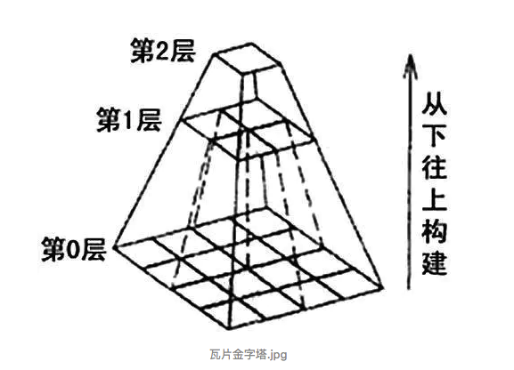
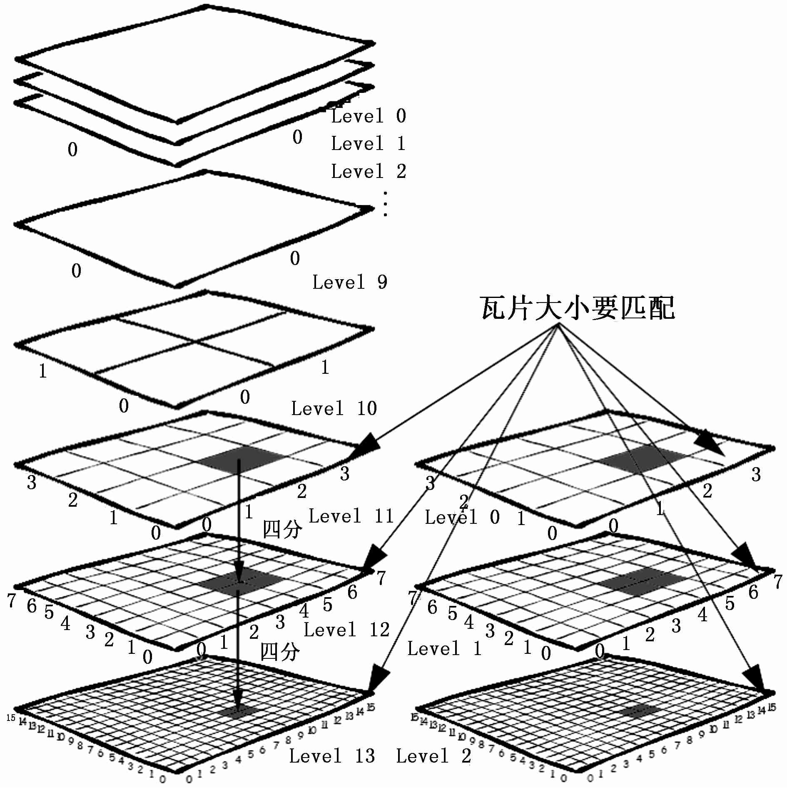
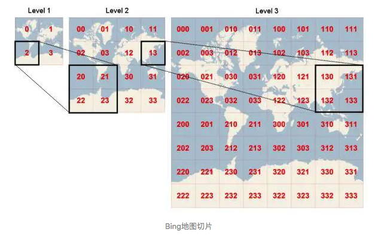

## 前言

互联网地图服务，常常采用构建瓦片地图的方式，加快用户的访问，减少数据传输量。具体而言，瓦片地图就是对投影后的地图在不同尺度（层）下进行切片，每个尺度得到的地图切片数量不同、表示范围不同、详细程度不同，但是图片的尺寸相同（一般为`256*256`），最终构成一个“瓦片金字塔“”。根据用户所浏览的区域范围，自动确定所要返回的切片层级，在满足用户查询需求的同时，保证了地图传输的效率。

## 坐标

常用的瓦片地图是三维的（见下图），通常使用`xyz`这样的坐标来精确定位一张瓦片。

- `z`：表示地图层级
- `xy`：表示某个层级内的瓦片平面
  - 每一个瓦片在横轴和纵轴上都有对应的坐标：`x`和`y`
  - `x`：横轴坐标
  - `y`：纵轴坐标

## 编号

主流的地图服务提供商基本都选择的是`WGS84 Web Mercator`坐标系。但是在如何对投影后的地图进行切片并编号时，不同厂商之间存在较大的差异

### 谷歌地图

以地图**左上角**为原点，`X`轴向右，`Y`轴向下，从`0`开始分别进行编号

`Z`的取值范围为`[0, 18]`，在第`z`级别，`x, y`方向的瓦片个数均为2^z^个，即`x, y`取值范围是[0 , 2^z-1^]

### TMS

以地图**左下角**为原点，`X`轴向右，`Y`轴向上，从`0`开始分别进行编号

`Z`的编码规则与谷歌地图相同

### 必应地图

同一层级的瓦片不用`XY`两个维度表示，而只用一个整数表示，该整数服从**四叉树编码**规则

`Z`的编码规则与谷歌相同

