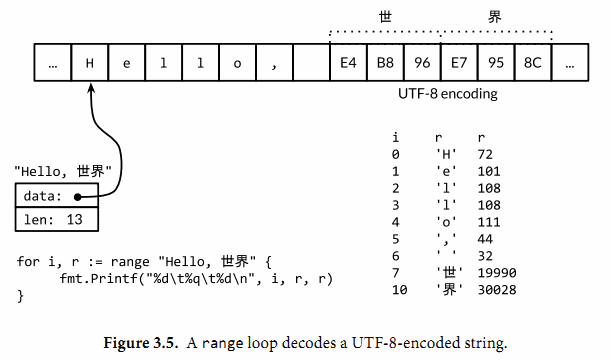

title: 13.Go语言学习笔记-Go基本数据类型-字符串
date: 2020-04-23
tags: Go
categories: Go语言
layout: post

------

摘要：本节介绍`Go`语言的基本数据类型：字符串

<!-- more -->

## 字符集与编码

### ASCII字符集

计算机面世初期使用的字符集，即：美国信息交换标准代码。由一个字节（8位）表示128个字符

## Unicode字符集

需要支持多种语言（如：中文、德文、日文等），需要容纳世界上所有的语言和符号，逐步进化成**Unicode**字符集，由四个字节（32位）表示了涵盖`100`多种语言，超过`120,000`个字符

不足：占用大量空间，很多字符只需要一个字节就能表示，但还是占用了四个字节的空间，对于数据的存储和传输都不是最优化的方案

## UTF-8编码

在`Unicode`字符集基础上，将`Unicode`码点编码为字节序列的变长编码，使用`1-4`个字节来表示`Unicode`字符

编码后，通过字节的高位`bit`来确定其长度

- 第`1`个字节高位是`0`，表示`ASCII`字符
- 第`1`个字节高位是`110`，表示需要两个字节
- 第`1`个字节高位是`1110`，表示需要三个字节
- 第`1`个字节高位是`11110`，表示需要四个字节
- 第`2-4`个字节的高位，必须是`10`

```tex
0xxxxxxx                             runes 0-127    (ASCII)
110xxxxx 10xxxxxx                    128-2047       (values <128 unused)
1110xxxx 10xxxxxx 10xxxxxx           2048-65535     (values <2048 unused)
11110xxx 10xxxxxx 10xxxxxx 10xxxxxx  65536-0x10ffff (other values unused)
```

## 字符串

> 与`Python`中的字符串类型一样

字符串类型是`string`

### 不可变序列

在`Go`语言中，字符串是**不可变**字节序列，一旦赋值就不能修改

```go
s := "hello, world"
s[0] = 'L' // compile error: cannot assign to s[0]
```

因为不可变的特性，使得多个变量可以同享相同的底层数据（非常安全）。对于字符串的复制、切片等操作的代价是很低的（不需要额外分配内存，性能非常高）


### 长度

通过内置函数`len`获得字符串的字节数

注意：是字符串的**字节数**，而不是字符串字符数

```go
s := "hello, world"
fmt.Println(len(s))     // "12"
s := "Hello, 世界"
fmt.Println(len(s))			// "13"
```

### 下标访问

使用下标访问字符，下标从`0`开始到`len() -1`结束，返回的是**字节值**

```go
s := "hello, world"
fmt.Println(s[0], s[7]) // "104 119" ('h' and 'w')
```

## 字面量

`Go`语言中的字符串可以有三种字面量表示方式

### 默认方式

使用`""`双引号包含的字符序列，字符序列应该是键盘可以输入的字符

```go
var s = "Hello, world"
```

### 转义方式

对于无法通过键盘输入的字符，可以通过转义的方式输入，需要使用`\`转义符

```go
var s = "Hello \n world"		// "\n"是换行符
var s = "\x41"							// 对应"A"
```

对于`Unicode`转义字符，可以通过`Unicode`码点输入特殊的字符

`\uhhhh`对应`16bit`的码点值，`\Uhhhhhhhh`对应`32bit`的码点值，其中`h`是一个十六进制数字；一般很少需要使用`32bit`的形式，每一个对应码点的`UTF8`编码

```go
"世界"
"\xe4\xb8\x96\xe7\x95\x8c"
"\u4e16\u754c"
"\U00004e16\U0000754c"
```

### 原生方式

如果不希望进行转义处理，可以使用原生字符串形式（与`Python`中的`r`一样）

```go
const GoUsage = `Go is a tool for managing Go source code.

Usage:
    go command [arguments]
...`
```

这种表示方式常用于正则表达式、路径字符串、JSON串等场景

## 遍历字符

我们知道，`Go`语言中的字符串也是使用`UTF-8`编码的。与其他语言不同的是，`Go`语言的字符串下标访问的是字节而不是字符，返回的也是对应下标的字节值，并没有对存储的字节进行解码

```go
s := "Hello, 世界"
fmt.Println(len(s))			// 13
fmt.Println(s[7])				// 228 \xe4
```

这样我们是无法正确的使用字符串的，也就是说，我们需要使用带解码功能的遍历字符串的方法

```go
import "unicode\utf8"

s := "Hello, 世界"

fmt.Println(utf8.RuneCountInString(s)) // "9"

for i := 0; i < len(s); {
    r, size := utf8.DecodeRuneInString(s[i:])
    fmt.Printf("%d\t%c\n", i, r)		// %c 字符输出
    i += size
}
```

- `RuneCountInString(s)`：返回字符串中`rune`的个数，如果字符串含有非`ASCII`字符，结果可能小于`len(s)`
- `DecodeRuneInString(s)`：返回字符串第一个`rune`编码的字符，以及所占用的字节数



当然，`Go`语言提供了隐式解码的方法，使用`range`关键字迭代字符串将隐式调用解码方法

```go
import "unicode\utf8"

s := "Hello, 世界"

fmt.Println(utf8.RuneCountInString(s)) // "9"

for i, r := range "Hello, 世界" {
    fmt.Printf("%d\t%q\t%d\n", i, r, r)
}
```

### 错误编码

如果遇到一个错误的`UTF8`编码输入，将生成一个特别的`Unicode`字符`\uFFFD`，在印刷中这个符号通常是一个黑色六角或钻石形状，里面包含一个白色的问号"�"

### rune序列

虽然使用`UTF8`字符串交换格式非常方便，但程序内部采用`rune`序列可能更方便，因为`rune`大小一致，支持数组索引和方便切割

```go
s := "我爱你中国"
fmt.Printf("% x\n", s) // "e6 88 91 e7 88 b1 e4 bd a0 e4 b8 ad e5 9b bd"
r := []rune(s)
fmt.Printf("%x\n", r)  // "[6211 7231 4f60 4e2d 56fd]"
```

### 类型转换

可以使用`string`类型转换，将字节、字节数组、`rune`转换为编码后的字符串

```go
fmt.Println(string(65))     	// "A", not "65"
fmt.Println(string(0x4eac)) 	// "京"
fmt.Println(string(1234567)) 	// "�"
```

注：与其他编程语言有不同之处，不是把被转换的变量两边加上`""`，而是进行编码处理（类似于：`chr(x)`）

将一个整形数转换为字符串有两种方法：

- 使用`strconv`包中提供的`Itoa()`函数
- 使用`fmt`包中的`Println()`函数

```go
x := 65
y := fmt.Sprintf("%d", x)
fmt.Println(y, strconv.Itoa(x)) // "65 65"
```

将一个字符串转换为整形数：

- 使用`strconv`包中的`Atoi()`函数
- 使用`strconv`包中的`ParseInt()`函数

```go
x, err := strconv.Atoi("123")             // x is an int
y, err := strconv.ParseInt("123", 10, 64) // base 10, up to 64 bits
```

## 内置库

涉及到字符串处理的内置库有`bytes`、`strings`、`strconv`、`unicode`


