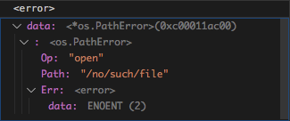

title: 34.Go面向对象之类型断言
date: 2020-05-10
tags: Go
categories: Go语言
layout: post

------

摘要：本节介绍`Go`语言的面向对象中的类型断言。包括：

<!-- more -->

## 是什么

类型断言：判断一个接口的类型与断言类型是否匹配。具体的语法如下：

```go
val, ok = x.(T)
```

- `x`：接口类型的变量
- `T`：断言类型
- `val`：断言后的变量
- `ok`：类型是否匹配

其实就是，如果`x`与`T`类型匹配（接口匹配或类型匹配），则返回的`ok`为`true`，否则`ok`为`false`

## 为什么

对于接口来说，其接口的类型和接口的值都是可以动态改变的。在面向对象编程中，需要在运行时判断接口的动态类型，根据被访问对象是否与特定类型匹配，从而进一步处理业务逻辑

- 接口的类型是动态的，这个与其他类型是最大的不同
- 判断接口类型的变量，与我们期望的数据类型是否匹配
- 如果匹配，就可以按期望的数据类型进行操作

## 怎么做

通过下例进行说明，本例中定义了`3`个接口类型以及`2`个类

```go
// Customer 顾客接口
type Customer interface {
	Buy(item string) // 买东西
}
// Producer 厂家接口
type Producer interface {
	Produce(item string) // 生成商品
}
// Maller 商家接口
type Maller interface {
	Sell(item string) // 销售商品
}
// Nike 实体类
type Nike struct {
	ID   int
	Name string
}
// Produce 作为厂家生产商品
func (n *Nike) Produce(item string) {
	fmt.Println("Nike Produce" + item)
}
// Sell 作为卖家 销售商品
func (n *Nike) Sell(item string) {
	fmt.Println("Nike Sell" + item)
}
// TMall 天猫
// 定义不一样的数据结构
type TMall struct {
	ID   string
	Name string
	Addr string
}
// Produce 天猫能生成商品
func (n *TMall) Produce(item string) {
	fmt.Println("TMall Produce" + item)
}
// Sell 天猫能销售商品
func (n *TMall) Sell(item string) {
	fmt.Println("TMall Sell" + item)
}
// Buy 天猫能买东西
func (n *TMall) Buy(item string) {
	fmt.Println("TMall Buy" + item)
}

func main() {
	var p Producer // 定义厂家接口变量 p
  fmt.Printf("%T, %[1]v\n", p) // 输出：<nil>, <nil>
	p = &Nike{1, "Nike"}  // 创建一个Nike实体对象
	fmt.Printf("%T, %[1]v\n", p) // 输出：*main.Nike, &{1 Nike}
  t, ok := p.(*TMall) // 断言是否与TMall匹配?
	fmt.Printf("%T, %[1]v, %v\n", t, ok) // 输出：*main.TMall, <nil>, false
	t, ok := p.(Maller) // 断言是否与Maller匹配?
	fmt.Printf("%T, %[1]v, %v\n", t, ok) // 输出：*main.Nike, &{1 Nike}, true
	b, ok := p.(Customer) // 断言是否与Customer匹配？
	fmt.Printf("%T, %[1]v, %v\n", b, ok) // 输出：<nil>, <nil>, false
}

```

- `x`必须是接口类型
- 断言类型`T`可以是接口类型或者实体类
- 断言成功，根据断言类型`T`有不同判定标准
  - 断言类型`T`为接口类型：意味着`x`的接口方法能够覆盖`T`的接口方法
  - 断言类型`T`为实体类型：`x`的类型与`T`类型一致，必须是同样的类型
- 断言失败，`x`的类型有两种情况
  - 断言类型`T`为接口类型：`x`的类型和值都为零值`nil`
  - 断言类型`T`为实体类型：`x`的类型为`T`，值为零值`nil`

## 应用场景

列举了两个应用场景：面向实体类型、面向接口类型。

### 区别错误类型（实体类）

`Go`中的`error`是一个接口类型，只有一个返回错误描述字符串的方法`Error()`。如果要区分返回的错误具体是哪种错误，首先就需要知道实现该接口的具体类型，以及其错误代码

**可能有人会说，从返回的错误描述字符串中查找关键字，不是非常简单吗？可是对于不同的系统平台，有可能返回的错误描述会存在差异；而且这种改动可能非常隐蔽**

我们来看`Go`中是如何做的。这段代码是`PathError`错误实体类的定义，由三个属性和一个接口方法组成

```go
package os

// PathError records an error and the operation and file path that caused it.
type PathError struct {
    Op   string
    Path string
    Err  error
}

func (e *PathError) Error() string {
    return e.Op + " " + e.Path + ": " + e.Err.Error()
}
```

如何判断返回的错误是预期的错误呢？例如：文件不存在

```go
import (
    "errors"
    "syscall"
)

var ErrNotExist = errors.New("file does not exist")

// IsNotExist returns a boolean indicating whether the error is known to
// report that a file or directory does not exist. It is satisfied by
// ErrNotExist as well as some syscall errors.
func IsNotExist(err error) bool {
    if pe, ok := err.(*PathError); ok {
        err = pe.Err
    }
    return err == syscall.ENOENT || err == ErrNotExist
}
```

我们用代码调试工具看看，具体的错误对象的内容

```go
_, err := os.Open("/no/such/file")
fmt.Println(os.IsNotExist(err)) // "true"
```

通过添加断点的方式，跟踪到了`err`变量的值



可以看到，变量是`PathError`类型，其`Err`属性是`syscall.ErrNo`类型的值，`2`代表文件不存在

我们再返回`IsNotExists`函数的代码，就非常清楚了

- `err.(*PathError)`：进行类型断言。如果是`PathError`类型，则取出其中保存的`error`错误值。类型断言的原因是为了取出其中包含的`Err`属性值而已
- 比较错误值，是`syscall.ENOENT`还是前面定义的`errors.New("file does not exist")`

### 询问行为（接口类）

如果我们要判断一个接口值是否匹配特定的接口，可以使用类型断言，其中匹配类型`T`为接口类型。

有时，我们需要判断某个接口值是否包含指定的方法。可以将指定的方法包装成一个临时接口，通过类型断言判断

我们在`HTTP`响应头中添加响应内容类型等一些属性时，如果使用`io.Writer`接口的`write`方法，每次都需要将`string`转换为`[]byte`（内存拷贝耗时，频繁的内存申请和释放），对于`Web`服务的性能有较大的影响

```go
func writeHeader(w io.Writer, contentType string) error {
    if _, err := w.Write([]byte("Content-Type: ")); err != nil {
        return err
    }
    if _, err := w.Write([]byte(contentType)); err != nil {
        return err
    }
    // ...
}
```

如果`io.Writer`的接口值`w`，其类型实现了`writeString`方法，可以直接使用`string`就可以大大提高性能

我们如何判断接口值`w`是否支持`writeString`方法呢？可以借助类型断言

```go
// 直接使用writeString 方法写入
// 如果 w 有 writeString 方法，则可以替代 write 方法
func writeString(w io.Writer, s string) (n int, err error) {
    type stringWriter interface { // 定义一个临时的接口类型
        WriteString(string) (n int, err error) // 只有 writeString 方法
    }
    if sw, ok := w.(stringWriter); ok { // 类型匹配
        return sw.WriteString(s) // 避免了内存拷贝
    }
    return w.Write([]byte(s)) // 类型不匹配，还是需要内存拷贝
}

func writeHeader(w io.Writer, contentType string) error {
    if _, err := writeString(w, "Content-Type: "); err != nil {
        return err
    }
    if _, err := writeString(w, contentType); err != nil {
        return err
    }
    // ...
}
```

## 类型开关（多态？）

在面向对象中，多态是同一个行为具有多个不同表现形式或形态的能力

**多态有如下优点**：消除类型之间的耦合关系、可替换性、可扩充性、接口性、灵活性、简化性

**多态存在的三个必要条件**：继承、重写、父类引用指向子类对象

在`Go`语言中，使用接口实现多态特性，接口值中类型和值分离的特性，使得多态存在两种方式

### 子类型多态（subtype polymorphism）

一个接口的方法表达了实现这个接口的具体类型间的相似性，但是隐藏了代表的细节和这些具体类型本身的操作

重点：只要方法一致就行，不关心具体类型间是否有关系。**鸭子类型**

### 特殊多态（ad hoc polymorphism）

一个接口值可以持有各种具体类型值，且将这个接口认为是这些类型的联合（`union`）

重点：具体的类型满足这个接口，而不关心接口的方法（如：空接口），并且没有任何的信息隐藏

我们将以这种方式使用的接口描述为可辨识联合（`discriminated unions`）

### 类型开关

一种简化类型断言的语法。使用关键字`type`，取代断言类型`T`，从而简化`if-else`链

```go
switch x.(type) { // 注意 x.(type) 必须在 switch 语句中使用
    case nil:       // ...
    case int, uint: // ...
    case bool:      // ...
    case string:    // ...
    default:        // ...
}
```

### 应用示例

执行`SQL`语句的代码实现

```go
import "database/sql"

func listTracks(db sql.DB, artist string, minYear, maxYear int) {
    result, err := db.Exec(
        "SELECT * FROM tracks WHERE artist = ? AND ? <= year AND year <= ?",
        artist, minYear, maxYear)
    // ...
}
```

在`Exec`函数中，用传递的参数`artist...`替换语句中使用`?`，从而生成最终的`SQL`语句

但传递参数的类型是不确定的，可以是`int`、`string`甚至是`nil`值，就需要通过类型断言进行判断和处理

```go
func sqlQuote(x interface{}) string {
    if x == nil {
        return "NULL"
    } else if _, ok := x.(int); ok {
        return fmt.Sprintf("%d", x)
    } else if _, ok := x.(uint); ok {
        return fmt.Sprintf("%d", x)
    } else if b, ok := x.(bool); ok {
        if b {
            return "TRUE"
        }
        return "FALSE"
    } else if s, ok := x.(string); ok {
        return sqlQuoteString(s) // (not shown)
    } else {
        panic(fmt.Sprintf("unexpected type %T: %v", x, x))
    }
}
```

但大量的`if-else`语句，既不美观有不利于维护，使用**类型开关**就可以简化代码

```go
func sqlQuote(x interface{}) string {
    switch x := x.(type) { // 定义一个新变量 x
    case nil:
        return "NULL"
    case int, uint:
        return fmt.Sprintf("%d", x) // x has type interface{} here.
    case bool:
        if x {
            return "TRUE"
        }
        return "FALSE"
    case string:
        return sqlQuoteString(x) // (not shown)
    default:
        panic(fmt.Sprintf("unexpected type %T: %v", x, x))
    }
}
```

