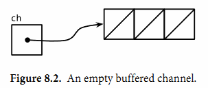

title: 40.Go并发之CSP模式
date: 2020-05-13
tags: Go
categories: Go语言
layout: post

------

摘要：本节介绍`Go`语言中并发的一些基本知识

<!-- more -->

## 概念

并发：指同时进行多个任务的程序。例如：`Web`服务可以处理成千上万的请求，页面可以边渲染、边响应输入、边发送请求等，随着计算机硬件的发展（多核、多线程）以及互联网的发展，并发程序越来越重要

`Go`语言中的并发程序可以用两种手段来实现：

- 传统模式：多线程共享内存
- 现代模式：顺序通信进程`CSP（communicating sequential processes）`

`Go`的并发有些类似于`Python`的协程，其并发性能和数量远远优于传统的并发模式。并发的良好支持也是`Go`语言被众多大厂重视和应用的原因之一

### 之前发生

**之前发生`happens before`**是`Go`语言并发内存模型的一个关键术语

- 表述为：`x`事件在`y`事件之前发生
  - 真实的意思：保证在`y`之前的事件`x`都已经完成。如：更新变量的操作已经完成，可以放心依赖已完成事件
  - 而不是：`x`事件在时间上比`y`发生的更早

- 表述为：`x`事件既不在`y`事件之前发生，也不在`y`事件之后发生
  - 真实的意思：`x`事件和`y`事件是并发的，我们不能确定两个事件发生的先后顺序
  - 而不是：`x`事件和`y`事件是同时发生的

当两个`goroutine`并发访问相同的变量时，我们有必要保证某些事件的执行顺序，以避免出现某些并发问题

## Goroutines

在`Go`语言中，每个并发的执行单元叫作`goroutine`

在一个线性的程序中，代码是严格按顺序依次执行的，前面的没有执行完，是不会执行后面的

主函数`main()`是在一个单独的称为`main goroutine`中执行，也就是说每个可执行程序至少有一个`goroutine`

使用`go`关键字会创建一个新的`goroutine`，语句中的函数/方法将在这个新的`goroutine`中执行，`go`语句本身会迅速完成，不会挂起等待其执行完毕

```go
f()    // call f(); wait for it to return
go f() // create a new goroutine that calls f(); don't wait
```

### 如何退出

`goroutine`是独立的运行单元，一旦开始执行后，控制其安全退出有三种方式：

- 主函数`main()`正常退出，所有`goroutine`立即退出
- 终止程序`os.Exit(1)`，所有`goroutine`立即退出
- 通过`Channels`实现通信，相关的`goroutine`安全退出

## Channels

`channels`是`goroutine`间的通讯机制，通过其进行数据传递

每个`channels`都必须指定可以发送的数据类型（使用`interface{}`可以发送任何类型的数据）

初始化一个`channels`需要使用`make`语句，复制`channels`或作为参数传递时，只是拷贝其引用，其实指向的是同一个`channels`对象

```go
var ch = make(chan 数据类型[, 容量])
// 实例
var ch = make(chan int) // 不带缓存的channels，传递 int 类型数据
var ch = make(chan int, 3) // 带3个缓存的channels，传递 int 类型数据
var ch = make(chan interface{}) //不带缓存的channels，传递 任何 类型数据
```

对于一个初始化的的`channels`，可以进行发送数据、接收数据和关闭三种操作

```go
ch <- 1	// 向channels发送数据1
x = <-ch // 从channels中接收数据，将数据保存到变量 x 中
<-ch // 从channels中接收数据，并丢弃该数据
close(ch) // 关闭channels
x, ok := <-ch // ok 表示 ch 是否已关闭
for x := range channels {...} // 使用range语句，自动循环取数据，当channels关闭时，退出循环
```

- 向`channels`发送的数据类型，必须与初始化的类型匹配
- 无论发送和接收数据，都使用`<-`操作符
- 不使用接收结果的接收操作是合法的（第三个例子）
- 关闭`channels`后，向其发送数据会导致`panic`错误；但依然可从其接收数据，当`channels`中没有任何数据时，返回零值的数据，而且`ok`返回`false`

### 无缓存

无缓存的`channels`相当于必须双方同时在线的通讯机制。一方不在线则另一方会阻塞

- `A`向`channels`中发送数据
  - `B`没有接收，则`A`的发送操作阻塞
  - `B`开始接收，则`A`继续
- `A`从`channels`中接收数据
  - `B`没有发送，则`A`的接收操作阻塞
  - `B`开始发送，则`A`继续

基于无缓存`Channels`的发送和接收操作将导致两个`goroutine`做一次**同步操作**，称为同步`Channels`

我们可以利用无缓存`channels`的同步特点，在`main goroutine`退出前，等待其他`goroutine`安全退出

通过`channels`传递消息有两个要点：数据本身、行为本身。当我们更希望强调通讯发生的行为时，我们将它称为**消息事件**。对于消息事件来说，可以发送任何数据，但通常我们发送一个空结构数据

通过一个无缓存`Channels`发送数据时，接收者收到数据发生在唤醒发送者`goroutine`之前

```go
done := make(chan struct{})
done <- struct{}{}
```

### 单方向

`channels`是用于`goroutine`间的通信机制，所以`channels`必须是可以发送和接收的通道

但对于某一个`goroutine`来说，通常情况下，它只需要发送或者接收，也就是说其对于`channels`的操作是单向的

当一个`channel`作为一个函数参数时，总是被专门用于只发送或者只接收（加入方向操作符`<-`）

```go
func funcname(out chan<- int, in <-chan int) {
		...
}
```

- `chan<-`：只能向该`channels`发送数据
- `<-chan`：只能从该`channels`接收数据

当限定了函数中`channels`参数的操作方向时，这种限制将在编译器检测。

- 对`chan<-`进行接收操作会编译错误
- 关闭`<-chan`的操作会编译错误

### 有缓存

通过在`channels`中加入缓存，可以解耦发送方和接收方`goroutine`的同步状态。双方不必完全保持同步状态，可以进行**适度**的调节。用生产线进行说明（每道工序的缓存为`3`）：

- 正常情况下，上下游的工序时间是匹配的
- 若缓存中有`1`个零件，则上下游时间可以有适当的偏差。上游慢了，下游从缓存中取走零件，不必等待
- 下游慢了，上游可以把零件先缓存起来，而不必等着下游接收

其实，加入缓存是为了解决因`goroutine`间不同步而导致的性能问题。但需要根据实际情况，综合考虑：缓存的容量、`goroutine`数量等问题



当缓存满时，发送操作将被阻塞；当缓存空时，接收操作将被阻塞

可以获取缓存`channels`的容量和数据长度

```go
cap(ch) // 容量
len(ch) // 当前时刻的数据长度，仅供参考
```

### PipeLine

`Pipeline`管道：可以使用`channels`将多个`goroutine`连在一起，就像一个管道一样


```Go
func counter(out chan<- int) {
    for x := 0; x < 100; x++ {
        out <- x
    }
    close(out) // 退出机制
}

func squarer(out chan<- int, in <-chan int) {
    for v := range in {
        out <- v * v
    }
    close(out) // 退出机制
}

func printer(in <-chan int) {
    for v := range in {
        fmt.Println(v)
    }
}

func main() {
    naturals := make(chan int)
    squares := make(chan int)
    go counter(naturals)
    go squarer(squares, naturals)
    printer(squares)
}
```

### 退出机制

使用`channels`可以安全的退出`goroutine`，常用的有两种方式：

- 利用无缓存的消息事件。`main goroutine`挂起，直到`goroutine`发送消息后退出
- 发送方关闭`channels`，接收方接收时返回`ok==false`

## 并发循环

介绍在并行时循环迭代的常见并发模型。并发循环的关键是要确保所有`goroutine`都执行完毕，通常情况有两种实现方式。下面就一步步进行讲解，案例要实现批量生成图片的缩略图

**原代码**在一个循环中依次处理图片

```go
func makeThumbnails(filenames []string) {
    for _, f := range filenames {
        if _, err := thumbnail.ImageFile(f); err != nil {
            log.Println(err)
        }
    }
}
```

要提高性能，需要将每个`thumbnail.ImageFile`处理函数放到独立的`goroutine`中，且`main goroutine`必须等到所有的`work goroutine`都执行完毕后才能退出。这就需要使用`channels`实现

### **方式一：消息事件**

每个`work goroutine`执行完毕后，向`channels`发送一个**消息事件**，`main goroutine`接收到消息后计数，接收到全部消息后完成

```go
func makeThumbnails11(filenames []string) {
    ch := make(chan struct{})
    for _, f := range filenames {
        go func(f string) {
            thumbnail.ImageFile(f) // NOTE: ignoring errors
            ch <- struct{}{} // 消息事件
        }(f)
    }
    // Wait for goroutines to complete.
    for range filenames { // 循环次数与处理次数相同（计数模式）
        <-ch
    }
}
```

### **方式二：执行结果**

每个`work goroutine`执行完毕后，向`channels`发送一个执行结果的消息，`main goroutine`接收到消息后计数并处理信息，接收到全部消息后完成。消息不仅起到通知状态的作用，还包含执行的结果信息（如：文件名、尺寸等）

```go
func makeThumbnails12(filenames []string) (thumbfiles []string, err error) {
    type item struct {  // 消息格式
        thumbfile string
        err       error
    }
    ch := make(chan item, len(filenames)) // 有缓存channels
    for _, f := range filenames {
        go func(f string) {
            var it item
            it.thumbfile, it.err = thumbnail.ImageFile(f)
            ch <- it // 有足够的缓存，因此无需等待
        }(f)
    }
    for range filenames {
        it := <-ch
        if it.err != nil {
            return nil, it.err // 直接返回无BUG，虽然没有接收所有的消息，但所有goroutine都能安全退出
        }
        thumbfiles = append(thumbfiles, it.thumbfile)
    }
    return thumbfiles, nil
}
```

这里使用了缓存`channels`，而且缓存的容量正好是`work goroutine`的数量。因此，每个`goroutine`执行完毕时将直接退出，并不会被阻塞等待读取。也是因为这个原因，在`main goroutine`读取消息时，可以随时中断退出。

如果我们使用的是无缓存`channels`，在`main goroutine`读取消息时，遇到错误直接返回将导致**`goroutine`泄露**，这些`goroutine`将会一直处于阻塞状态，而不能得到释放

### **方式三：同步计数**

有时，我们无法事先预知循环的次数（如：上例中的文件名是通过`channels`传递的）。这时可以使用同步计数的方式，在`goroutine`执行前计数，在`goroutine`执行完后减数，通过加减匹配实现计数功能

```go
func makeThumbnails13(filenames <-chan string) int64 { // filenames 是一个 channels
    sizes := make(chan int64)
    var wg sync.WaitGroup // 1.声明计数器
    for f := range filenames {
        wg.Add(1) // 2. 主goroutine中，对计数器+1
        // worker
        go func(f string) {
            defer wg.Done() // 3.goroutine退出时，计数器-1 
            thumb, err := thumbnail.ImageFile(f)
            if err != nil {
                log.Println(err)
                return
            }
            info, _ := os.Stat(thumb) // OK to ignore error
            sizes <- info.Size()
        }(f)
    }

    // closer 相当于值守goroutine，在后台监控计数器的状态
    go func() {
        wg.Wait() // 4. 监控计数清零，挂起状态，直到为0
        close(sizes) // 5. 关闭work 与 main 之间的channels
    }()

    var total int64
    for size := range sizes { //6. 关闭channels后，退出循环
        total += size
    }
    return total
}
```

需要注意的是：使用的计数器必须能够保证在并发`goroutine`中的安全，本例中使用的是`sync.WaitGroup`

- 确保计数器加`1`行为，是发生在`closer`这个`goroutine`执行前（`happend before`）
- 每个`goroutine`执行后，对计数器减一
- 使用`closer`这个`goroutine`监控计数器是否清零，即所有`work goroutine`执行完毕。当执行完毕后就会关闭`sizes`这个`channels`
- 关闭`channels`将导致`range sizes`退出循环，随即`main goroutine`退出

### 限制并发数

有时我们需要限制并发的数量（如：同时打开过多的文件/`socket`会导致资源不足）

### 多路复用

### 并发退出


