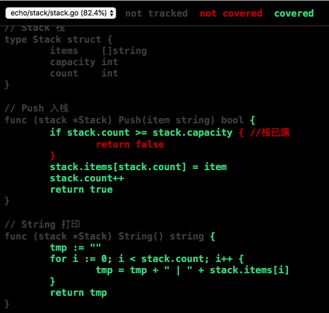
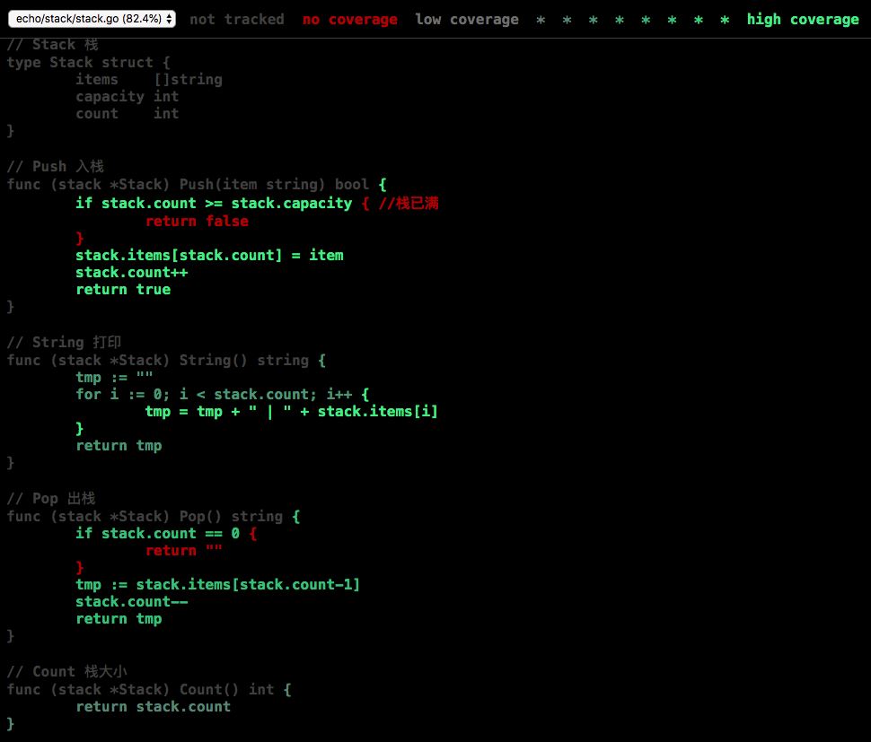
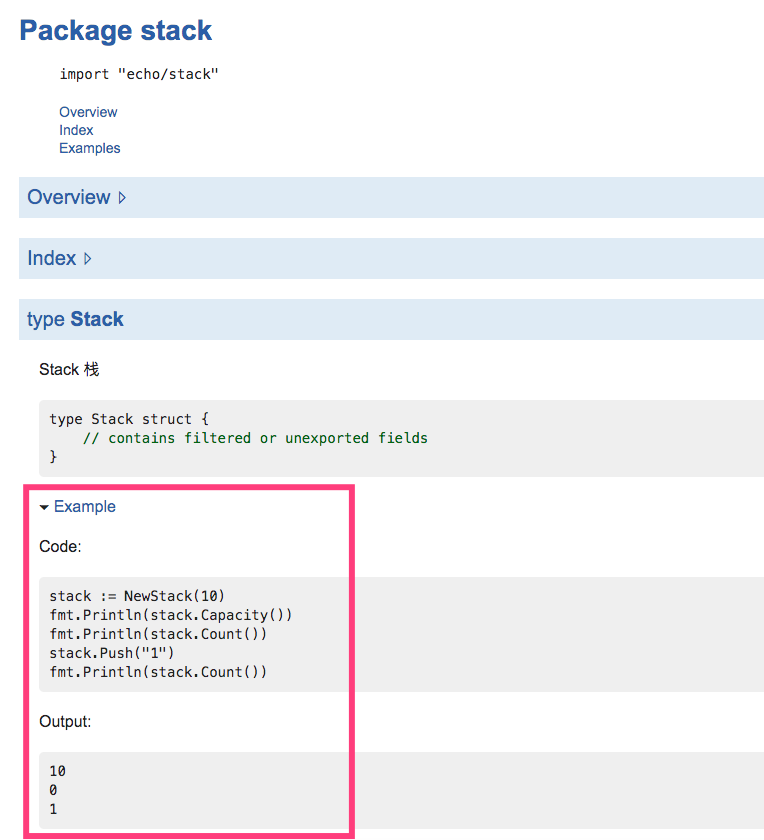

title: 50.Go测试
date: 2020-05-19
tags: Go
categories: Go语言
layout: post

------

摘要：本节介绍`Go`语言内置的测试功能

<!-- more -->

随着技术发展和需求爆炸，软件的规模越来越大，也变得越来越复杂。随之而来的就是软件的`Bug`越来越多样、越来越隐蔽，难以消除，为了提升代码质量、控制其复杂性，一般采用两种实践中证明比较有效的方法：

- 代码评审
- 软件测试

本节着重阐述`Go`中的软件测试

## 前言

测试：具体指自动化测试，通过编写的测试程序，检测被测试代码的行为和预期一致。这些测试代码称为测试用例，它们都是经过精心设计的，用来执行特定的功能、或验证输入边界的处理

软件测试是一个巨大的领域。作为程序员来说，测试代码的编写、维护以及执行软件测试会占据部分工作时间。对于每一种主流的编程语言，都会有许多用于测试的软件包，同时也有大量的测试相关的理论，而且每种都吸引了大量技术先驱和追随者。这些足以说明：**编写有效测试是码农必备的一项技能**

`Go`语言的测试技术是**相对低级**的。它依赖一个`go test`测试命令和一组按照约定方式编写的测试函数，测试命令可以运行这些测试函数。编写相对轻量级的纯测试代码是有效的，而且它很容易延伸到基准测试和示例文档

在编写测试代码时，每一个测试函数针对某个具体任务

- 小心处理边界条件
- 思考合适的数据结构
- 推断合适的输入应该产生什么样的结果输出

## 执行测试

这里说明的是`Go`语言内置的测试工具，而非第三方测试包。后期对测试有了更深入的了解后，会补齐常用测试包部分的使用说明

执行`go test`命令（具体见`107Go命令test`），`Go`测试工具将按照一定的约定和组织来测试代码的程序

所有以`_test.go`为后缀名的源文件在执行`go build`时不会被构建成包的一部分，它们是`go test`测试的一部分

在`*_test.go`文件中，有三种类型的函数：测试函数、基准测试（`benchmark`）函数、示例函数

- 测试函数：以`Test`为函数名前缀的函数，用于测试程序的一些逻辑行为是否正确
  - `go test`命令会调用这些测试函数并报告测试结果是`PASS`或`FAIL`
- 基准测试函数：是以`Benchmark`为函数名前缀的函数，用于衡量一些函数的性能
  - `go test`命令会多次运行基准函数以计算一个平均的执行时间
- 示例函数：以`Example`为函数名前缀的函数，提供一个由编译器保证正确性的示例文档
  - 示例函数帮助使用者快速有效的工作，可以在`godoc`生成的文档中体现

测试执行过程包含以下几个步骤：

- 执行`go test`命令
- 遍历所有`*_test.go`文件中符合上述命名规则的函数
- 生成一个临时的`main`包用于调用相应的测试函数
- 构建并运行、报告测试结果
- 清理测试中生成的临时文件

## 测试函数

### 函数格式

以`Test`为函数名前缀的函数，用于测试程序的一些逻辑行为是否正确

```Go
func TestName(t *testing.T) {
    // ...
}
```

注意：可选后缀名必须以大写字母开头

```Go
func TestSin(t *testing.T) { /* ... */ }
func TestCos(t *testing.T) { /* ... */ }
func TestLog(t *testing.T) { /* ... */ }
```

### testing.T

每个测试函数都有一个入口参数`t`，用于报告测试失败和附加的日志信息。其类型为`testing.T`提供以下方法

```go
func (c *T) Error(args ...interface{})
func (c *T) Errorf(format string, args ...interface{})
func (c *T) Fail()
func (c *T) FailNow()
func (c *T) Failed() bool
func (c *T) Fatal(args ...interface{})
func (c *T) Fatalf(format string, args ...interface{})
func (c *T) Log(args ...interface{})
func (c *T) Logf(format string, args ...interface{})
func (c *T) Name() string
func (t *T) Parallel()
func (t *T) Run(name string, f func(t *T)) bool
func (c *T) Skip(args ...interface{})
func (c *T) SkipNow()
func (c *T) Skipf(format string, args ...interface{})
func (c *T) Skipped() bool
```

### 可选参数

在执行`go test`测试命令时，可以加入一些命令参数，从而改变测试行为和结果

参数`-v`：打印每个测试函数的名字和运行时间，以及`Log*`函数的日志输出

```shell
$ go test -v
=== RUN TestPalindrome
--- PASS: TestPalindrome (0.00s)
=== RUN TestNonPalindrome
--- PASS: TestNonPalindrome (0.00s)
=== RUN TestFrenchPalindrome
--- FAIL: TestFrenchPalindrome (0.00s)
    word_test.go:28: IsPalindrome("été") = false
=== RUN TestCanalPalindrome
--- FAIL: TestCanalPalindrome (0.00s)
    word_test.go:35: IsPalindrome("A man, a plan, a canal: Panama") = false
FAIL
exit status 1
FAIL    gopl.io/ch11/word1  0.017s
```

参数`-run`：对应一个正则表达式，过滤函数名被正确匹配的测试函数

```shell
$ go test -v -run="French|Canal"
=== RUN TestFrenchPalindrome
--- FAIL: TestFrenchPalindrome (0.00s)
    word_test.go:28: IsPalindrome("été") = false
=== RUN TestCanalPalindrome
--- FAIL: TestCanalPalindrome (0.00s)
    word_test.go:35: IsPalindrome("A man, a plan, a canal: Panama") = false
FAIL
exit status 1
FAIL    gopl.io/ch11/word1  0.014s
```

### 测试断言

`Go`没有像其它编程语言一样使用断言`assert`，而是使用`Error*`和`Fatal*`处理异常，使用`Log*`输出日志

- `Error*`：测试失败，但并不触发`panic`异常，测试继续
- `Fatal*`：测试停止，触发`panic`异常，测试中断
- `Log*`：输出日志

每个测试函数，都有一个`t`参数，用于报告测试失败和附加的日志信息

```Go
t.Error(`函数名("实际参数列表") = false`)
t.Errorf(`函数名("%s") = %v`, `实参`, `结果`)
```

一般情况下，测试失败信息的格式为：`f(x) = y, 正确结果 z`

- `f(x)`：失败的操作和对应的输入
- `y`：实际的运行结果
- `z`：期望的正确结果

### 表格测试

我们需要准备大量的测试数据，`Go`语言中常见的测试数据使用如下的**表格驱动**方式。方便向表格中添加新的测试数据，而且测试逻辑也没有冗余，着力于完善错误信息

```Go
func TestIsPalindrome(t *testing.T) {
    var tests = []struct { //定义一个临时的结构类型，属性：测试数据、测试结果
        input string
        want  bool
    }{
        {"", true},	// 直接在声明处，对测试数据进行初始化
        {"a", true},
        {"aa", true},
        {"ab", false},
        {"kayak", true},
        {"detartrated", true},
        {"A man, a plan, a canal: Panama", true},
        {"Evil I did dwell; lewd did I live.", true},
        {"Able was I ere I saw Elba", true},
        {"été", true},
        {"Et se resservir, ivresse reste.", true},
        {"palindrome", false}, // non-palindrome
        {"desserts", false},   // semi-palindrome
    }
    for _, test := range tests { // 测试逻辑简单、清晰
        if got := IsPalindrome(test.input); got != test.want {
            t.Errorf("IsPalindrome(%q) = %v", test.input, got)
        }
    }
}
```

### 子测试

如果测试用例比较多的时候，没办法一眼看出来具体是哪个测试用例失败了。可以使用`Go 1.7`引入的子测试：

```go
func TestIsPalindrome(t *testing.T) {
    var tests = map[string]struct { //定义一个临时的结构类型，属性：测试数据、测试结果
        input string
        want  bool
    }{
      "none": {"", true},	// 直接在声明处，对测试数据进行初始化
      "one": {"a", true},
      "two": {"aa", true},
      "two": {"ab", false},
      "two": {"kayak", true},
        {"detartrated", true},
        {"A man, a plan, a canal: Panama", true},
        {"Evil I did dwell; lewd did I live.", true},
        {"Able was I ere I saw Elba", true},
        {"été", true},
        {"Et se resservir, ivresse reste.", true},
        {"palindrome", false}, // non-palindrome
        {"desserts", false},   // semi-palindrome
    }
    for name, test := range tests { // 测试逻辑简单、清晰
      	t.Run(name, func(t *testing.T) { // 使用t.Run()执行子测试
        		if got := IsPalindrome(test.input); got != test.want {
            		t.Errorf("IsPalindrome(%q) = %v", test.input, got)
            }
        })
    }
}
```


### 随机测试

表格驱动的测试是通过构造精心准备的测试数据完成的，有时我们需要一些随机的数据来进一步检验代码的适应性

随机测试的测试数据准备参照两种方式：

- 测试数据遵循特定的模式，我们可以预知测试结果
- 编写对照函数，测试结果与对照函数的结果进行对比

下面的例子，通过随机生成测试数据，来测试回文字符串函数

```Go
import "math/rand"

// randomPalindrome returns a palindrome whose length and contents
// are derived from the pseudo-random number generator rng.
func randomPalindrome(rng *rand.Rand) string {
    n := rng.Intn(25) // random length up to 24
    runes := make([]rune, n)
    for i := 0; i < (n+1)/2; i++ {
        r := rune(rng.Intn(0x1000)) // random rune up to '\u0999'
        runes[i] = r
        runes[n-1-i] = r
    }
    return string(runes)
}

func TestRandomPalindromes(t *testing.T) {
    // Initialize a pseudo-random number generator.
    seed := time.Now().UTC().UnixNano()
    t.Logf("Random seed: %d", seed)
    rng := rand.New(rand.NewSource(seed))

    for i := 0; i < 1000; i++ {
        p := randomPalindrome(rng)
        if !IsPalindrome(p) {
            t.Errorf("IsPalindrome(%q) = false", p)
        }
    }
}
```

### 测试main包

`main`包在构建时会生成可执行程序，对于`main`包的测试与其他测试类似

```go
package main

import (
    "bytes"
    "fmt"
    "testing"
)

func TestEcho(t *testing.T) {
  	...
}
```

注意：测试代码中并没有调用`log.Fatal`或`os.Exit`，调用这类函数会导致程序提前退出，若测试过程中发生`panic`异常，应该用`recover`捕获异常，将当前测试当作失败处理

### 白盒测试

黑盒测试：测试包公开的`API`，屏蔽内部实现，业务相对稳定，测试用例更新较少

白盒测试：测试包内部一些棘手的实现，可以提高测试覆盖率，可以使用伪对象替代不易测试的部分（如：信用卡消费、更新生产库等）

注意：使用伪对象时，一定记得替换为伪对象后，记得恢复为被替换前的对象，以便后续代码可以正常工作

待测试代码：

```go
func CheckQuota(username string) {
    used := bytesInUse(username)
    const quota = 1000000000 // 1GB
    percent := 100 * used / quota
    if percent < 90 {
        return // OK
    }
    msg := fmt.Sprintf(template, used, percent)
    auth := smtp.PlainAuth("", sender, password, hostname)
    err := smtp.SendMail(hostname+":587", auth, sender,
        []string{username}, []byte(msg))
    if err != nil {
        log.Printf("smtp.SendMail(%s) failed: %s", username, err)
    }
}
```

为方便测试邮件发送（使用伪对象），需要将代码重构，将邮件发送部分独立成一个**函数变量**

```go
var notifyUser = func(username, msg string) {
    auth := smtp.PlainAuth("", sender, password, hostname)
    err := smtp.SendMail(hostname+":587", auth, sender,
        []string{username}, []byte(msg))
    if err != nil {
        log.Printf("smtp.SendEmail(%s) failed: %s", username, err)
    }
}

func CheckQuota(username string) {
    used := bytesInUse(username)
    const quota = 1000000000 // 1GB
    percent := 100 * used / quota
    if percent < 90 {
        return // OK
    }
    msg := fmt.Sprintf(template, used, percent)
    notifyUser(username, msg)
}
```

编写测试函数，注意恢复被替换的对象

```go
func TestCheckQuotaNotifiesUser(t *testing.T) {
  	// Save and restore original notifyUser.
    saved := notifyUser
    defer func() { notifyUser = saved }()
  
    var notifiedUser, notifiedMsg string
    notifyUser = func(user, msg string) {
        notifiedUser, notifiedMsg = user, msg
    }
    // ...simulate a 980MB-used condition...
    const user = "joe@example.org"
    CheckQuota(user)
    if notifiedUser == "" && notifiedMsg == "" {
        t.Fatalf("notifyUser not called")
    }
    if notifiedUser != user {
        t.Errorf("wrong user (%s) notified, want %s",
            notifiedUser, user)
    }
    const wantSubstring = "98% of your quota"
    if !strings.Contains(notifiedMsg, wantSubstring) {
        t.Errorf("unexpected notification message <<%s>>, "+
            "want substring %q", notifiedMsg, wantSubstring)
    }
}
```

### 外部测试包

包中的测试代码属于包的一部分，我们通常将测试函数保存到单独的文件中，该文件属于被测试包

当我们进行集成测试时，经常会遇到循环导入（循环依赖）的问题，这时就需要将测试代码独立成一个专门的包（外部测试包）。外部测试包的包名采用特殊命名规则`包名_test`，包名为`_test`后缀使得测试工具建立额外的包来运行测试

外部测试包不能被其他任何包导入，也就是说外部测试包只能用于执行测试命令，不能用于正常的开发用途

使用`go list`工具可以查看源文件、包内测试、外部测试

- `GoFiles`：源文件

```go
$ go list -f={{.GoFiles}} fmt
[doc.go errors.go format.go print.go scan.go]
```

- `TestGoFile`：包内测试

```go
$ go list -f={{.TestGoFiles}} fmt
[export_test.go]
```

- `XTestGoFile`：外部测试

```go
$ go list -f={{.XTestGoFiles}} fmt
[errors_test.go example_test.go fmt_test.go gostringer_example_test.go scan_test.go stringer_example_test.go stringer_test.go]
```

在外部测试包中进行白盒测试，需要访问被测试包内部的代码。这种情况下，需要通过一些技巧来解决：

- 在包内创建一个`export_test.go`文件
- 导出内部的实现给外部测试包（该文件只在测试时有效）

```Go
package fmt

var IsSpace = isSpace
```

### 有效测试

测试的目的：通过尽可能全面的覆盖，保证更多的代码通过测试；测试失败时，有足够有效的提示信息帮助作者快速定位异常原因；能够从多个失败测试的模式中发现内在的规律

测试代码的编写，不能仅仅考虑代码的优雅、对重复代码的封装等华而不实的地方，更重要的是能够将失败测试引发的错误信息准确无误的输出给作者

测试代码在设计时，要考虑到健壮性，即不要因为小小的变动就需要大量的维护工作，或者没有修改太多内容，却发生了大量的失败测试

避免脆弱测试代码的方法是：只检测你真正关心的属性，保持测试代码的简洁和内部结构的稳定，对断言有所选择

- 避免复杂的输入/输出，越复杂越难测试，越复杂后期变动可能性越大
- 不要对字符串进行全字匹配，针对在项目的发展中比较稳定不变的子串进行比较
- 编写从复杂输出中提取可用于断言的必要信息的函数，能迅速修复因项目演化导致的不合逻辑的失败测试

## 测试覆盖率

> 测试能证明缺陷存在，而无法证明没有缺陷

测试覆盖率：对**待测程序**执行测试的程度。因程序动态难以精确测量，测试覆盖率并不能量化。我们一般用**语句覆盖率**来代表测试覆盖率。语句覆盖率：在测试中至少被运行一次的代码占总代码数的比例

### 测试通过

在显示测试覆盖率之前，先要确保所有的测试都正常通过。而且需要在测试命令中加入一些参数以记录测试覆盖数据

- `-coverprofile=c.out`参数：统计覆盖率数据，将统计结果输出到参数指定的文件中（默认：`c.out`）

```go
mode: set
echo/stack/stack.go:11.44,12.35 1 1
echo/stack/stack.go:15.2,17.13 3 1
echo/stack/stack.go:12.35,14.3 1 0
echo/stack/stack.go:21.37,23.35 2 1
echo/stack/stack.go:26.2,26.12 1 1
echo/stack/stack.go:23.35,25.3 1 1
echo/stack/stack.go:30.34,31.22 1 1
echo/stack/stack.go:34.2,36.12 3 1
echo/stack/stack.go:31.22,33.3 1 0
echo/stack/stack.go:40.33,42.2 1 1
echo/stack/stack.go:45.36,47.2 1 0
echo/stack/stack.go:50.36,56.2 1 1
```

- `-covermode=count`参数：记录每个语法块的执行次数，用于衡量哪些是被频繁执行的热点代码

```go
mode: count
echo/stack/stack.go:11.44,12.35 1 20
echo/stack/stack.go:15.2,17.13 3 20
echo/stack/stack.go:12.35,14.3 1 0
echo/stack/stack.go:21.37,23.35 2 3
echo/stack/stack.go:26.2,26.12 1 3
echo/stack/stack.go:23.35,25.3 1 20
echo/stack/stack.go:30.34,31.22 1 10
echo/stack/stack.go:34.2,36.12 3 10
echo/stack/stack.go:31.22,33.3 1 0
echo/stack/stack.go:40.33,42.2 1 2
echo/stack/stack.go:45.36,47.2 1 0
echo/stack/stack.go:50.36,56.2 1 2
```

### 显示覆盖率

通过以下命令，将上面输出的`c.out`统计结果，以`html`页面的方式展示覆盖率

```bash
$ go tool cover -html=c.out
```



如果加入了`-covermode=count`参数，则输出的结果如下，可以看到代码块执行的次数



### 如何看待数值

把实现`100%`的测试覆盖率作为测试目标，是即不可行也不可取的做法

- 代码被执行过并不意味着代码就是没有`BUG`
- 有些语句永远也不会被执行到，如：触发`panic`的语句
- 一些逻辑很难编写对应的测试代码
- 考虑编写测试代码的成本
- 测试覆盖率只是帮助我们识别测试薄弱的地方，应把工作中心放到如何设计好的测试用例和应用代码上来

## 基准测试

基准测试：测量一个程序在固定工作负载下的性能

### 用法

基准测试函数写法如下：

```Go
func BenchmarkStackPush(b *testing.B) {
  	stack = NewStack(b.N)
    for i := 0; i < b.N; i++ {
      stack.Push(fmt.Sprint("%d", i))
    }
}
```

- 以`Benchmark`作为函数名前缀
- 基准测试函数的形参为：`b *testing.B`

`testing.B`拥有的方法如下：

```go
func (c *B) Error(args ...interface{})
func (c *B) Errorf(format string, args ...interface{})
func (c *B) Fail()
func (c *B) FailNow()
func (c *B) Failed() bool
func (c *B) Fatal(args ...interface{})
func (c *B) Fatalf(format string, args ...interface{})
func (c *B) Log(args ...interface{})
func (c *B) Logf(format string, args ...interface{})
func (c *B) Name() string
func (b *B) ReportAllocs()
func (b *B) ResetTimer() // 复位计数器
func (b *B) Run(name string, f func(b *B)) bool
func (b *B) RunParallel(body func(*PB))
func (b *B) SetBytes(n int64)
func (b *B) SetParallelism(p int)
func (c *B) Skip(args ...interface{})
func (c *B) SkipNow()
func (c *B) Skipf(format string, args ...interface{})
func (c *B) Skipped() bool
func (b *B) StartTimer()
func (b *B) StopTimer()
```

执行基准测试函数的命令如下：

```bash
go test -bench=.
```

- `-bench`参数：必须使用该参数指定基准测试函数才可工作，可以使用`.`通配符代表所有基准测试
- `-benchmem`参数：包含内存的分配数据统计，便于观察内存优化的情况

执行结果如下：

```bash
goos: darwin # 操作系统
goarch: amd64 # 系统架构
pkg: echo/stack
BenchmarkPush-4   	 7956134	       157 ns/op	      32 B/op	       2 allocs/op
#     CPU核数：4   执行次数：7956134		用时：157ns/次		内存分配：32B/次	分配次数：2/次	
PASS
ok  	echo/stack	1.519s
```

### 原理

开始时并不知道每个基准测试函数运行所花的时间，在真正运行基准测试前先尝试用较小的`N`运行测试来估算基准测试函数所需要的时间，然后推断一个较大的时间保证稳定的测量结果

循环在基准测试函数内实现，不是在基准测试框架内实现。这样可以让每个基准测试函数有机会在循环启动前执行初始化代码，这样并不会显著影响每次迭代的平均运行时间

### 用途

- 揭示渐近增长函数的运行时间
- 性能达标情况下所需的最小内存
- 评估不同算法对于相同的输入在不同的场景和负载下的优缺点

### 性能剖析

剖析技术：基于程序执行期间一些自动抽样，在收尾时进行推断，最后产生的统计结果

- `CPU`剖析

  标识了最耗`CPU`时间的函数

  `$ go test -cpuprofile=cpu.out`

- 堆剖析

  标识了最耗内存的语句。平均每`512KB`的内存申请会触发一个剖析数据

  `$ go test -memprofile=mem.out`

- 阻塞剖析

  记录阻塞`goroutine`最久的操作。如：系统调用、管道发送和接收、获取锁等

  `$ go test -blockprofile=block.out`

性能剖析技术对于长时间运行的程序尤其有用，可以持续收集其运行时的剖析数据，用于后期的性能分析

使用性能剖析参数后，会生成`包名.test`和`剖析.out`文件

```bash
$ go test -bench=. -benchmem -cpuprofile=cpu.out
goos: darwin
goarch: amd64
pkg: echo/stack
BenchmarkPush-4   	 8124904	       149 ns/op	      32 B/op	       2 allocs/op
PASS
ok  	echo/stack	1.587s
```

性能分析：使用`pprof`分析收集到的剖析数据

```go
$ go tool pprof -text -nodecount=10 ./stack.test cpu.out
File: stack.test
Type: cpu
Time: May 21, 2020 at 10:04am (CST)
Duration: 1.56s, Total samples = 1.69s (108.48%)
Showing nodes accounting for 1.60s, 94.67% of 1.69s total
Showing top 10 nodes out of 81
      flat  flat%   sum%        cum   cum%
     0.68s 40.24% 40.24%      0.68s 40.24%  runtime.madvise
     0.49s 28.99% 69.23%      0.55s 32.54%  runtime.mallocgc
     0.27s 15.98% 85.21%      0.35s 20.71%  runtime.scanobject
     0.05s  2.96% 88.17%      0.05s  2.96%  runtime.memmove
     0.03s  1.78% 89.94%      0.06s  3.55%  runtime.greyobject
     0.02s  1.18% 91.12%      0.02s  1.18%  fmt.(*pp).doPrintf
     0.02s  1.18% 92.31%      0.02s  1.18%  runtime.findObject
     0.02s  1.18% 93.49%      0.02s  1.18%  runtime.memclrNoHeapPointers
     0.01s  0.59% 94.08%      0.01s  0.59%  runtime.(*gcBits).bytep (inline)
     0.01s  0.59% 94.67%      0.01s  0.59%  runtime.(*mspan).init (inline)
```

- `-text`：以文字方式显示
- `-nodecount`：显示前`n`行结果
- `./stack.test`：基准测试中生成的文件（二进制）
- `cpu.out`：性能剖析的结果文件（二进制）

分析结果显示：`runtime.madvise`占用了`40.24%`的`CPU`资源，对性能影响较大

## Setup和TearDown

测试程序有时需要在测试之前进行额外的设置（`setup`）或在测试之后进行拆卸（`teardown`）

### 主测试

在`*_test.go`文件中定义`TestMain`函数，在测试运行之前进行设置`setup`或在测试之后进行拆卸`teardown`操作。`TestMain`是由`Go`测试框架自动识别和运行的，且**仅运行一次**

- 测试文件包含函数:`func TestMain(m *testing.M)`，则测试会先调用`TestMain(m)`
- `TestMain`运行在主`goroutine`中，在调用 `m.Run`前后做任何设置（`setup`）和拆卸（`teardown`）
- 退出测试时使用`m.Run`的返回值作为参数调用`os.Exit`
- 如果`TestMain` 依赖命令行参数（包括`testing`包的标记），则需要手动调用`flag.Parse`

```go
func TestMain(m *testing.M) {
	fmt.Println("write setup code here...") // 测试之前的做一些设置
	// 如果 TestMain 使用了 flags，这里应该加上flag.Parse()
	retCode := m.Run()                         // 执行测试
	fmt.Println("write teardown code here...") // 测试之后做一些拆卸工作
	os.Exit(retCode)                           // 退出测试
}
```

### 子测试

为每个测试集/子测试设置`Setup`与`Teardown`，非`Go`测试框架支持，完全由代码实现

- 编写`setup`函数
- 返回`teardown`函数

```go
// 测试集的Setup与Teardown
func setupTestCase(t *testing.T) func(t *testing.T) {
	t.Log("如有需要在此执行:测试之前的setup")
	return func(t *testing.T) {
		t.Log("如有需要在此执行:测试之后的teardown")
	}
}
// 子测试的Setup与Teardown
func setupSubTest(t *testing.T) func(t *testing.T) {
	t.Log("如有需要在此执行:子测试之前的setup")
	return func(t *testing.T) {
		t.Log("如有需要在此执行:子测试之后的teardown")
	}
}
```

使用方式

```go
func TestSplit(t *testing.T) {
	type test struct { // 定义test结构体
		input string
		sep   string
		want  []string
	}
	tests := map[string]test{ // 测试用例使用map存储
		"simple":      {input: "a:b:c", sep: ":", want: []string{"a", "b", "c"}},
		"wrong sep":   {input: "a:b:c", sep: ",", want: []string{"a:b:c"}},
		"more sep":    {input: "abcd", sep: "bc", want: []string{"a", "d"}},
		"leading sep": {input: "沙河有沙又有河", sep: "沙", want: []string{"", "河有", "又有河"}},
	}
	teardownTestCase := setupTestCase(t) // 测试之前执行setup操作
	defer teardownTestCase(t)            // 测试之后执行testdoen操作

	for name, tc := range tests {
		t.Run(name, func(t *testing.T) { // 使用t.Run()执行子测试
			teardownSubTest := setupSubTest(t) // 子测试之前执行setup操作
			defer teardownSubTest(t)           // 测试之后执行testdoen操作
			got := Split(tc.input, tc.sep)
			if !reflect.DeepEqual(got, tc.want) {
				t.Errorf("excepted:%#v, got:%#v", tc.want, got)
			}
		})
	}
}
```

## 示例函数

示例函数：以`Example`为函数名前缀的函数，提供一个由编译器保证正确性的示例文档

### 用法

示例代码如下

```go
func ExampleStack() {
	stack := NewStack(10)
	fmt.Println(stack.Capacity())
	fmt.Println(stack.Count())
	stack.Push("1")
	fmt.Println(stack.Count())
	// Output:
	// 10
	// 0
	// 1
}
```

- 没有函数参数和返回值
- 可以包含`// Output:`格式的注释。`go test`会执行含注释的示例函数，并检查标准输出与注释是否匹配

### 作为文档使用

例子可以更简洁直观的方式来演示函数的用法，比文字描述更直接易懂，特别是作为一个提醒或快速参考时

示例函数是真实的`Go`代码，需要接受编译器的编译时检查，这样可以保证源代码更新时，示例代码不会脱节



### 作为测试用例使用

对于包含`// Output:`格式注释的示例函数，`go test`会执行这些示例函数，并检查标准输出与注释是否匹配

```go
--- FAIL: ExampleStack (0.00s)
got:
10
0
1
want:
10
1
1
FAIL
FAIL	echo/stack	0.008s
FAIL
```

### 直接演练

示例函数为用户提供了一个真实的演练场。 [http://golang.org](http://golang.org/) 就是由`godoc`提供的文档服务，使用了`Go Playground`让用户可以在浏览器中在线编辑和运行每个示例函数

因为墙的原因，我们无法访问`golang.org`