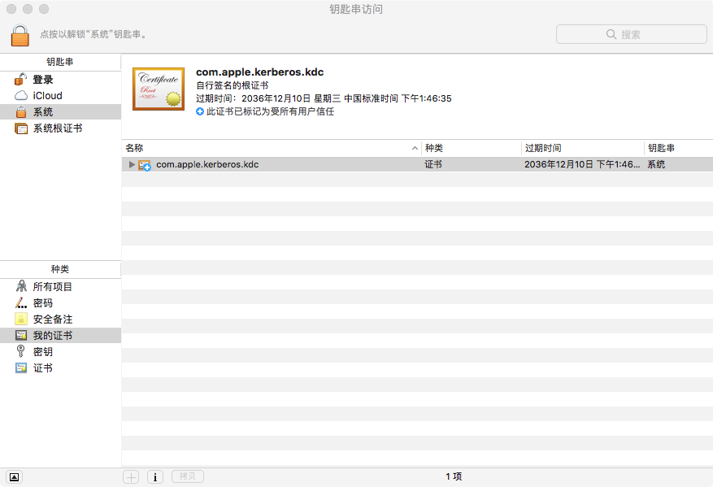
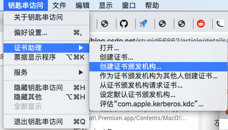
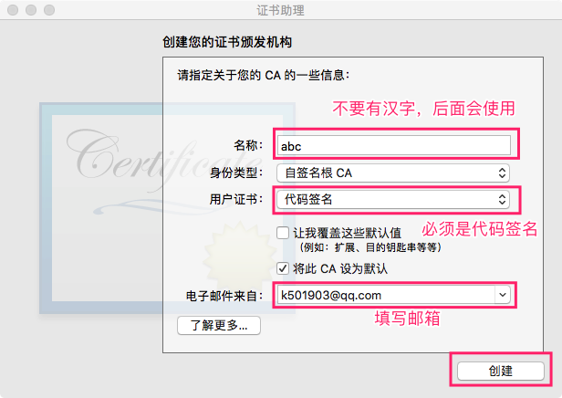
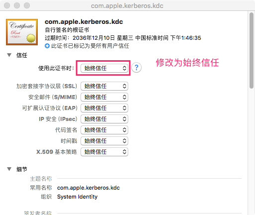
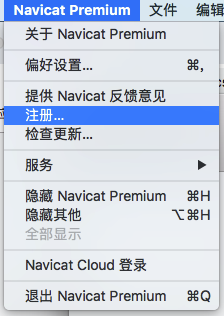
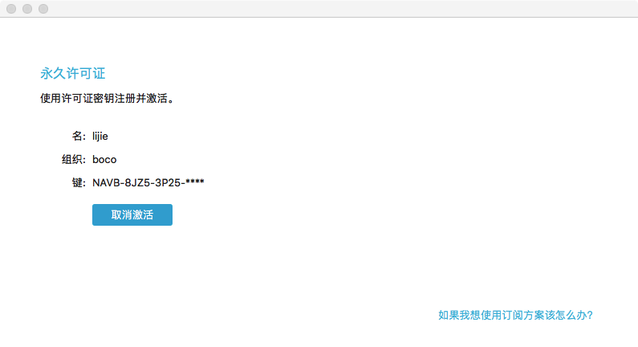

# 编译破解程序

## 下载

可以直接从`Github`上下载`mac`分支到本地

```bash
git clone -b mac https://github.com/DoubleLabyrinth/navicat-keygen.git
```

## 解压缩

已经将破解程序下载到了本地，解压缩即可使用

# 安装依赖

```bash
brew install openssl 
brew install rapidjson 
brew install capstone 
brew install keystone 
```

对于`Macos`来说，一般情况下已经安装好了，可以使用下面的命令查看

```bash
brew list
```

# 编译

```bash
cd navicat-keygen    // 这个目录下有 Makefile 文件 不要进错了
make all
```

编译成功后，在`bin`目录下有两个文件

```bash
navicat-keygen    navicat-patcher
```

# 破解

## 执行命令

```bash
./navicat-patcher   /Applications/Navicat\ Premium.app/Contents/MacOS/Navicat\ Premium
```

## 生成代码签名证书

### 打开钥匙串应用



### 创建证书

从如下图所示的入口，进入证书创建页面



按照图中的提示，输入证书信息，点击“创建”按钮创建



在“我的证书”中，双击打开证书，在“信任”中选择“始终信任”



## 替换签名文件

```bash
# CA_CODE 即为证书名称，本例中为"abc"
codesign -f -s "CA_CODE" /Applications/Navicat\ Premium.app/Contents/MacOS/Navicat\ Premium
```

## 生成激活码

### 运行如下命令

```bash
./navicat-keygen RegPrivateKey.pem 
```

### 按照提示输入

```bash
Which is your Navicat Premium language?
0. English
1. Simplified Chinese
2. Traditional Chinese
3. Japanese
4. Polish
5. Spanish
6. French
7. German
8. Korean
9. Russian
10. Portuguese

(Input index)> 1 # 输入1 表示 简体中文
(Input major version number, range: 0 ~ 15, default: 12)> 12 # 输入Navicat的版本号

Serial number:
NAVB-8JZ5-3P25-EESR  # 生成的注册码

Your name: lijie # 输入用户名
Your organization: boco # 输入所属单位

Input request code (in Base64), input empty line to end: # 等待Navicate应用中的“请求码”
```

### 打开注册界面

**注意：要先断网再打开应用程序。只有这样才会出现手动激活按钮**

从如图所示入口，打开注册界面



进入注册页面，输入上面生成的注册码“NAVB-8JZ5-3P25-EESR”，点击“激活”

由于断网，因此进入了“手动激活”模式，应用程序自动生成“请求码”

### 生成激活码

将“请求码”复制到"终端"中，连续两个回车

```shell
Input request code (in Base64), input empty line to end:
QEqRbtVfUcCCpu2yesnoZ6DJawjE2OhWhCQPre6k7ujZmfbnvkSdgooqi3i89EzIq9Q6rF/bNJhymeIyiMS7pSz064W5TYWLpsbm56REtRR0jYNJJxD6vPx5Ge+Rf4AKYZf4KElodRrPgKXi53TxWq5DLxfCPHjFQ1FX95F7rTNvrqGCtvGWtReY5pUe36JrCCxHWeBtJhx8+UBkFPCCu7JZurvDmi3w8qWSRjNDoNypclc0S3inYZm40pLe1vPxm7rg1I2RrjeGRnAM0bUp8xxEQRtCudohKJfBqjS9KKyDSn9xl91wfilqOn2Ey0HBhpjgN522tp9ilvDs4LYtZg==

Request Info:
{"K":"NAVB8JZ53P25EESR", "DI":"YzIzODhkNGQwMWRiNmMy", "P":"MAC"}

Response Info:
{"K":"NAVB8JZ53P25EESR","DI":"YzIzODhkNGQwMWRiNmMy","N":"lijie","O":"boco","T":1563162851}

License: # 这里就是生成的激活码，复制到注册界面中即可
XTkXDNnWEcwyRXcM0OLIF1r0t/APG0Yn+bycyf9UM5GuLz903OVEstixnVl5PlwhlAL/lwlAb0+MO30QKsW8DLo8/wBhCEdTW6P0VCLfQfBQV7NFkeoYWvrYb5SbyFyGW3y16m9ZQ/5jELU6Vck+62h63TUC40gBeaN91ddJt+E8JyWqX3GcKZfq0HtiUVklCnbJJccc9ihMAKWwK6cVXe+gcNBqJQ1XIo8/xDu7QA4ugdDmPYv/xi0CHuJSpRupoQLoPaMzqx2bzCm0U9gOUetmhyyT2zXtCbv1jSslmZTeUcaff822UDsO+ZCf61/cc94l9mkM1hZpqcL3RXShaQ==
```

### 激活应用

将“激活码”复制到“手动激活”界面中，即可激活



