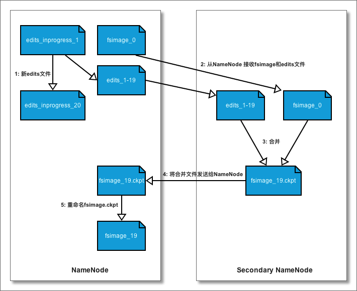

# 概述

## 原因

分布式文件系统（Hadoop Distributed File System）出现的原因：

1. 大容量专用存储设备（如：SAN）价格昂贵，用普通计算机硬盘取代可以降低成本
2. 大型数据集（如：PB级）超过硬盘的存储能力，只能将数据集分块存储到不同的硬盘中
3. 网络资源有限、昂贵，尽量减少网络传输大量的数据

## 挑战

分布式文件系统相对于本地文件系统，在保证数据的一致性、容错性和访问性能方面有很多挑战：

1. 文件分块存储在多台计算机上，文件管理和网络编程的复杂度增加
2. 文件系统要有一定的容错性，对于商用硬件来说发生的概率会较高
3. 避免磁盘空间碎片化，合理控制单位数据的存储成本

## 特点

1. 能够运行在廉价机器上，具备高容错性
2. 流式数据访问，一次写入、多次读取效率最高
3. 面向大规模数据集，能够进行批处理、能够横向扩展
4. 简单一致性模型

## 缺点

1. 不支持低延迟数据访问（如：毫秒级）
2. 不适合大量小文件存储（元数据占用空间）
3. 不支持并发写入，一个文件只能有一个写入者
4. 不支持文件随机修改，仅支持追加写入

# 架构

HDFS采用Master/Slave（主从）的架构来存储数据，默认情况下，这种架构由四个部分组成：

1. HDFS Client

   客户端节点，提供类似POSIX的文件访问接口供用户调用

2. NameNode

   Master节点，负责管理文件系统的命名空间（Namespace）、接受Client对文件的访问。一个集群只有一个

3. DataNode

   Slave节点，负责管理所在节点中的文件存储，定期向NameNode上报状态并接受Client的读写操作

4. Secondary NameNode

   NameNode的助理，负责定期将NameNode中的edits日志合并到fsimage中，分担NameNode的处理压力


## Client

为访问HDFS文件系统，提供了用户接口，包括POSIX、JAVA、HTTP REST API、FUSE等

Client与NameNode和DataNode进行通讯，完成对HDFS文件系统的访问，这些过程封装在接口内，对用户透明

## NameNode

架构中的Master节点，负责管理文件系统的命名空间（Namespace），但不存储文件数据，接受Client节点对文件的访问请求

命名空间是一颗文件系统树，树中的节点由元数据组成（具体细节后面介绍）。元数据是关键信息，为防止数据丢失，将其保存在本地文件系统中（注意：不是HDFS中）

- fsimage，内存中文件系统树的镜像
- edits日志文件，保存文件系统的变化，由多个文件组成

节点启动时，将文件系统树（fsimage和edits文件）加载到内存中，因此对内存需求较高

与所有种类的节点进行数据交互：

- 接收Client的文件访问请求，创建新的元数据、返回元数据
- 接收Secondary NameNode对fsimage和edits文件的请求并更新本地文件
- 接收DataNode的心跳和块报告，监控DataNode节点的运行状态并重建数据块与元数据的映射关系

## DataNode

架构中的Slave节点，负责存储HDFS中的文件数据

HDFS中文件是分块存储的，DataNode节点负责管理分块ID与分块文件间的映射关系

定期向NameNode节点汇报，向其他DataNode节点复制数据块副本

与其他节点的数据交互：

- 接受Client节点的读写请求并将数据发送给Client
- 定期向NameNode节点发送心跳，上报节点的块报告
- 向其他DataNode节点复制数据块副本

## Secondary NameNode

相当于NameNode的秘书角色，负责将edits日志中文件系统树的变动同步到fsimage文件中。

因为fsimage文件非常大，而将edits日志的内容合并到fsimage文件的操作会消耗大量CPU和内存，如果由NameNode节点处理，会影响其处理性能。

只与NameNode节点进行交互：

- 定期（小时级）从NameNode节点获得fsimage文件和edits日志文件
- 在本地将edits文件合并到fsimage文件中
- 将fsimage文件发送给NameNode节点

# 原理

## 数据块

1. **block**

   block在HDFS中称为数据块，是文件存储和处理基本单位

   在HDFS中客户端会将文件按块大小（默认：128M、可调）分割，分割后的数据块存储在各DataNode节点中

   块大小的设置取决于两个因素：

   - 寻址时间在整块读写中的占比。因为寻址时间是固定的，而读写时间与数据量成正比。如果块太小，则分块多、总寻址时间长，造成读写效率不高
   - 分块数量与Map任务数量的比例。Hadoop中每个map任务对应一个数据块，如果块太大，则分块少，map任务就少，任务执行速度变慢

2. **packet**

   是HDFS中数据传输的基本单位，默认为64K

3. **chunk**

   是HDFS中数据校验的基本单位，默认516Byte，其中数据512Byte、校验4Byte

4. 三者的关系

   - 文件在客户端被分割成block
   - 客户端向DataNode传输数据时，以512Byte为单位，生成一个chunk
   - 将chunk写入packet，到达64K后，将packet放入队列中
   - 将packet从队列中取出，发送给DataNode
   - DataNode接收并校验后，存储packet并返回ack
   - DataNode将packet发送给PipeLine中存储副本的DataNode

## 命名空间

HDFS的命名空间（Namespace）由NameNode节点负责管理，它是整个HDFS的核心，记录着文件与block、block与DataNode的对应关系

NameNode在启动时，将整颗文件系统树（fsimage和edits）加载到内存中，因此该节点对内存容量要求很高

考虑到命名空间的频繁更新（增、删、改）和持久化保存，将命名空间存储在NameNode的本地文件系统中，由两类文件组成，分别为：fsimage（多个）和editLog（多个）

- fsimage用于维护文件系统树，以及文件树中所有的文件和文件夹的元数据
- edits日志记录了对文件的增、删、改等操作

在 HDFS 启动时，会进行一次检查点操作，将最新的 fsimage 载入内存，并将之后的 edits 文件中的事务逐一执行，并生成新的 fsimage.ckpt 文件，最后重命名为 fsimage 文件

### NameNode中的目录结构

在NameNode中存储命名空间的序列化文件，由一组文件（含fsimage和edits）组成，具体如下所示：

```shell
${dfs.namenode.name.dir}
|---- current
|    |---- VERSION
|    |---- seen_txid
|    |---- fsimage_0000000000000000000
|    |---- fsimage_0000000000000000000.md5
|    |---- fsimage_0000000000000000015
|    |---- fsimage_0000000000000000015.md5
|    |---- edits_0000000000000000001-0000000000000000002
|    |---- edits_0000000000000000003-0000000000000000015
|    |---- edits_inprogress_0000000000000000016
|---- in_use.lock
```

详细介绍目录中的文件功能

1. {dfs.namenode.name.dir} 目录

   在配置文件中设置的namenode中保存命名空间的目录

2. current目录

   保存当前使用的命名空间存储目录

3. VERSION文件

   保存正在运行的HDFS的版本信息 

   ```shell
     #Fri Dec 06 22:05:27 CST 2019
     namespaceID=2082678695
     clusterID=CID-0dcd19b9-45f8-4db2-8083-804f35c1c7fe
     cTime=1575302191346
     storageType=NAME_NODE
     blockpoolID=BP-1471388629-192.168.8.100-1575302191346
     layoutVersion=-63
   ```

   - namespaceID

     命名空间的唯一标识符，在namenode首次初始化`hdfs namenode --format`时创建。每个namenode唯一对应一个标识符

   - clusterID

     集群的唯一标识符，对于联邦HDFS非常重要

   - blockpoolID

     数据池块的唯一标识符，包含了由一个namenode管理的命名空间中的所有文件

   - cTime

     标记namenode存储系统的创建时间

   - storageType

     说明存储目录中包含的是namenode的数据结构

   - layoutVersion

     布局版本，是一个负数。布局变更后版本号会递减

4. fsimage_* 文件

   文件系统镜像文件，由多个文件组成。每个文件名中的数字部分表示文件中的最后一个事务编码（如15）

   secondarynamenode会定期生成检查点文件来帮助namenode更新 fsimage

   - 保存的是文件系统中的目录和文件的`inode`序列化信息
   - 文件`inode`：复本级别、修改时间、访问时间、访问许可、块大小、组成一个文件的块等
   - 目录`inode`：修改时间、访问许可、配额元数据等

   注意：在 fsimage 文件中，不保存数据块和datanode的映射关系。namenode将这部分信息放在内存中，由namenode向datanode索取

   **fsimage 文件只保存最后两个**

5. edits_* 文件

   客户端执行写操作时（创建、移动、删除等），这些事务首先被记录到编辑日志中。

   每个编辑日志文件称为一个段，文件名由 `edits` 及后缀组成，后缀指示出包含事务ID信息。例如：`edits_0000000000000000001-0000000000000000002`，表示该编辑日志包含事务ID1--ID2

   任意时刻只有一个编辑日志文件处于可写入状态，命名为：`edits_inprogress_0000000000000000016`

6. seen_txid 文件

   保存当前处于可写入状态的编辑日志的起始事务ID

7. in_use.lock 文件

   保存当前进行写操作的 `namenode` 进程id，使用`jps`指令可以查看

## 数据块存储

数据块存储在 DataNode 中，具体的存储结构和文件说明如下：

```shell
$ {dfs.datanode.data.dir}/
|---- current/
|    |---- BP-1471388629-192.168.8.100-1575302191346/
|    |    |---- current
```


## 读流程


1. client向HDFS文件系统请求读取文件（文件类型和文件目录）
2. HDFS文件系统通过RPC调用向NameNode获取文件块位置信息（块ID、每个块存储的DataNode列表）
3. client向FSDataInputStream读取文件（文件目录和块信息）
4. FSDataInputStream根据块和DataNode的对应关系，读取第一个块
5. 依次读取每个块，同一时间只有一个块，将读取的数据块追加到本地文件结尾
6. 全部文件块读写完成后，关闭文件

### 问题

1. DataNode的状态是不稳定的，可能存在失效的情况。对于DataNode与块ID的映射，是在何时完成的？
   - 写入一个块时，由NameNode分配？
   - 写入块的DataNode向NameNode上报的？
2. 读取操作是分别读取文件的每个块，这个操作是串行还是并行的？
   - 从资料上看，是串行的，也就是同时只有一个块的读操作，一个完成后再读下一块
   - 可是这样的化，读的性能是不是不高呢？
3. 客户端从NameNode得到文件块信息，是一次获取所有的，然后交由客户端自己去管理，还是一次只获取一个块，读取完成后再从NameNode获取下一块，如果是后者，只能是串行读取

## 写流程


1. client向HDFS文件系统请求创建文件（文件类型和文件目录）
2. HDFS文件系统通过RPC调用向NameNode请求创建文件
   - NameNode检查文件是否已存在、文件权限
   - 通过后将创建文件的操作写入edits日志
   - 分配可写入的DataNode列表（按距离排序）
3. client将文件进行分块（默认128M），开启输出文件流
4. 将block分割成packet，发送给DataNode
   - 根据重复数（默认3），将DataNode组成一个PipeLine
   - 将packet发送给第一个DataNode，第一个再发送给下一个
5. pipeline中的DataNode依次返回ack packet
   - 最后一个DataNode向前返回ack packet
   - 依次向前发送并将ack packet返回给client
6. 所有写操作完成后，client关闭文件操作
7. client通知NameNode创建完成

### 问题

1. 一个由多个块组成的文件（大于分块尺寸），每个块写在一个DataNode中，还是每次写在不同的块中（不是复制节点，而是第一个DataNode节点）
2. 每个块写入的DataNode是由谁指定的？NameNode还是客户端？
3. 如果在PipeLine中的某个DataNode节点失效，本次写操作是否是成功的？后续是由NameNode通知某个保存块的DataNode节点发送给另一个块，还是由DataNode自行决定？按照主从结构来说，管理权应该在NameNode，所以说分配的任务应该是NameNode负责

## 拓扑距离

NameNode在决定由哪几个DataNode来保存数据块时，需要兼顾带宽和容错。带宽是稀缺资源，必须节省网络传输量；容错是分布式存储的核心，必须尽可能避免硬件故障导致的数据失效


为了简化计算，Hadoop采用了拓扑距离的方式：**把网络看成一棵树，两个节点间的距离是它们到最近共同祖先的距离的综合**。并根据实际场景（数据中心、机架、节点）进行了量化定义：

- d=0，同一节点上的进程
- d=2，同一机架上的进程
- d=4，同一数据中心的进程
- d=6，不同数据中心的进程

可以看出这样大大简化计算的复杂度，又兼顾了网络带宽的实际情况

## 副本存放

副本存放需要在可靠性、写入带宽和读取带宽间进行权衡

HDFS默认布局策略如下（默认是3个副本）：

1. 在运行客户端的节点存放第1个副本。若客户端在集群之外，就随机选择一个（避免存储太满或太忙）
2. 在离架上的随机节点存放第2个副本。不是同一个机架上的节点
3. 与第2个副本同架的另外随机节点存放第3个副本。与第2个副本统一机架但不同节点
4. 更多的副本将在集群中随机选择节点，但避免在同一机架上存放过多副本

一旦选择好副本的存放位置，就根据网络拓扑创建一个管线（PipeLine）


## 完整性

分布式存储要解决的主要问题就是数据的完整性，毕竟数据分块存储在不同的DataNode中。在分布式存储中，数据的完整性包括：数据传输的完整性和数据存储的完整性

### 校验和

HDFS使用校验和（CRC-32）的方式，对每个chunk进行数据校验

### 传输完整性

需要解决在数据传输过程中，因网络抖动导致的数据错误

1. 写操作校验

   客户端对每个chunk（默认512Byte）进行一次校验和（4Byte），pipeline中的最后一个DataNode接收到数据后，对数据进行校验，失效返回校验错误异常

2. 读操作校验

   客户端对每个chunk进行一次校验和，再对DataNode存储的对应chunk的校验和进行二次校验

### 存储完整性

需要解决存储在DataNode中的数据失效（硬件故障、覆盖、位衰减等）

启动后台进程，定期对每个块进行。如果发现数据块失效，则通知NameNode该块失效。NameNode将记录该失效数据块以禁止从其复制副本，并通知保存有该块的DataNode向其他DataNode复制副本，然后删除该DataNode中的数据块

### 校验日志

每次对块进行校验后（读、定期检查），更新校验日志记录校验时间

### 问题

1. 校验和存储在哪里呢？
   - 块文件中
   - 单独的文件中，每个chunk的校验和
2. 读取时校验的流程？
   - 客户端校验？还是DataNode校验？
   - 如果存储的是每个chunk的校验和，那这个过程就会非常耗时
   - 客户端接收chunk后，校验其中数据和校验和，再校验校验和与DataNode中存储校验和，是分两步吗？
3. DataNode中的后台校验进程如何校验？
   - 整块校验？还是每个chunk校验

## 检查点

为了防止因NameNode故障导致关键数据丢失，在架构中由Secondary NameNode负责备份和维护命名空间，称为检查点



### 处理步骤

1. Secondary NameNode 请求 namenode 停止使用正在进行中的 edits 文件。新的编辑操作记录在新的文件中，namenode同时更新所有存储目录中的 seen_txid 文件
2. Secondary NameNode从NameNode获得最近的 fsimage 和 edits 文件（HTTP GET）
3. Secondary NameNode 将 fsimage 文件载入内存，逐一执行 edits 文件中的事务，创建合并后的 fsimage.ckpt 文件
4. Secondary NameNode 将创建的 fsimage.ckpt 文件发送给NameNode（HTTP PUT）
5. NameNode将 fsimage.ckpt 文件重命名

### 配置参数

创建检查点的触发条件受两个配置参数控制

1. 间隔一定时间创建检查点

   参数：dfs.namenode.checkpoint.period 即间隔时间。单位：秒，默认1小时

2. 编辑日志事务数量达到上限

   参数：dfs.namenode.checkpoint.txns 即事务数量。默认100万

   参数：dfs.namenode.checkpoint.check.period 即检查日志事务数量的间隔时间。单位：秒，默认1分钟

# 联邦架构

单个NameNode管理命名空间，存在以下问题：

1. 管理文件数量有限。NameNode需要将全部命名空间加载在内存中处理以提高效率。单节点内存容量的上限，制约了可管理文件的数量
2. 单点故障。虽然有Secondary NameNode对命名空间进行备份，但受限于备份策略，一定会丢失文件信息
3. 处理性能。单NameNode的并发处理性能是有限的，必将制约客户端和DataNode的响应性能

为了解决上述问题，就需要实现NameNode的水平扩展。称为“联邦架构”（Federation）


1. 实现了NameNode节点的水平扩展，组成一个联邦命名空间
2. 每个NameNode独立工作，管理自己的命名空间和块池，相互之间不协调
3. 所有NameNode会共享底层的DataNode存储资源，DataNode向所有NameNode汇报
4. 同属于一个联邦的命名空间的块，组成一个块池
5. 每个NameNode都有一个独立的Secondary NameNode负责备份

通过使用联邦结构解决了HDFS的如下问题：

1. HDFS集群扩展性。多个NameNode各自分管一部分目录，使得一个集群可以扩展到更多节点，不再像HDFS1.0中那样由于内存的限制制约文件存储数目
2. 性能更高效。多个NameNode管理不同的数据，且同时对外提供服务，将为用户提供更高的读写吞吐率
3. 良好的隔离性。用户可根据需要将不同业务数据交由不同NameNode管理，这样不同业务之间影响很小

# 高可用架构

虽然联邦架构实现了水平扩展，提高了HDFS集群的处理性能，但对于单点故障导致的高可用问题，依旧没有解决


  ```

  ```