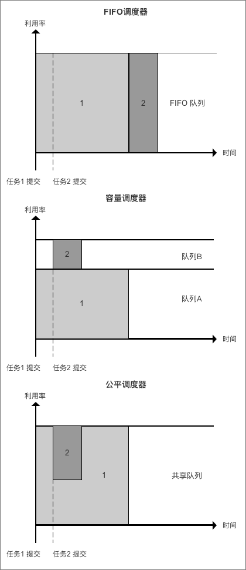

# 概述

YARN（Yet Another Resource Negotiator）是Hadoop的集群资源管理系统。在Hadoop2.x被引入，以改善MapReduce实现，因具有足够的通用性，可以支持其他的分布式计算模式。

Hadoop1.x仅支持MapReduce计算框架，而且MapReduce还负责完成资源调配和管理作业运行


Hadoop1.x负责资源管理和作业管理，由两个后台进程负责：

1. JobTracker
2. TaskTracker

Hadoop1.x的不足主要有以下几点：

1. 可伸缩性

   极限是：集群中的节点5000个，同时工作的任务数40000个

   通常情况下，只能创建小的、功能差的集群

2. 资源利用

   每个计算节点被管理员分配固定数量的map和reduce slots，而且这些slots不能相互替代。就会出现某个节点map slots都被使用，而reduce slots空闲，但不能分配更多的map slots的情况，资源的利用效率不高

3. 工作负载支持

   仅支持MapReduce作业

基于以上原因，在Hadoop2.x中引入了YARN，将集群的资源管理和作业调度独立出来


YARN的架构由五个组成部分：

1. Client

2. ResourceManager（核心服务）

   一个资源管理器，负责集群中的资源管理

3. NodeManager（核心服务）

   集群中的所有节点，负责启动和监控容器

4. ApplicationMaster

   一个应用对应一个，可以是简单的一个MapReduce作业，也可以申请资源进行分布式运算

5. Container

   执行特定应用程序的容器，有资源限制（CPU、内存等）。Application Master（RM分配给应用的第一个Container）和MapReduce作业均运行在Container中

MapReduce和YARN在组成上的比较

| MapReduce1  | YARN                                                 |
| ----------- | ---------------------------------------------------- |
| Jobtracker  | Resouce Manager、Application Master、timeline server |
| Tasktracker | Node Manager                                         |
| slot        | Container                                            |

# 机制

YARN应用程序的执行流程如下


1. Client向RM提交应用，包括AM程序及启动AM的命令
2. RM为AM分配第一个容器，并与对应的NM通信，令其在容器上启动应用的AM
3. AM启动时向RM注册，允许Client向RM获取AM信息然后直接和AM通信
4. AM通过资源请求协议，为应用协商容器资源
5. 如容器分配成功，AM要求NM在容器中启动应用，应用启动后可以和AM独立通信
6. 应用程序在容器中执行，并向AM汇报
7. 在应用执行期间，Client和AM通信获取应用状态
8. 应用执行完成，AM向RM注销并关闭，释放资源

YARN本身不会为应用的个部分（Client、Master和进程）彼此间通信提供任何手段

## 问题

1. 申请多少个Container，以及每个Container的资源（CPU和内存）是谁控制的RM还是NM。
2. 申请资源的总量，是否是Application Master负责计算？他向RM申请时，是提供一个总的资源总和，还是拆分为多个资源请求？

## 资源请求

YARN有一个灵活的资源请求模型，请求多个容器时，可以指定每个容器需要的计算资源（CPU和内存）以及对容器的本地限制要求。

### 本地限制

确保分布式数据处理高效使用集群带宽，通常会将容器分配给存储HDFS数据块的节点。

1. 向存储HDFS数据块三个复本的节点申请容器资源
2. 向存储复本节点机架中的某个节点申请容器资源
3. 向集群中的任何一个节点申请容器资源

### 申请方式

YARN应用可以在运行中的任意时刻提出资源申请

1. 开始时提出所有资源请求，例如：Spark
2. 分阶段提出资源请求，例如：MapReduce

## 应用生命期

不解

# 调度

YARN的调度器会根据既定策略为应用分配资源，提供多种调度策略供用户选择

## 调度器差异



## 先进先出调度器（FIFO）

### 特点

1. 所有用户共享执行队列，不适合共享集群
2. 按照顺序（先进先出）运行队列中的应用
3. 当没有可用资源时，后续任务需要等待资源空闲
4. 应用不区分优先级，小任务或时效高的任务不适合

## 容量调度器（Capacity）

### 特点

1. 设置多个队列，为每个队列分配固定比例的资源
2. 小作业和时效高的作业可用独占一个队列
3. 牺牲一定的资源利用率，换取任务抢占和优先级
4. 大作业执行时间较FIFO调度器要长

### 原理

1. 设置层次结构的多个队列，每个队列内使用FIFO调度策略
2. 不同组织或用户使用不同的队列
3. 为每个队列设置可用资源，做到队列兼顾
4. 为了提升资源利用率，设置队列最大可用资源（超过容量），当某队列达到容量上限，而总的资源有空闲（其它队列）时，可以为其分配空余资源，称为“弹性队列”

### 配置

以一个队列层次为例进行说明

```bash
root
|---prod
|---dev
		|---eng
		|---science
```

配置文件如下（文件名：`capacity-scheduler.xml`）

```xml
<?xml version="1.0"?>
<configuration>
	<property>
    //根队列下有两个子队列
  	<name>yarn.scheduler.capacity.root.queues</name>
    <value>prod,dev</value>
  </property>
  <property>
    //dev队列下有两个子队列
  	<name>yarn.scheduler.capacity.root.dev.queues</name>
    <value>eng,science</value>
  </property>
  <property>
    // prod队列分配40%容量
  	<name>yarn.scheduler.capacity.root.prod.capacity</name>
    <value>40</value>
  </property>
  <property>
    // dev队列分配60%容量
  	<name>yarn.scheduler.capacity.root.dev.capacity</name>
    <value>60</value>
  </property>
  <property>
    // dev队列最大容量75%
  	<name>yarn.scheduler.capacity.root.dev.maximum-capacity</name>
    <value>75</value>
  </property>
  <property>
  	<name>yarn.scheduler.capacity.root.dev.eng.capacity</name>
    <value>50</value>
  </property>
  <property>
  	<name>yarn.scheduler.capacity.root.dev.science.capacity</name>
    <value>50</value>
  </property>  
</configuration>
```

注意：

1. 同级队列容量的和必须是100%

## 公平调度器（Fair）

### 特点

1. 即保证了资源利用率，又保证小作业能及时完成
2. 任务共享队列，可以跨队列平衡
3. 在所有运行的作业间动态平衡资源，需要等待作业容器执行完毕
4. 每个作业都能公平共享资源（一个就100%，两个就各50%...）

### 原理

资源在用户间实现了公平共享


1. 队列A中提交任务1，队列B中没有任务，这时任务1占用全部资源（队列B+队列B）
2. 队列B中提交任务2，这时就会为任务2分配一半资源，不过需要等待任务1释放部分资源
3. 任务1和2都在执行中，此时队列B提交任务3，这时就会将队列B中的资源分配一半给任务3
4. 这时，队列A中的任务1占用50%资源，队列B中的任务2和任务3占有25%的资源
5. 当任务2执行完毕后，任务3得到了50%的资源

### 配置

1. 启用公平调度器

   在Hadoop中默认采用容量调度器，需要设置配置文件（yarn-site.xml）启用公平调度器

2. 队列配置

   - 可以为每个队列设置不同的调度策略
   - 可以为每个队列设置资源占用比例（或权重）

3. 队列放置

   - 使用一个基于规则的系统来确定应用放到哪个队列中
   - `specified`：用户指明队列时
   - `user`：以用户名命名的队列
   - `primaryGroup`：以用户的主Unix组名命名的队列
   - `default`：兜底规则，指明队列名

4. 抢占

   - 允许调度器终止那些占用资源超过了其公平共享份额的队列的容器

   - 抢占会降低整个集群的效率

## 延迟调度

所有的YARN调度器都试图以本地请求为重。一般情况下，当本地没有空闲资源时，就需要放宽本地性限制，在其他节点分配资源启动容器

这时，如果等待一段时间（几秒），就会增加请求节点（本地性）分配到容器的机会，保证集群效率。

我们将这种等待一段时间的调度策略为“延迟调度”。容量调度器和公平调度器都支持延迟调度

### 原理

1. 节点管理器（NM）周期性的（默认1秒）向资源管理器发送心跳请求，包括：正在运行的容器、可用资源等信息
2. 资源管理器收到的心跳请求，就是调度机会，调度器会根据资源信息为应用调度容器
3. 当使用延迟调度时，调度器不会简单的使用第一个调度机会（心跳），而是等待设定的最大数据的调度机会发生，然后才会放松本地性限制并接收下一个调度机会

## 主导资源公平性

当多种类型资源需要调度时，调度的复杂度会增加。例如：一个应用对CPU需求量很大但对内存需求很少；另一个应用对内存需求量很大但对CPU需求很少，这时就采用主导资源公平性原则进行调度（Dominant Resouce Fairness，DRF）

### 原理

观察每个应用的**主导资源**，并将其作为对集群资源使用的**度量**

1. 集群资源

   举例：100个CPU，10TB内存

2. 主导资源

   如何确定每个应用的主导资源？

   举例如下：

   - 应用A：每份容器，2CPU、300GB内存

   - 应用B：每份容器，6CPU、100GB内存

   应用A：CPU资源占比2%，内存占比3%，则内存为主导资源，度量值为3%

   应用B：CPU资源占比6%，内存占比1%，则CPU为主导资源，度量值为6%

3. 调度度量

   从上面的计算可知：应用B的度量值为6%，应用A的度量值为3%

   由于应用B请求的资源是应用A的两倍，因此为应用B分配50%的容器，为应用A分配25%的容器


