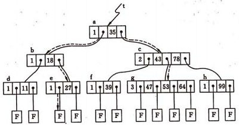

# 基础

## ACID

> 事务管理的原则

### Atomicity

原子性。事务是不可分割的整体，要么都发生，要么都不发生

### Contistency

一致性。事务前后数据的完整性必须保持一致

### Isolation

隔离性。多个用户并发访问时，每个用户都分配独立的事务，且并发的事务间是隔离的

#### 脏读

一个事务读取了另一个事务未提交的数据

#### 不可重复读

在一个事务内读取表中的某一行数据，多次读取结果不同

#### 虚读(幻读)

在一个事务内读取到了别的事务插入的数据，导致前后读取不一致(一般是行影响，多了一行)

#### 数据库设置有四个选项

- Serializable(串行化)。可避免脏读、不可重复读、虚读情况的发生
- Repeatable Read(可重复度)。可避免脏读、不可重复读情况的发生。**默认值**
- Read Committed(读已提交)。可避免脏读情况发生
- Read UnCommitted(读未提交)。最低级别，以上情况均无法保证

#### 举例

> 表结构如下：
>
> CREATE TABLE `AMOUNT` (`id`  varchar(10) NULL,`money`  numeric NULL);

```mysql
### 演示脏读
# 用户A 开启一个事务，但未提交
start transaction;
insert into amount(id, money) values ('A', 800);

# 用户B
# 设置隔离模式为最低的"读未提交"
set session transaction isolation level read uncommitted;
select * from amount;
# 可以看到未提交的事务中的数据，这些就是脏数据
+------+-------+
| id   | money |
+------+-------+
| A    |   800 |
+------+-------+

```

```mysql
### 演示如何避免脏读
# 用户A 开启一个事务，但未提交
start transaction;
insert into amount(id, money) values ('A', 800);

# 用户B
# 设置隔离模式为"读已提交"，或者除"read uncommitted"外的任意
set session transaction isolation level read committed;
select * from amount;
# 输出为空，因为用户A没有提交
Empty set (0.01 sec)

```

```mysql
### 演示重复读
# 用户A 开启了一个事务
start transaction;
select * from amount;
# 当前数据库中的数据为
+------+-------+
| id   | money |
+------+-------+
| A    |   800 |
| B    |   700 |
+------+-------+
# 用户B 开启了一个事务，更新了其中的一条记录B = 800，并提交了数据
start transaction;
update amount set money = money + 100 where id = 'B';
commit;
# 用户A 再次查询表中的数据显示
select * from amount;
+------+-------+
| id   | money |
+------+-------+
| A    |   800 |
| B    |   800 |
+------+-------+
# 结果表明，用户B提交的数据，在用户A的事务中被重复读取了(数据发生了变化)

```

````mysql
### 演示避免重复读

# 用户A设置隔离模式为"重复读"
set session transaction isolation level repeatable read;
# 用户A开启一个新事务
# 查询当前表中的数据
start transaction;
select * from amount;
# 显示有两笔记录
+------+-------+
| A    |   800 |
| B    |   700 |
+------+-------+

# 用户B 开启了一个事务，更新了其中的一条记录B = 800，并提交了数据
start transaction;
update amount set money = money + 100 where id = 'B';
commit;

# 用户A 再次查询表中的数据显示
select * from amount;
# 由于隔离级别，避免了在一个事务中查询到了其他用户修改的数据
+------+-------+
| id   | money |
+------+-------+
| A    |   800 |
| B    |   700 |
+------+-------+

````


### Durability

持久性。事务一旦被提交，数据改变是永久性的。

### 问题

还是没有搞懂`serializable`适用的情况，也没有看到实际的例子

## B树

> Balance-tree 平衡多路查找树
>
> - 平衡。左边和右边分布均匀
> - 多路。父节点有多个子节点（二叉树只有两个节点）

### 知识点

#### 阶

遍历整棵树，子节点最多的个数就是树的阶。例如：一颗树最多有4个子节点，称为4阶树

#### 度

树的高度或层数，称为度。

### 用途

**显著减少定位**定位记录时所经历的中间**过程**，加快存取速度。一般用于**数据库的索引**。

### 定义

- 对于N阶树来说，每个节点最多有N颗子树
- 根节点至少有2颗子树
- 非叶子节点(除根节点)至少有P个子节点，N/2 <= P <= N
- 所有非叶子节点中包含以下数据（n，A0，K1，A1，K2，…，An）
  - `Ki`为关键码，是真实数据，存放在线性表当中，从左向右升序排列
  - `Ai`为指向子树的指针，且`Ai-1`指向子树中的所有节点的关键码均小于`Ki`
  - `n`为关键码的个数，N/2 - 1 <= n <= N - 1
- 所有的叶子节点都出现在同一层次上。

### 查找

类似于二叉排序树的查找，每个节点有多关键码的有序表。到达某个节点时，先在有序表中查找。没有按照排序的指针信息查找子树，直到遍历到叶子节点为止。

举例：从如下B-树中查找关键码`47`



注释：

1. A节点（根节点）。`n=1, K1=35`，节点只有1个关键码
2. C节点（非叶子节点）。`n=2, K1=43, K2=78`，节点有2个关键码，从左到右顺序为43、78

顺序：

1. 从根节点A开始。A节点中只有一个关键码`35`，且目标值`47` > `35`，若存在必在指针A1所指的子树中
2. 顺指针找到C节点。该节点有两个关键码（43、78），43 < 47 < 78，若存在必在指针A1所指的子树中
3. 顺指针找到G节点。该节点找到关键码`47`，查找成功

## DAG

> 有向无环图（Directed Acyclic Graph）
>
> - 有向：有方向，且统一方向
> - 无环：构不成闭环

### 定义

- 是一种常用的数据结构
- 具有独特的拓扑结构
- 多条链跟随主链，这些链之间大方向相同且不存在环路

### 用途

- 动态规划
- 导航中寻求最短路径
- 数据压缩

### 图

#### 定义

由一组**顶点**和一组能够将两个顶点相连的**边**组成。主要包括：

- 无向图。节点的简单连接
- 有向图。连接有方向
- 加权图。连接带有权值
- 加权有向图。连接即有方向性，又带有权值

#### 术语

- 顶点。图中的一个点
- 边。连接两个顶点的线段
- 相邻的。一个边的两头的顶点称为相邻的顶点
- 度数。由一个顶点出发，有**几条边**就称该顶点有几度
- 路径。通过边来连接，按顺序的从一个顶点到另一个顶点中间经过的**顶点集合**
- 简单路径。没有重复顶点的路径
- 环。至少含有一条边，且起点和终点都是同一个顶点的**路径**
- 简单环。不含重复顶点和边的环
- 连通的。当从一个顶点出发可以通过至少一条边到达另一个顶点，两个顶点相通
- 连通图。如果一个图中，从任意顶点均存在一条边可以**到达另一个任意顶点**
- 无环图。不包含环的图
- 稀疏图。图中的每个顶点的度数都不是很高，看起来很稀疏
- 稠密图。图中的每个顶点的度数都很高，看起来稠密
- 二分图。可以将图中所有顶点分为两部分的图

### 有向图

> 由一组顶点和有向边组成

#### 术语

- 出度。由一个顶点出发的边的总数
- 入度。指向一个顶点的边的总数
- 头。一条边的出发顶点
- 尾。一条边的指向顶点
- 有向路径。图中的一组顶点可以满足从其中任意一个顶点出发，都存在一条有向边指向这组顶点中的另一个
- 有向环。至少含有一条边的起点和终点都是同一个顶点的一条有向路径
- 简单有向环。一条不含有重复顶点和边的环
- 路径或环的长度就是它们包含的边数
- 可达性。从一个顶点出发，有一条有向边指向另一个顶点。可达性可以作为“垃圾回收”的算法

### 有向无环图

> 不包含有向环的有向图

### 算法

- 深度优先搜索算法
- 寻找有向环算法

# 概念

## HDFS

> Hadoop Distruibuted Filesytem，Hadoop分布式文件系统

### 特点

1. 适用于大尺寸文件(大于100MB)的管理，对小文件来说性能没有优势
2. 顺序写入数据(类似于磁带)，不支持随机访问文件内容

### 问题

1. 既然是分布式文件系统，一个文件在写入时就会分配给不同的节点吗？
2. 随机访问只是成本高，需要从头顺序定位，还是说不能实现？

## HBase

> Hadoop Database，Hadoop数据库

### 特点

1. 非结构化数据库(NoSQL)，基于列而不是行的模式，存储键值对
2. 数据存储在HDFS中

## Hive

> 为Hadoop提供类SQL查询引擎

### 特点

1. 

# 详解

## Hadoop

- 大数据框架，将巨大的数据集分派到一个由普通计算机组成的集群中的多个节点进行存储。
- 对数据进行索引和跟踪，提高数据处理和分析效率
- 更多用于静态数据的处理，或者可以称为“离线数据”

基本处理过程：

- 从HDFS文件系统读取数据集
- 将数据集拆分成小块并分配给所有可用节点
- 针对每个节点上的数据子集进行计算，计算中间结果重新写入HDFS
- 重新分配中间态结果并按照键进行分组
- 通过对每个节点计算的结果进行汇总和组合对每个键的值进行Reducing
- 将计算最终结果写入HDFS

## Spark

- 大数据框架，不负责数据的分布式存储。必须与分布式文件系统集成使用。可以集成Hadoop，也可以选择其他基于云的数据系统平台。
- 提供对分布式存储数据的处理和分析的工具，比Hadoop的MapReduce处理速度快，批处理比MapReduce快10倍，内存数据分析快100倍
- 更多用于流数据处理，或者称为“在线数据”。适用于大部分机器学习，常用场景：实时的市场活动、在线产品推荐、网络安全分析、机器日记监控等

## HDFS

>  Hadoop Distruibuted Filesytem，Hadoop分布式文件系统

将文件分割成固定大小的块，存储在分布式集群中的各个节点中

### 适用性

- 不适合场景
  - 低时延数据访问
  - 大量的小文件
  - 多用户写入
  - 任意修改文件

### 原理

将一个大文件分隔成64MB大小的块，将块存储在集群中的各个节点中

由三类节点负责完成：

- NameNode

  - 守护进程，对内存和IO进行集中管理

  - 管理文件系统的命名空间
  - 记录文件分块，块存储节点信息

- DataNode

  - 工作节点
  - 存储和检索数据块
  - 定期向NameNode发送块列表

- Secondary NameNode

  - 辅助节点
  - 与NameNode通信，定期保存HDFS元数据快照

Hadoop的2.x发行版支持高可用HA

- 配置一对NameNode，通过Zookeeper进行管理，保证只有一个活动NameNode
- NameNode间通过高可用的共享存储实现编辑日志的共享
- DataNode同时向两个NameNode发送数据块处理报告

为什么不适合存储小文件

- 每个块为固定的64MB大小，小文件会浪费存储资源
- NameNode存储着文件的元数据(Meta)，每个元数据占用150Byte，大量的小数据会占用NameNode的资源

如何解决内

- 源头治理，将小文件合并为大文件
- 如果无法合并，则可以使用archive打包
- 或者使用HBase、ES存储

## MapReduce

> Hadoop提供的数据处理分析工具

工作原理：将一个线性处理的耗时任务，划分成多个可以并行进行的小任务，之后再汇总处理

包含了两个处理步骤：

- Map

  将一个工作任务划分成多个小任务，分配给多个节点同时工作，提高效率

  举例来说，要数图书馆的图书数量。你数1号书架、我数2号书架，这就是Map。人越多、数的越快

- Reduce

  将每个小任务处理结果，集中起来进行统计分析，得出最终的结果

  举例来说，每个人数完自己的书架后，大家集中起来，统计出图书馆的图书数量

不足：

- 数据读写基于文件系统
- 每个任务都需要读写文件系统，读取原始数据，将处理后的数据写入

## 批处理框架

> 操作大容量静态数据集

1. 数据集的特点
   - 有界：数据的有限集合
   - 持久：数据持久存储在持久存储中
   - 大量：海量数据集
2. 适应性
   - 需要对全套数据访问才能完成的计算工作，如：计算总数
   - 需要处理大量持久数据时，如：对历史数据进行分析
3. Hadoop
   - 专门用于批处理的框架
   - HDFS。用于数据分布式存储和检索，可以保存中间态处理结果和最终结果
   - YARN。充当Hadoop堆栈的集群协调组件。协调管理底层资源和调度作业的运行
   - MapReduce。原生批处理引擎，负责数据的处理

## 流处理框架

> 操作实时流数据，动态数据

1. 数据集的特点
   - 无界：无限量的数据
   - 动态：随时进入系统的数据
   - 少量：处理一条(流处理)、少量(微批处理)
2. 适应性
   - 近实时处理需求的任务，错误日志、基于时间的衡量指标，对数据变化做出及时响应，关注一段时间内变化趋势
3. Storm
   - 侧重于极低延迟的流处理框架
   - 可以与Hadoop的YARN集成
4. Samza
   - 与Kafka紧密绑定的处理框架
   - 与YARN集成

## 混合框架

> 同时处理批处理和流处理工作负载

1. Spark

   - 可以处理流任务的批处理框架

   - 通过完善的内存计算和处理优化机制加快批处理工作负载的运行速度
   - 可以独立集群部署（需要存储层），或与Hadoop集成取代MapReduce引擎
   - Spark Streaming实现流处理（微批处理），以亚秒级增量对流进行缓存，对缓存进行微批处理，不是真正的流处理，性能方面存在不足

2. Flink

   - 可以处理批处理任务的流处理框架
   - 可以称为Kappa架构


