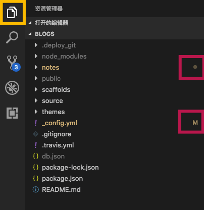
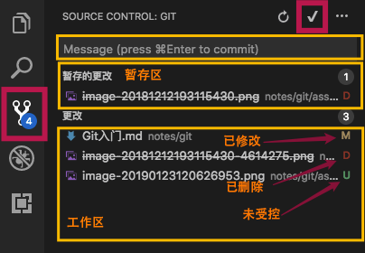
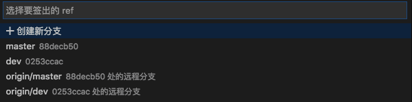
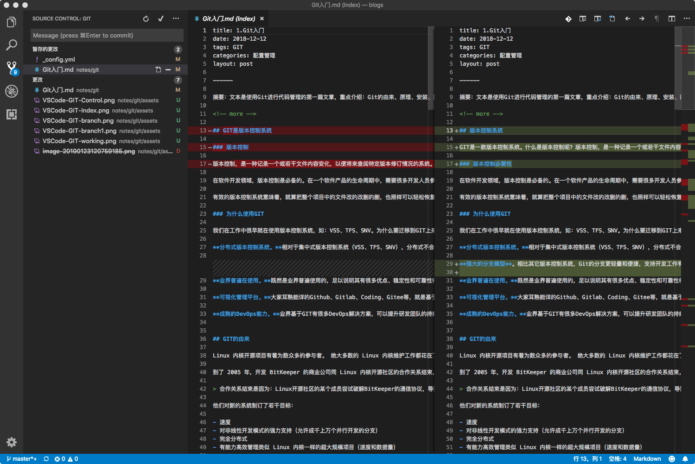
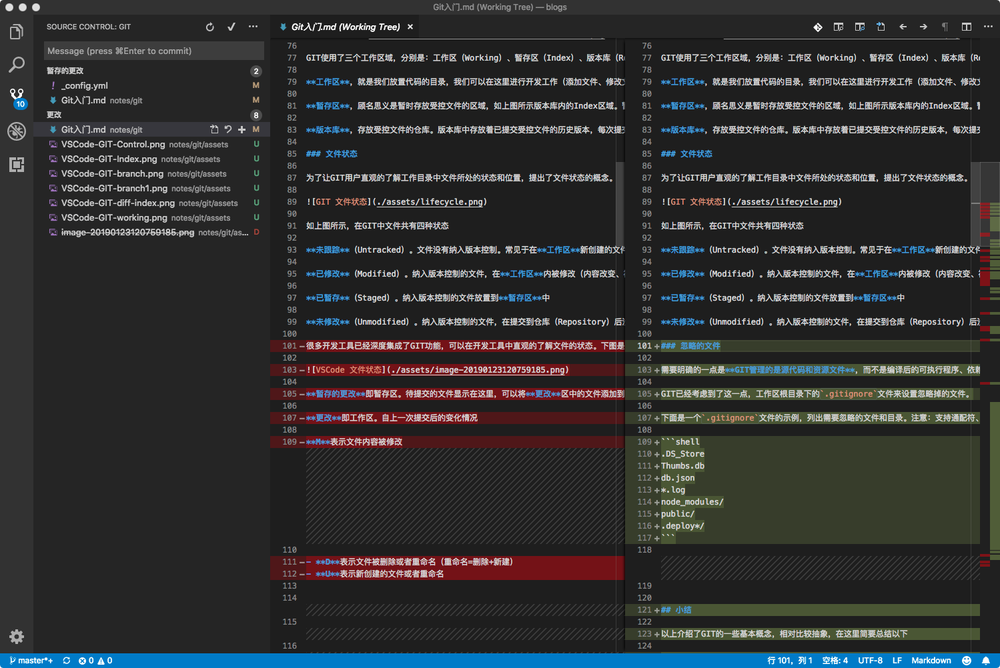
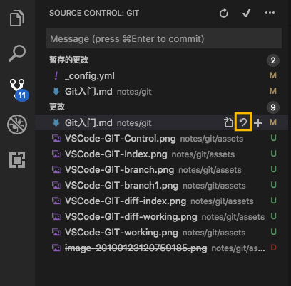
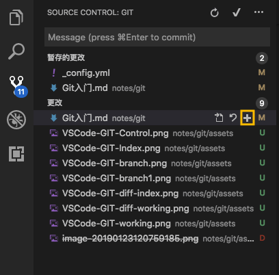
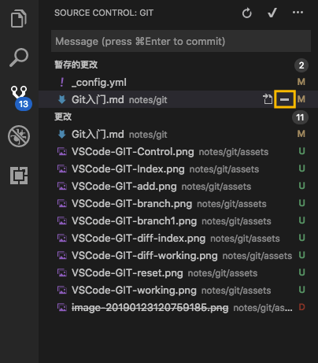
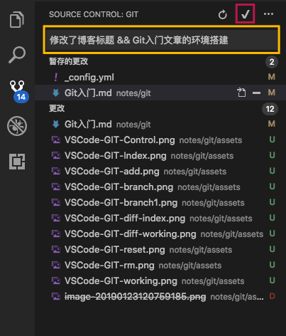

title: 1.Git-入门
date: 2018-12-12
tags: GIT
categories: 配置管理
layout: post

------

摘要：文本是使用Git进行代码管理的第一篇文章，重点介绍：Git的由来、原理、安装、配置、常用命令和工具，并通过一个示例演示创建和使用本地Git仓库。

<!-- more -->

## 版本控制系统

GIT是一款版本控制系统。什么是版本控制呢？版本控制，是一种记录一个或若干文件内容变化，以便将来查阅特定版本修订情况的系统。理论上可以对任何类型的文件进行版本控制。

### 版本控制必要性

在软件开发领域，版本控制是必备的。在一个软件产品的生命周期中，需要很多开发人员参与，经历多次的修改（BUG修复、功能增加、软件重构），尤其是当前软件迭代的速度越来越快，若缺少有效的版本控制，是无法想象的。

有效的版本控制系统意味着，就算把整个项目中的文件改的改删的删，也照样可以轻松恢复到原先的样子，工作量却微乎其微。

### 为什么使用GIT

我们在工作中很早就在使用版本控制系统，如：VSS、TFS、SNV。为什么要迁移到GIT上来呢？

**分布式版本控制系统。**相对于集中式版本控制系统（VSS、TFS、SNV），分布式不会过度依赖服务端，减少对资源使用的冲突，更利于多人间协作开发；而且，GIT的分支设计可以将本地仓库的代码一次提交到不同的远端仓库中，避免因服务端故障而影响开发工作。

**强大的分支模型**。相比其它版本控制系统，Git的分支更轻量和便捷，支持开发工作有序高效的演进。

**业界普遍在使用。**既然是业界普遍使用的，足以说明其有很多优点、稳定性和可靠性得到了验证，而且不需要对开发人员进行单独的培训。

**可视化管理平台。**大家耳熟能详的Github、Gitlab、Coding、Gitee等，就是基于GIT的可视化管理平台。这些平台提供了可视化的用户管理、权限管理、分支管理、ISSUE管理、代码评审、第三方服务集成等功能，打通了需求、设计、开发、测试、部署整个环节，大大提升了软件开发效率。其中，Gitlab的社区版提供本地化部署。

**成熟的DevOps能力。**业界基于GIT有很多DevOps解决方案，可以提升研发团队的持续集成、持续交付能力。


## GIT的由来

Linux 内核开源项目有着为数众多的参与者。 绝大多数的 Linux 内核维护工作都花在了提交补丁和保存归档的繁琐事务上（1991－2002年间）。到 2002 年，整个项目组开始启用一个专有的分布式版本控制系统 BitKeeper 来管理和维护代码。

到了 2005 年，开发 BitKeeper 的商业公司同 Linux 内核开源社区的合作关系结束，他们收回了 Linux 内核社区免费使用 BitKeeper 的权力。 这就迫使 Linux 开源社区（特别是 Linux 的缔造者 Linus Torvalds）基于使用 BitKeeper 时的经验教训，开发出自己的版本系统。 

> 合作关系结束是因为：Linux开源社区的某个成员尝试破解BitKeeper的通信协议，导致厂家翻脸；而Linus Torvalds用了2周时间就完成Git原型的开发

他们对新的系统制订了若干目标：

- 速度
- 对非线性开发模式的强力支持（允许成千上万个并行开发的分支）
- 完全分布式
- 有能力高效管理类似 Linux 内核一样的超大规模项目（速度和数据量）

## 原理

在正式使用GIT前，先对GIT的工作原理进行一个简单的介绍，将有助于在工作中更好的运用它。

### 文件管理

作为一个版本控制系统，GIT有其特有的文件管理方式。

**本地文件操作**。基于**速度**的设计目标，GIT操作基本在本地完成（除了与远程库交换数据外），GIT将文件保存在隐藏目录中（工作目录下的`.git`），作为分布式版本控制系统，不需要频繁的访问**服务器**。

**存储空间更小**。GIT只对有差异的文件版本进行独立存储，而且对内容相同的不同文件也只保留一份。

**操作更便捷**。GIT采用快照的版本管理方式，每个版本都保存着全量的受控文件。基于快照的管理方式使得分支控制更便捷和高效。


**文件完整性**。GIT采用`SHA-1`对文件计算校验和，并将该校验和作为文件名存储在仓库中。因此GIT可以根据校验和判断出哪个文件发生了变化，且文件也不会出现重名现象。

### 工作区域

作为一款分布式版本控制系统，GIT的工作区域概念与SVN的不同，如下图所示


GIT使用了三个工作区域，分别是：工作区（Working）、暂存区（Index）、版本库（Resository）

**工作区**，就是我们放置代码的目录，我们可以在这里进行开发工作（添加文件、修改文件、删除文件、重命名文件），工作区中的文件（含目录结构）受GIT的管理，当进行分支和版本切换时，工作区中的文件与相应的版本保持一致。

**暂存区**，顾名思义是暂时存放受控文件的区域，如上图所示版本库内的Index区域。暂存区存放在版本库中，与版本库公用一个存储对象。暂存区的作用是在提交操作时，将暂存区内的文件一次性更新到版本库（Repository）中

**版本库**，存放受控文件的仓库。版本库中存放着已提交受控文件的历史版本，每次提交操作都会在版本库中创建一个新的版本。版本库采用分支和HEAD指针对当前操作的版本进行管理。

### 文件状态

为了让GIT用户直观的了解工作目录中文件所处的状态和位置，提出了文件状态的概念。


如上图所示，在GIT中文件共有四种状态

**未跟踪**（Untracked）。文件没有纳入版本控制。常见于在**工作区**新创建的文件

**已修改**（Modified）。纳入版本控制的文件，在**工作区**内被修改（内容改变、被删除、重命名）

**已暂存**（Staged）。纳入版本控制的文件放置到**暂存区**中

**未修改**（Unmodified）。纳入版本控制的文件，在提交到仓库（Repository）后没有被修改

### 忽略的文件

需要明确的一点是**GIT管理的是源代码和资源文件**，而不是编译后的可执行程序、依赖的包文件或者数据库备份等。因此，工作区内的部分文件和目录是不需要纳入GIT进行管理的。

GIT已经考虑到了这一点，工作区根目录下的`.gitignore`文件来设置忽略掉的文件。

下面是一个`.gitignore`文件的示例，列出需要忽略的文件和目录。注意：支持通配符、目录需要在结尾加入`/`

```shell
.DS_Store
Thumbs.db
db.json
*.log
node_modules/
public/
.deploy*/
```


## 小结

以上介绍了GIT的一些基本概念，相对比较抽象，在这里简要总结以下

**为什么使用版本控制？**

- 能有效的管理文件的变更，能高效的在不同版本间进行切换。
- 帮助软件团队更好的协同工作，降低版本整合的复杂度。
- 提升版本管理思路，合理规划产品版本和研发进度。

**为什么迁移到GIT？**

- 分布式版本管理，不过度依赖服务器，每个人都可单独工作。
- 其设计理念使得其能适应目前快速迭代的开发模式
- 强大的分支模型支持大规模开发的有序和高效
- 软件开发全生命周期管理，从需求到部署完整的生态。

**GIT的基本原理**

- 通过划分**工作区域**的方式清晰操作的边界。**工作区**可以自由的进行文件的编辑；**暂存区**为了提交操作的方便；**仓库**保存版本历史。

- 自动检测文件的变化，用**文件状态**使其可视化。用户只需要关注将哪些修改存储到仓库中。

  

---

下面重点介绍如何使用GIT在本机进行版本的管理，暂不涉及分支和远程仓库。

## 环境搭建

在Windows环境下搭建GIT环境，其他系统的搭建请参照[官方指南](https://git-scm.com)。

### 安装

GIT的安装非常简单，这里就不赘述了。

- GIT安装，[下载地址](https://git-scm.com/download/win)
- 图形工具，[下载地址](https://tortoisegit.org/download/)

按上面给出的下载地址下载对应的版本（64位和32位），先安装GIT，再安装图形工具及其汉化包（如果使用集成了GIT的开发工具可以不安装图形工具）

### 配置

> 安装好Git后，需要在正式使用前先进行配置

考虑到用户操作的便利性，GIT引入了**作用域**的概念

**系统作用域**，配置信息对当前终端的所有用户和仓库均有效（**很少使用**）

**全局作用域**，配置信息仅对当前用户的所有仓库有效（**默认值**）

**局部作用域**，配置信息只对当前仓库有效

在配置操作时，通过添加**作用域可选项**对作用域进行限制，默认的作用域是**全局作用域**。不同作用域的配置信息存储在不同位置，不会相互影响。当多个作用域的配置信息同时存在时，其优先级为**局部 > 全局 > 系统**

> 什么时候需要多个配置信息呢？可以考虑这样的场景：你同时维护两个代码库，一个是公司的代码库使用公司的邮箱作为账号；另一个是github上的个人代码库，使用个人邮箱作为账号。这时就需要配置多个参数信息。

**配置用户信息**

大部分可视化版本控制平台的用户名均采用邮箱地址，因此建议用户名=邮箱。邮箱单独设置，是因为可以在仓库发生变化（PR）时通知相关人员。

```bash
# 设置用户信息为全局作用域
$ git config --global user.name '<用户名>'
$ git config --global user.email '<邮箱>'

# 设置用户信息为局部作用域
$ git config --local user.name '<用户名>'
$ git config --local user.email '<邮箱>'
```

**查看配置信息**

```bash
# 查看全部配置信息
$ git config --list

# 查看某项配置
$ git config user.name

# 查看作用域下的配置(叠加作用域参数)
$ git config --local user.name
```

**删除配置信息**

```bash
# 使用 --unset 参数
# 如果用户名和邮箱设置错误，需要先删除
$ git config --local --unset user.name
$ git config --local --unset user.email
```

好了，完成用户信息的配置后，我们就可以开始使用GIT。

## 开发工具

很多开发工具已经深度集成了GIT功能，以图形化方式直观的进行管理。下面以`VS Code`为例进行介绍，使用其它开发工具可以参考。

### 资源管理器

在`VS Code`中打开版本库所在的目录后，在资源管理器中就可以看到如下的界面

- 左上角黄框表示当前在资源管理器页面
- 右侧的红框表示有文件变更发生，如果文件处于子目录中则用圆点表示，否则用文件状态表示。



### 版本控制

版本控制页面，标题显示`SOURCE CONTROL: GIT`表示当前的版本控制系统是`GIT`

- 左侧红框表示当前在版本控制页面，数字表示当前有4个文件发生了变化
- 右上角的`对勾`表示把暂存区中的文件提交到仓库中
- 下面的`message`是编辑提交消息的区域
- **暂存的更改**即暂存区。待提交的文件显示在这里
- **更改**即工作区内自上一次提交后的文件变化情况
- **M**表示文件内容被修改
- **D**表示文件被删除或者重命名（重命名=删除+新建）
- **U**表示新创建的文件或者重命名



### 分支管理

简单提一下分支管理，在`VS Code`的左下角显示当前工作的分支（默认为`master`）


点击该区域可以切换分支、创建新分支



## 基本操作

本章节只介绍在个人电脑上GIT的基本操作，创建版本库、编辑文件、放入暂存区、提交版本库。分支管理、标签管理和远程库的操作在后续章节介绍。

### 创建版本库

在本机创建版本库非常简单，使用`git init`命令即可完成。**仓库名即为工作目录名**

```bash
# 创建版本库同时创建工作目录
$ git init [仓库名称]
# 示例
$ git init test

# 在已有工作目录中初始化版本库
$ cd test
$ git init
```

创建完版本库后，就可以使用GIT对其中的文件进行管理。

### 编辑文件

在`VS Code`中可以很方便的创建文件和目录，编辑文件，删除文件。在这里就不赘述了。

GIT会自动检测发生变更的文件，并在文件的末尾显示其所处状态的图标

### 比较差异

`VS Code`提供了快速比较文件版本差异的功能，包括暂存区与版本库的差异，以及工作区与版本库的差异

**暂存区与版本库的差异**

在版本管理页面中，点击**暂存的更改**中的文件，显示版本差异。左侧为版本库中的内容，右侧为暂存区的内容



**工作区与版本库的差异**

在版本管理页面中，点击**更改**中的文件，显示版本差异。左侧为版本库中的内容，右侧为工作区的内容



### 撤销修改

在版本管理页面中，点击图中黄框图标，撤销文件的修改。**撤销后修改的内容无法恢复**



### 放入暂存区

在版本管理页面中，点击图中黄框图标，将该文件添加到暂存区中。**鼠标点击“更改”，出现的+图标可以把所有修改的文件一次添加到暂存区中**



### 移除暂存区

在版本管理页面中，点击图中黄框图标，将该文件从暂存区中移除。**鼠标点击“暂存的更改”，出现的--图标可以把暂存区中所有文件一次清除**



### 提交版本库

在版本管理页面中，检查**暂存的更改**中是否包含全部需要提交的文件，并根据需要添加、移除。

在提交消息输入框中，编辑本次版本提交变更的内容，点击“提交”按钮，将本次变更提交到版本库中



## 小结

GIT的使用非常简单，配合集成GIT功能的开发工具，不需要过多的学习成本。

在本机创建并使用GIT进行版本管理，需要以下几个步骤

- **创建版本库**。可以在初始化时创建新的工作目录
- **文件编辑**。在工作目录中新建、修改、删除文件
- **放入暂存区**。将发生变化的文件放入暂存区，准备提交到版本库中
- **提交版本库**。为本次提交添加**备注**即提交消息，将暂存区中的所有文件一次性提交到版本库中。**注意：提交消息要求把修改内容进行详细描述，便于理解版本的差异**

## 附录：常用命令

本章节涉及到的GIT命令如下

**创建版本库**

```bash
$ git init [仓库名称]
```

**将文件添加到暂存区**

```bash
# 添加所有变化的文件
$ git add .
# 添加指定修改的文件
$ git add [文件名]
# 添加所有版本库中文件的变更
$ git add -u
```

**比较文件差异**

```bash
# 比较工作区与版本库的差异
$ git diff [文件名]
# 比较暂存区与版本库的差异
$ git diff --cached [文件名]
```

**移除暂存文件**

```bash
$ git rm --cached [文件名]
$ git reset HEAD [文件名]
```

**取消工作区中文件的修改**

```bash
$ git checkout --[文件名]
```

**提交版本**

```bash
$ git commit -m'提交消息'
```

