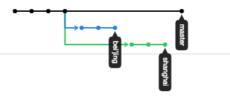
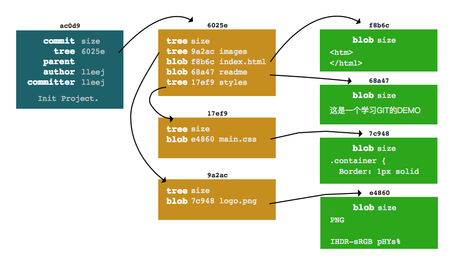
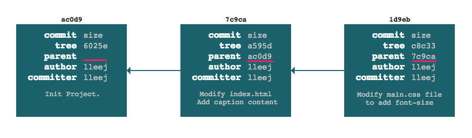

title: 2.Git-分支
date: 2019-01-25
tags: GIT
categories: 配置管理
layout: draft

------

摘要：文本是使用Git进行代码管理的第二篇文章，重点介绍：Git“必杀技”分支的原理、用途、用法以及指令，通过一个示例演示如何利用分支进行多版本管理。

<!-- more -->

回顾：上篇介绍了Git的一些基本概念和日常用法，包括Git的特点、工作区域和文件状态的概念；如何安装Git环境、配置用户信息；如何在本地创建版本库，使用`VS Code`操作版本库等。

你也许会有这种感觉，这跟之前使用的版本管理系统没有什么区别呀？而且，这个也解决不了快速迭代和并行开发的问题呀？那是因为，我们还没有使用Git“必杀技”分支。本文就讲讲分支的妙用。

## 前言

当创建一个版本库时，GIT默认创建一个名为`master`的分支，使用`git commit`命令提交到版本库中的版本信息作用在这个分支上。为什么会有默认`master`分支呢？这是因为GIT的版本控制依赖于分支。

以一张图可以清晰的了解分支以及分支和提交(版本)的关系（github中仓库的Insights/Network页面）



上图三条颜色的线代表三个分支，线上的圆点代表提交(版本)

- `master`默认分支。在该分支上一共产生了4次提交

- `beijing`分支。在`master`分支第3次提交后创建，在该分支产生了3次提交

- `shanghai`分支。在`master`分支第3次提交后创建，在该分支也产生了3次提交

从上图可以看出

**分支相互独立**。基于某一次提交(版本)可以创建多个分支，之后在不同分支上的提交不受其他分支的影响。

**分支是具名的**。创建的分支名称是语义化的，默认`master`分支代表主分支，`beijing`和`shanghai`两个分支可以理解为在北京和上海的两个团队。当然，分支也可以按任务创建，如：`feature_login`、`fix_231`等，可根据团队的开发流程和习惯自行定义。

**提交依赖分支**。每次提交操作都发生在某个分支上（**没有分支的提交是危险的，会被GIT垃圾回收**），因此在提交前需要确认当前的工作分支。

以上是对分支概念的简单介绍，在正式开始之前还需要对上文提到的“提交”和“分支”以及之间关系做进一步的解释，看看GIT是如何实现的，这将有助于对分支的深入理解。

## 提交简介

为了避免理解上的分歧，我们统称GIT中“版本”为“提交”英文名“commit”。也就是说，每次`git commit`都会在GIT版本库中创建一个新的版本，我们称这个“版本”为“提交”。我们通常说的V1.0、V2.1等版本，其实是在“提交”上打的标签而已。

下面以一个网页项目为例进行说明，其目录结构和文件如下所示，共有2个目录和4个文件组成

```bash
# test仓库中的文件结构
# tree命令查看结果
├── images
│   └── logo.png
├── index.html
├── readme
└── styles
    └── main.css
```

### GIT中的提交

将工作目录中的全部文件通过`git commit`指令提交到`Git仓库`中，仓库创建的文件如下所示



**`blob`文件**，右侧绿色的部分，每个代表一个文件，与工作目录中的文件一一对应

**`tree`文件**，中间黄色的部分，每个代表一个目录，包括1个根目录以及2个子目录

**`commit`文件**，左侧青色的部分，代表一个提交，提交通过`tree文件(6025e)`管理提交的文件和目录

**文件名是哈希值**，所有的文件名为文件内容的`sha-1`值，长度40

通过这三类文件，Git对提交的版本进行管理。

### 提交间关联

我们已经了解到提交是Git版本管理的基本单位，通过`commit文件`可以方便的读取指定版本的文件信息。下图中每个圆点代表一个提交，那每个提交间的关系Git是怎么管理的？


为了能够方便的遍历Git提交，在`commit文件`中使用`parent属性`保存上次`commit文件`的名称，这样就可以通过该属性向上(单向)遍历提交历史。可以快速回退到某个提交的版本

下图所示，共有三次提交，除第一次提交没有`parent属性`值外，后面两次提交的`parent属性`值指向前面的`commit文件`



注意：一个提交可能存在两个`parent`，当两个分支合并时，合并的提交文件中`parent属性`保存两个分支的`commit文件`

### 小结

通过上面的分析，我们可以掌握以下内容

**提交的分层管理**。每个文件都一一对应仓库中的`blob文件`，每个目录对应仓库中的一个`tree文件`管理其目录下的文件和子目录，提交对应一个`commit文件`通过根`tree文件`管理全部文件和目录。

**提交间的关联**。提交使用`commit文件`中的`parent属性`建立关联，这种关联是单向的(从后向前)，通过这种关联可以实现在不同提交(版本)间的快速切换。

## 理解分支


