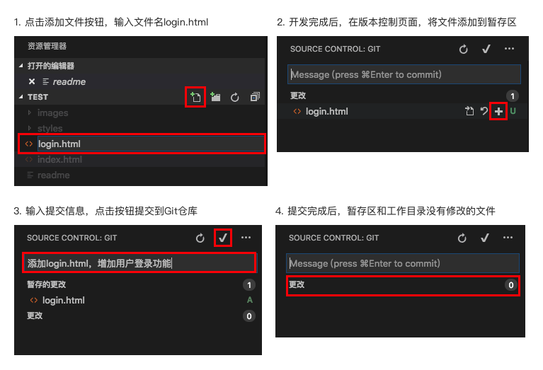
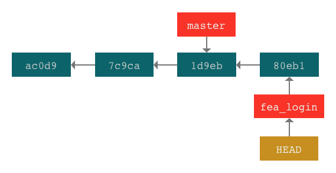
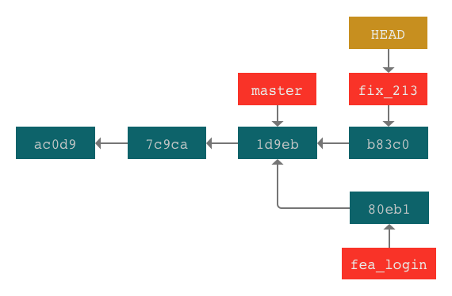
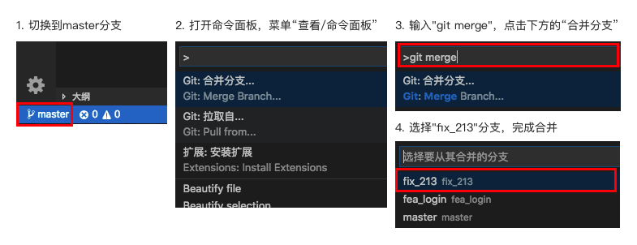
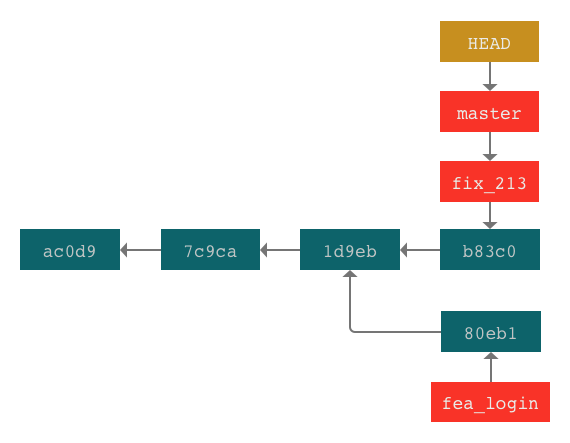
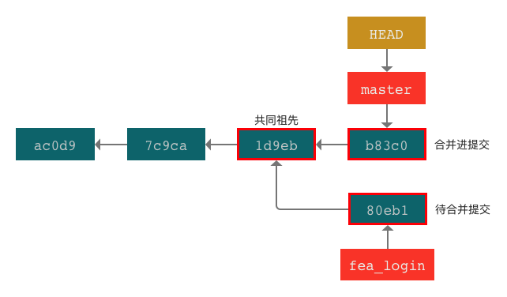
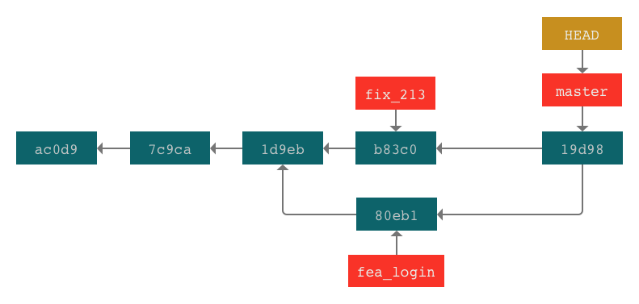
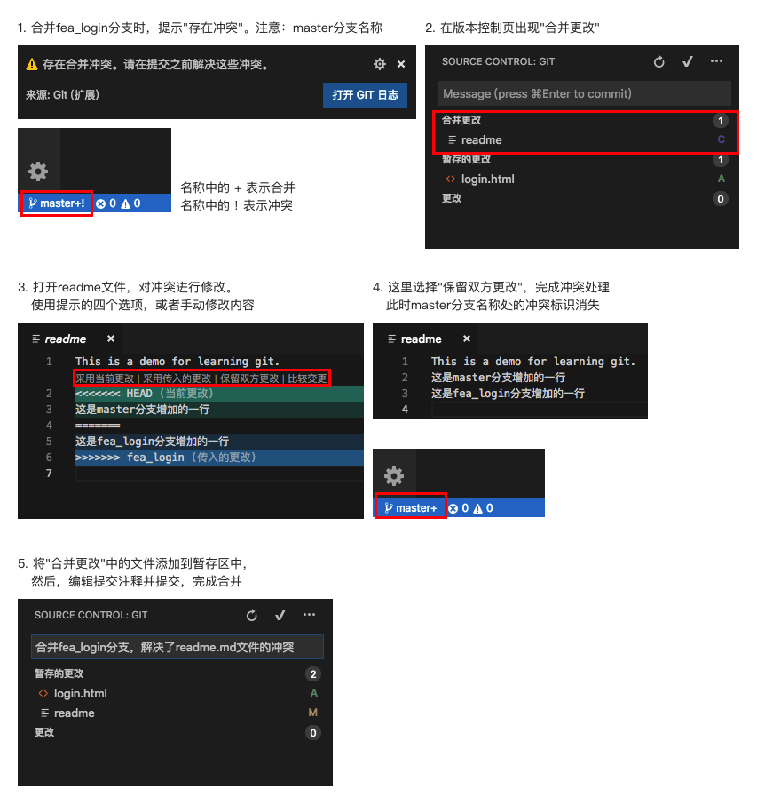
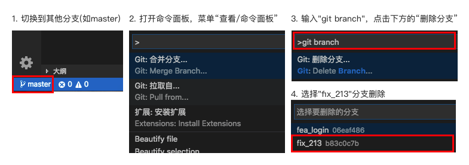
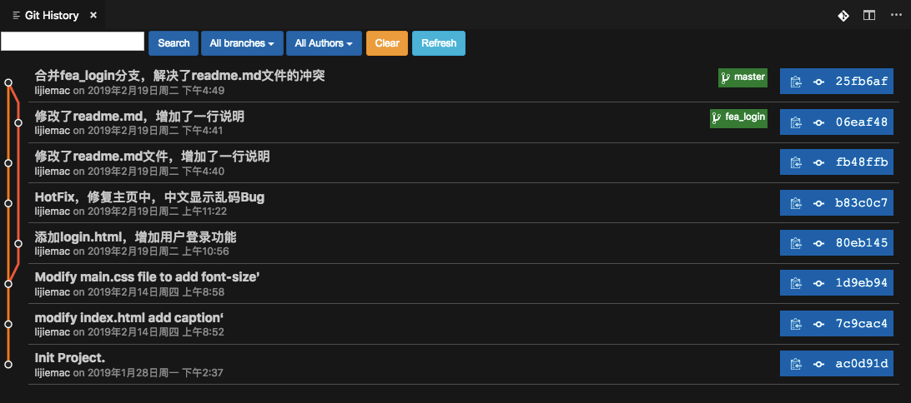

title: 2.Git-分支
date: 2019-01-25
tags: GIT
categories: 配置管理
layout: post

------

摘要：文本是使用Git进行代码管理的第二篇文章，重点介绍：Git“必杀技”分支的原理、用途、用法以及指令，通过一个示例演示如何利用分支进行多版本管理。

<!-- more -->

回顾：上篇介绍了Git的一些基本概念和日常用法，包括Git的特点、工作区域和文件状态的概念；如何安装Git环境、配置用户信息；如何在本地创建版本库，使用`VS Code`操作版本库等。

你也许会有这种感觉，这跟之前使用的版本管理系统没有什么区别呀？而且，这个也解决不了快速迭代和并行开发的问题呀？那是因为，我们还没有使用Git“必杀技”分支。本文就讲讲分支的妙用。

## 前言

当创建一个版本库时，GIT默认创建一个名为`master`的分支，使用`git commit`命令提交到版本库中的版本信息作用在这个分支上。为什么会有默认`master`分支呢？这是因为GIT的版本控制依赖于分支。

以一张图可以清晰的了解分支以及分支和提交(版本)的关系（github中仓库的Insights/Network页面）


上图三条颜色的线代表三个分支，线上的圆点代表提交(版本)

- `master`默认分支。该分支有4次提交

- `beijing`分支。从`master`分支创建，该分支有3次提交

- `shanghai`分支。从`master`分支创建，该分支有3次提交

从上图可以看出

**分支相互独立**。基于某一次提交(版本)可以创建多个分支，之后在不同分支上的提交不受其他分支的影响。

**分支是具名的**。创建的分支名称是语义化的，默认`master`分支代表主分支，`beijing`和`shanghai`两个分支可以理解为在北京和上海的两个团队。当然，分支也可以按任务创建，如：`feature_login`、`fix_231`等，可根据团队的开发流程和习惯自行定义。

**提交依赖分支**。每次提交操作都发生在某个分支上（**没有分支的提交是危险的，会被GIT垃圾回收**），因此在提交前需要确认当前的工作分支。

以上是对分支概念的简单介绍，在正式开始之前还需要对上文提到的“提交”和“分支”以及之间关系做进一步的解释，看看GIT是如何实现的，这将有助于对分支的深入理解。

## 提交简介

为了避免理解上的分歧，我们统称GIT中“版本”为“提交”英文名“commit”。也就是说，每次`git commit`都会在GIT版本库中创建一个新的版本，我们称这个“版本”为“提交”。我们通常说的V1.0、V2.1等版本，其实是在“提交”上打的标签而已。

下面以一个网页项目为例进行说明，其目录结构和文件如下所示，共有2个目录和4个文件组成

```bash
# test仓库中的文件结构
# tree命令查看结果
├── images
│   └── logo.png
├── index.html
├── readme
└── styles
    └── main.css
```

### GIT中的提交

将工作目录中的全部文件通过`git commit`指令提交到`Git仓库`中，仓库创建的文件如下所示


**`blob`文件**，绿色，代表文件，与工作区一一对应

**`tree`文件**，黄色，代表目录，根目录和2个子目录

**`commit`文件**，青色，代表提交，管理文件和目录

**文件名是哈希值**，所有的文件名为文件内容的`sha-1`值，长度40

通过这三类文件，Git对提交的版本进行管理。

### 提交间关联

我们已经了解到提交是Git版本管理的基本单位，通过`commit文件`可以方便的读取指定版本的文件信息。下图中每个圆点代表一个提交，那每个提交间的关系Git是怎么管理的？


为了能够方便的遍历Git提交，在`commit文件`中使用`parent属性`保存上次`commit文件`的名称，这样就可以通过该属性向上(单向)遍历提交历史。可以快速回退到某个提交的版本

下图所示，共有三次提交，除第一次提交没有`parent属性`值外，后面两次提交的`parent属性`值指向前面的`commit文件`


注意：一个提交可能存在两个`parent`，当两个分支合并时，合并的提交文件中`parent属性`保存两个分支的`commit文件`

### 小结

通过上面的分析，我们可以掌握以下内容

**提交的分层管理**。每个文件都一一对应仓库中的`blob文件`，每个目录对应仓库中的一个`tree文件`管理其目录下的文件和子目录，提交对应一个`commit文件`通过根`tree文件`管理全部文件和目录。

**提交间的关联**。提交使用`commit文件`中的`parent属性`建立关联，这种关联是单向的(从后向前)，通过这种关联可以实现在不同提交(版本)间的快速切换。

## 理解分支

Git的每次提交都是在提交链上添加一个新节点，新节点中保存其父节点的名称。当一个父节点有多个子节点时就形成了分支。我们知道，每次提交都是在其父节点版本的基础进行的修改，基于同一父节点的不同分支都从父节点继承了全部信息，而之后的修改则是相互独立、互不干扰的，这就像多子女的家庭，虽然都是同一个父母，但每个子女都有自己独立的生活一样。

下图是Git中分支的示意图，图中每个方框都代表一个实体。青色代表提交、红色代表分支、黄色代表当前分支。红色框住的提交是`beijing`和`shanghai`两个分支的父节点。从图中可以看出，在`beijing`分支上的任何改动都不会影响`master`分支和`shanghai`分支。


### 分支

**分支是文件**。在Git中分支是一个以文件形式存在的实体，文件内容为指向的提交文件名（40位哈希值）。由于分支采用语义化命名，相对于40位的哈希值更便于记忆和理解。

**分支是指针**。我们可以把分支看成一个指向提交的指针，分支的这种设计使得在Git中操作分支非常的快速和轻便。

**分支是动态的**。对于一个新建的空仓库，当第一次提交后，Git会默认创建一个名为`master`的分支指向该提交。之后在分支上做的提交操作，都会以分支当前指向的提交为父节点，创建新的提交节点。此时，分支的指针会移动并指向新的提交。简要的说就是：分支总是指向最后的提交，正常情况下总是向前移动。

### 当前分支

在Git仓库中创建多个分支时，如何确定我们工作的分支？Git使用`HEAD`表示当前分支。当前分支也是一个以文件形式存在的实体，在Git仓库中只有一个`HEAD`文件，其内容为当前工作的分支名称。

我们在Git仓库中进行的提交操作，都是对`HEAD`指向的分支进行的。因此，在工作时首先应该确认当前的工作分支，以免出现不必要的麻烦。

### 远程分支

即远程仓库上的分支，在Git中区分本地分支和远程分支。远程分支可以帮助我们直接操作远程仓库，可以拉取远程分支的提交到本地，也可以推送本地的分支到远程仓库。这部分内容在后面的章节进行介绍。

## 分支操作

下面介绍Git分支的常用操作，包括创建分支、切换分支、合并分支、删除分支。

假设在一个Git仓库的`master`分支下进行了3次提交，`master`分支指向最后一次提交(`1d9eb`)，当前分支为`master`分支，且仓库中不存在其他分支。


### 创建分支

假设，此时需要在项目中添加用户登录功能，我们可以创建一个新的分支，在这个分支上进行开发。

**使用指令**

在Git中创建分支非常的简单，使用`git branch`指令。

```bash
# 创建分支指令
$ git branch [分支名称]
# 示例，需要增加新特性login
$ git branch fea_login

# 创建并切换分支指令 合二为一
$ git checkout -b [分支名称]
```

**VS Code**


从当前分支`master`创建一个新分支，新分支与`master`分支指向同一个提交。


### 切换分支

创建`fea_login`分支后，我们在该分支上进行登录功能的开发工作，工作前需要将当前分支切换到`fea_login`

**使用指令**

在Git中切换分支使用`git checkout`指令。

```bash
# 切换分支指令
$ git checkout [分支名称]
# 示例，切换到fea_login分支
$ git checkout fea_login
```

**VS Code**

>  使用VS Code 创建分支后，将自动切换到新的分支


切换分支后，当前分支`HEAD`指向`fea_login`，而且工作区的内容更换为`fea_login`指向提交的内容


### 在分支上提交

我们在`fea_login`分支上创建`login.html`页面，开发完成后，将修改的内容提交到Git仓库中。

**使用指令**

```bash
# 编辑login.html
$ vi login.html
# 将login.html添加到暂存区中
$ git add login.html
# 提交到Git仓库中
$ git commit -m'添加login.html，增加用户登录功能'
```

**VS Code**



在`fea_login`分支上完成提交工作后，`fea_login`分支将指向新的提交。



这时，如果将当前分支切换回`master`分支，则工作目录将恢复到`master`分支指向的提交`1d9eb`，也就是说在工作目录中将看不到新增加的文件`login.html`。

### 创建紧急修补Bug分支

假设，此时`master`分支上的版本（发布版本）有Bug需要紧急修复，则需要创建一个分支`fix_213`。具体的分支创建和Bug修复过程就不再赘述。

Bug修复完成并通过测试后，将代码提交到Git仓库中。此时，分支如下图所示



**`master`分支**。Git仓库的主干分支，该分支的版本与现场运行版本保持一致，处于**稳定状态**。

**`fea_login`分支**。基于`master`分支创建的特性分支，用于开发新的功能。

**`fix_213`分支**。基于`master`分支创建的Bug修复分支，用于修复发布版本的紧急Bug。

`fea_login`分支和`fix_213`分支可以交由两人并行工作，或者交由一人通过切换分支来切换工作场景。不管哪种方式，都不需要开发人员还原曾经对`master`分支的修改，通过创建分支可以轻松实现。

### 合并分支

创建分支的目的是为了方便的切换工作场景（修补Bug、重构代码、添加特性…）而不至于混淆代码，当完成了分支的特定工作后，就需要将分支合并到主分支，使得项目的版本持续向前演进。

**快进合并**

以合并`master`和`fix_213`分支为例，由于 `master` 分支所在的提交是`fix_213`分支所在提交的直接祖先，合并操作不会出现需要解决的冲突，因此Git只会简单的将指针向前推进（指针右移）—— 称为"快进(Fast-Forward)"。

```bash
### 合并master和fix_213分支
# 先切换到合并进的分支master
$ git checkout master
# 合并fix_213分支到master分支
$ git merge fix_213
```

`VS Code`没有提供合并分支的图形化工具，可以使用命令模式进行合并。



**注意**：合并操作时，先要切换到合并进的分支(本例为`master`)，再对要合并的分支执行合并操作。

将`fix_213`分支合并进`master`分支后，分支如下图所示



**三方合并**

以合并`master`和`fea_login`分支为例。和之前合并 `fix_213` 分支时不同，两个分支从某个历史提交分叉开来。由于`master` 分支所在提交并不是 `fea_login` 分支所在提交的直接祖先，此时Git 会使用两个分支所在提交（`80eb1` 和 `b83c0`）以及这两个分支的共同祖先（`1d9eb`），进行三方合并。



三方合并时，Git将合并结果保存为一个新提交，称作**合并提交**，它的特别之处在于他有不止一个父提交。合并后的分支`master`指向这个**合并提交**。



**合并冲突**

在进行**三方合并**时，可能存在这样的情况：两个分支对同一个文件的同一个部分进行了不同的修改，此时Git无法自动完成合并操作，需要认为参与解决冲突(修改冲突文件)。待冲突解决后，手动将修改后的最终文件提交到Git仓库，最终完成合并操作。

下面是一个合并冲突的示例。为了模拟冲突，我们在`master`分支和`fea_login`分支上又分别对`readme.md`文件进行了修改，都修改了第二行内容。然后分别将修改的内容提交到Git仓库。



### 删除分支

分支是为了特定的工作场景创建的，在创建的分支上完成编辑工作并**合并到主分支**后，该分支就完成了历史使命，最好删除该分支，以保持仓库分支的简洁。

**使用指令**

```bash
# 删除指定分支
$ git branch -d [分支名称]
# 如果创建的分支未执行合并操作，则Git会提示不能删除，如果需要删除则
$ git branch -D [分支名称]
```

- 当前分支不能删除
- 未合并的分支需要使用`-D`强行删除

**VS Code**



### 查看分支和提交历史

有时我们需要查看本地Git仓库中的提交历史和分支情况，下面介绍常用的指令和方法

**使用指令**

```bash
### 查看Git仓库中的分支信息
# 只显示分支名称
$ git branch
# 显示分支的提交名称和注释
$ git branch -v

### 查看Git仓库中的提交历史
# 显示完整提交信息
$ git log
# 显示提交注释和名称
$ git log --oneline
# 图形化显示提交历史和关系
$ git log --graph
```

**VSCode**

建议安装`git history`插件，使用该插件可以在`VS Code`中以图形化方式查看分支和历史提交。



