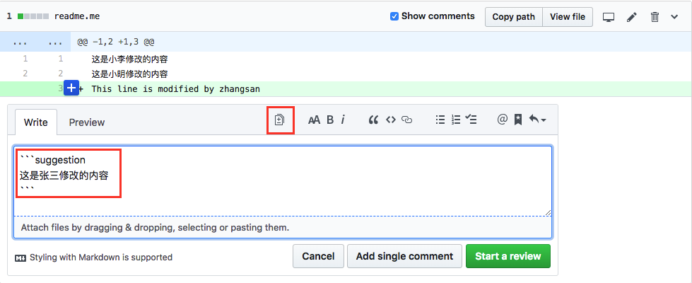
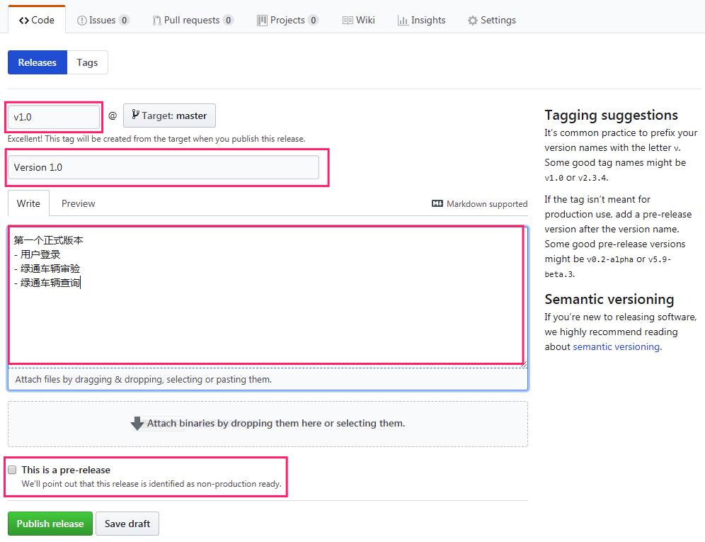

title: 6.Git-工作流(续)
date: 2019-03-14
tags: GIT
categories: 配置管理
layout: post

------

摘要：文本是使用Git进行代码管理的第六篇文章，重点介绍：适合团队自身的开发流程和开发规范以及版本库的操作。

<!-- more -->

## 现状

### 人员组成

| 岗位   | 职责                               | 人数 |
| ------ | ---------------------------------- | ---- |
| 产品   | 需求分析、原型设计、UI设计         | 2    |
| 架构   | 技术选型、技术预研、接口设计       | 1    |
| Web端  | 基于H5 + CSS + JS开发桌面Web端应用 | 2    |
| 移动端 | 基于Java开发Android原生应用        | 2    |
| 服务端 | 基于Java开发后台服务               | 1    |
| 数据端 | 数据建模、SQL脚本                  | 1    |

### 技术路线

| 岗位   | 工具                                     |
| ------ | ---------------------------------------- |
| 产品   | Office、Axure、PS                        |
| 数据   | Oracle、SQL Server、MySQL、MongoDB       |
| Web端  | H5 + CSS + JS、Vue开发框架、饿了吗组件库 |
| 移动端 | Java原生Android应用                      |
| 服务端 | Java开发后台服务，支持缓存和分布式       |

### 开发流程

| 岗位   | 输入                         | 输出                                                         |
| ------ | ---------------------------- | ------------------------------------------------------------ |
| 产品   | 业务需求、竞品介绍、招标文件 | 需求文档（Word文档）、项目计划（Excel）、原型（Axure）、UI界面、测试用例 |
| 架构   | 需求文档、项目计划、UI界面   | 技术选型（Word文档）、架构（Word文档）、接口文档（Word文档） |
| 数据   | 需求文档、技术选型           | 数据模型、SQL脚本、原始数据（整理或模拟）                    |
| Web端  | 需求文档、UI界面、接口文档   | 源代码、测试用例、打包文件                                   |
| 移动端 | 需求文档、UI界面、接口文档   | 源代码、测试用例、APK文件                                    |
| 服务端 | 需求文档、接口文档           | 源代码、测试用例、jar包                                      |

### 版本管理

1. 使用内部搭建的 SVN 服务器，进行代码的备份
2. 基于项目的版本管理，而不是基于产品的版本管理
3. 正在尝试建立公用组件库、部件库
4. 服务端实现了单元测试，Web端、移动端、数据端基本没有实现单元测试
5. 没有实现自动化的集成测试，集成测试需要人工操作
6. 没有实现基于版本库的代码审查、编译、部署

## 目标

使用 Git 对团队项目进行版本管理，逐步实现代码审查和持续集成。

### 第一阶段

保持现有开发模式，版本管理从 SVN 迁移到 Git，实现有效的版本管理。

1. 从 SVN 迁移到 Git
2. 实现分支工作流（分支开发、Pull Reqeust、代码审查）
3. 实现版本发布

### 第二阶段

实现单元测试、任务管理，初步实现持续集成（主干分支的自动测试和打包）

1. 实现单元测试，提交代码必须包含单元测试
2. 整合需求管理和问题跟踪机制
3. 版本发布的自动编译、单元测试、发布到测试环境

### 第三阶段

实现DevOps，版本的有序管理、持续集成、自动化部署和监控

1. 实现代码的持续集成
2. 实现版本的自动化部署
3. 实现在线版本的状态监控

## Git 服务端选择

对主流的Git 托管平台进行了试用，初步选择 Github 作为第一阶段的 Git 服务端

| 托管平台 | 优势                             | 限制                                                         |
| -------- | -------------------------------- | ------------------------------------------------------------ |
| Coding   | 国内托管平台，与腾讯深度融合     | 团队版本不支持免费，20人/年费用为1999元                      |
| Gitee    | 国内托管平台，增强项目管理指标   | 团队版本支持5人免费，但限制多(分支保护、第三方服务)<br />20人/年费用为1998元 |
| Github   | 国外托管平台，最大的开源托管平台 | 开源库基本没有限制，但私有库第三方服务收费；<br />个人付费版本：1人月8美元 |
| GitLab   | 社区版本支持私有化部署           | 需要自己搭建和维护，第三方服务支持较好                       |

## 开始之前

### 注册 Github

注册 Github 用户，配置好`SSH Key`。具体操作步骤见《Git-远程分支》中的远程仓库章节。

**要求：注册 Github 使用公司的邮箱作为用户名，便于身份确认和查找。**

### 分支命名

| 分支类型 | 分支命名                                                     | 限制      |
| -------- | ------------------------------------------------------------ | --------- |
| 功能开发 | fea/xxx 以`fea/`开头，清晰描述功能。如：`fea/userLogin`      | 长度 < 20 |
| 代码重构 | fef/xxx 以`ref/`开头，清晰描述重构内容。如：`ref/menuRouter` | 长度 < 20 |
| Bug修复  | fix/xxx 以`fix/`开头，Bug编号或描述。如：`fix/123`或`fix/addDuplicateUser` |           |
| 主干分支 | `master`                                                     | 不可推送  |
| 发布分支 | `release-版本号`，如：`release-v0.9.3`                       | 不可推送  |

### 版本命名 

采用语义版本，给定版本号MAJOR.MINOR.PATCH，例如：V0.9.4

1. 当前版本向下不兼容（API不兼容、插件不兼容、工具不兼容、库不兼容…）时`Major`加1，`minor`和`patch`清零。V0.9.4 —> V1.0.0
2. 当前版本增加了新的特性时`minor`加1，`patch`清零。V1.0.3 —> V1.1.0
3. 当前版本修复Bug后`patch`加1。V1.1.0 —> V1.1.1

### 项目角色

使用 Github 进行项目协作时，需要多个角色参与，后续流程说明中提交的角色，在这里统一说明

| 角色     | 职责                                           |
| -------- | ---------------------------------------------- |
| 管理员   | 仓库的管理工作                                 |
| 协作者   | 除管理员外，其他角色的统称                     |
| 开发人员 | 需求人员、设计人员、编码人员                   |
| 评审人员 | 对`Pull Request`进行评审的人员，可以是任何角色 |
| 测试人员 | 对发布分支进行测试的人员                       |

### 其他说明

1. 重视提交消息的正确书写，提交消息应该反映你的意图，而不仅仅是提交的内容。好的提交消息能够帮助我们快速的查找和理解提交历史。
2. 任何代码的改动必须在特定分支上进行，不能直接在主干分支`master`和发布分支`release`上进行代码的提交操作。我们对 Github 仓库的主干分支和发布分支进行了直接推送的限制。如果不小心在本地仓库上述分支进行了提交，只需要基于当前提交创建新的分支即可。
3. 尽量减少每个特定分支的持续时间，建议每个特定分支的工作时长控制在1天时间（最长也不要超过1周），这将更有利于协同开发。

## 创建和配置仓库

项目负责人（管理员）在自己的 Github 账号中创建项目仓库，添加协作者，初始化仓库代码，配置分支规则。

参与人员：项目管理员、协作者

### 创建仓库

1. 打开操作菜单，选择"New repository"，打开创建仓库页面
2. 输入仓库名称、描述、仓库类型为"Public"、不初始化"README"文件
3. 点击"Create repository"创建仓库


### 添加协作者

> 仓库协作者拥有向仓库推送代码的权限

1. 选择仓库页面中的"Settings"页签，打开仓库设置页面
2. 在左侧选择"Collaborators"菜单，设置仓库的协作者
3. 输入协作者的用户名，Github 会自动查找用户是否存在
4. 点击"Add collaborator"，将用户添加为协作者


5. 管理员拷贝邀请链接，并发送给协作者


6. 协作者在浏览器中打开邀请链接，并接收邀请


7. "Star"该项目仓库，便于今后的访问


8. 在本人 Github 账号中，通过"Star"访问到该仓库


### 初始化仓库

我们当前创建的仓库没有添加任何文件，因此也没有默认分支，处于空仓库状态。在配置分支规则前，需要初始化项目仓库，将项目的初始文件推动到仓库中（例如：脚手架生成的代码、或者简单的一个Readme文件）

1. 将远程仓库克隆到本地

```bash
$ git clone git@github.com:lijie6789/jlltweb.git
```

2. 将脚手架生成的代码拷贝到目录中 或者 创建一个README文件

```bash
# 出于演示的需要，创建一个空的README文件
$ touch readme.md
```

3. 将工作目录中的文件添加到本地仓库

```bash
$ git add .
$ git commit -m'初始化项目'
```

3. 将`master`分支推送到远程仓库

```bash
$ git push
```


### 配置分支规则

为了确保主干分支和发布分支处于受控状态，不被用户恶意 / 错误的覆盖，需要设置分支规则。

1. 选择仓库页面中的"Settings"页签，打开仓库设置页面
2. 在左侧选择"Branches"菜单，设置仓库的分支规则
3. 点击"Add rule"添加分支规则


3. 输入要设置规则的分支名称 / 匹配模式，本例为`master`

4. 选中"Require pull request reviews before merging"，必须使用`Pull Request`方式更新`master`分支
5. 选中"Include administrators"，管理员也不能例外
6. 点击"Create"按钮创建分支规则


7. 完成规则添加后，在分支规则的设置页面可以看到添加的所有规则


注意：如果有多个发布分支需要设置规则，如：`release-v0.1.0` `release-v0.2.0`…，可以使用通配符`release*`。

## 开发流程

当项目管理员完成远程仓库的创建和配置工作后，开发人员就可以基于这个远程仓库开始协作开发。

参与人员：管理员、开发人员、评审人员

开发流程如下图所示：


### 克隆远程仓库

开发人员首先需要从 Github 上把项目仓库克隆到本地。

```bash
# <项目目录> 可以选 默认目录名称为项目名称。如: jlltweb
$ git clone git@github.com:lijie6789/jlltweb.git <项目目录>
```

### 拉取分支

如果是刚刚克隆完远程仓库，则可以忽略这一步。在本地开发工作前，需要从远程仓库拉取最新的分支信息，主要是`master`分支，以确保是在最新的版本基础上进行后续开发工作

```bash
$ git pull
```

### 创建工作分支

所有的开发工作都必须在独有的工作分支上进行，**严禁在主干分支和发布分支上进行开发和提交**。

```bash
# 切换到主干分支
$ git checkout master
# 创建工作分支
$ git checkout -b [分支名]
```

### 开发工作

在工作分支上进行开发工作，并将工作成果（代码文件）提交到本地仓库中。**注意：每次提交操作都会创建一个版本快照，为了保持项目分支的整洁，控制好提交频率**。

```bash
$ git add .
$ git commit -m'提交消息'
```

### 本地测试

当工作分支上的工作完成后，要在本地进行代码的检查和测试工作，保证代码不会出现不能编译或明显的错误。

### 推送到远程仓库

将本地的工作分支推送到远程仓库中

```bash
$ git push origin [工作分支]
```

### 发起Pull Request请求

将提交的工作分支合并到主干分支中，由开发人员发起`Pull Request`请求。

打开项目仓库，我们发现之前推送的分支，显示在代码页面的上部（红框区域），我们可以点击"compare & pull request"按钮发起请求，或者在"branches"页签内点击"new pull request"按钮发起请求。


在`Pull Request`请求页面，填写和查看信息，指定审查人员

1. 注意：合并分支的方向不能错。"Able to merge"表示可以自动合并
2. 填写 Pull Request 说明，让审查人员和管理员清楚本次合并的内容
3. 指定审查人员，必须有一名审查人员
4. 下方提示合并包含的提交数量和文件变更数量，以及提交消息和文件变更内容
5. 点击"Create pull request"按钮发起请求


### 审查代码

审查人员打开 Github，看到有一个`Pull Request`需要审查

1. 在`Pull requests`页签中可以看到有一个请求
2. 由于没有经过审查人员的许可，该请求被阻断


切换到"Files changed"页签，对变更的文件进行代码审查

1. 对代码进行审查，在需要讨论和建议的地方，添加说明
2. 点击"start a review"开始审查


如果需要对代码提出修改建议，可以添加`suggestion`。

1. 点击"+/-"图标
2. 将原代码部分修改为建议内容
3. 点击"start a review"开始审查



审查完毕后，给出审查结论：保留、通过、不通过（需要修改）

1. 审查完毕后，点击"Review changes"按钮
2. 填写审查意见
3. 选择审查结论
4. 点击"submit review"提交审查


如果审查人员提出修改建议`suggustion`，则开发人员可以采纳建议，直接提交到分支上

1. 如果有多个建议被采纳，对每个采纳的建议使用"Add suggestion to batch"，进行批量提交
2. 如果有一个建议被采纳，可以使用"Commit suggestion"，直接提交该建议
3. 当然开发人员也可以忽略审查人员提出的任何建议


### 合并分支

所有的审查人员都通过后（示例中只要求1人审查），就可以合并工作分支了；示例中并没有配置持续集成CI，在实际项目中可以通过配置CI对合并的分支进行编译和测试，如果没有通过CI审查，则不能合并代码

1. 提示变更通过了审查，并且合并分支没有冲突
2. 点击"Merge pull request"按钮右侧的下箭头
3. 有三种合并的方式可以选择，建议使用"Rebase and merge"。
4. 再次点击合并按钮，完成合并操作，关闭"Pull Request"


## 发布流程

项目版本的发布是一个过程，需要持续一段时间。在这个过程中：开发人员提交新的特性、对代码进行测试并修复Bug以及其他一些事情。

Github 提供了针对发布的一些功能，保证版本发布可以有计划的、可跟踪的稳步推进。

### Project

Github 提供了项目看板功能，通过`Project`对任务进行管理和跟踪。我们可以将版本发布作为一个`Project`进行管理。

在仓库页面中，点击"Project"页签，进入项目看板


**新建项目**

1. 创建项目
2. 输入项目名称、描述
3. 选择"Automated kanban"模板
4. 创建一个新的项目


**管理项目**

对仓库中的`Issue`和`Pull Request`进行管理。可以在项目看板页面，通过拖动已有`Issue`和`Pull Request`卡片进行管理，也可以在`Issue`和`Pull Request`页面中设置`Project`进行管理。

由于使用了自动化看板`Automated kanban`，如果管理的`Issue`和`Pull Request`被关闭`Closed`，则会自动移动相关任务卡片到`Done`列中

在项目看板页面，通过拖动最右侧的任务卡片到相应的列中（To do、In progress、Done）管理和跟踪任务


在`Issue`和`Pull Request`页面中设置`Project`管理和跟踪任务


### Release

用于记录发布历史，可以手动创建`Release`，也可以使用第三方`App`，如：`Release Drafter`自动创建和跟踪版本发布变化。


**创建Release**

1. 进入"Release"页面，新建一个"Release"
2. 填写发布版本编号
3. 选择目标分支，从主干分支`master`创建
4. 填写版本描述
5. 设置是否为"pre-release"，即`beta`版本



**查看Release**

手动创建的`Release`，在创建时输入的信息会显示在列表中，包括：版本号、版本标题、版本描述；创建`Release`时，目标分支`master`的文件的打包文件。

当然，对于使用持续集成CI/CD的项目，打包源代码意义不大。


### Release Drafter

Release Drafter 是 Github 的第三方App。用于自动收集变更情况（提交中的提交消息），不需要手动创建`Release`，在仓库中添加配置信息后`.github/release-drafter.yml`，每次提交都会自动记录在`Draft`中。


当发布版本的开发、测试以及相关工作完成后，可以将`Draft`版本转换为`Release`版本。

1. 点击"Edit"，编辑`Draft`版本信息
2. 输入版本号、版本标题
3. 点击"Publish Release"发布版本


发布版本信息如下所示


### Release分支

在开发过程中，所有的`Pull Request`，都将开发分支合并到主干分支`master`上。当到达版本发布节点（所有功能和Bug修复都已经完成，具备发布条件），基于主干分支`master`创建发布分支`release`。对于目前的绿通项目，采用持续迭代的版本模式，因此只需要创建一个`release`分支即可。

最终我们是把`release`分支的代码部署到正式运行环境中。

## 修复流程

当已发布版本在实际运行中出现Bug，需要进行紧急修复（HotFix），就需要启动修复流程。

在进行版本修复时，主干分支可能已经遥遥领先于当前版本了（进入下一个版本的开发中）。为了保持开发的一致性，我们需要从主干分支创建修复分支（Fix分支）。

在修复完Bug后，将修复分支推动到服务端，并开启`Pull Request`将修复分支合并到主干分支。当Bug修复完成后（通过测试验证），将本次修复的提交合并到`release`分支中，一般采用`cherry-pick`的方式。

更新`release`分支后，需要创建新的版本`release`并更新版本号，版本号更新采用`语义化版本`的规范

## 常见问题

### 为什么会发生合并冲突？

当你基于主干分支`master`创建一个新的分支，并在分支上变更文件时；另一个人也基于主干分支`master`创建了一个新的分支，并在分支上变更与你相同的文件；而且在他变更后先将变更合并到主干分支上了。

