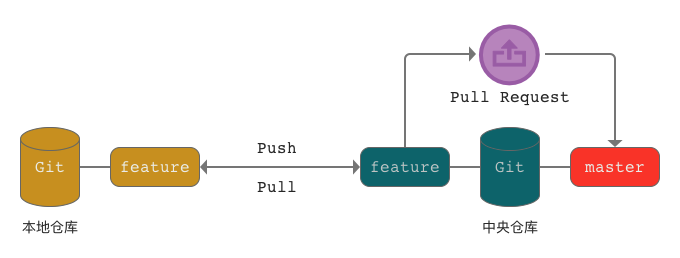

title: 4.Git-工作流
date: 2019-03-01
tags: GIT
categories: 配置管理
layout: draft

------

摘要：文本是使用Git进行代码管理的第四篇文章，重点介绍：团队开发模式下开发的工作流以及如何使用远程仓库进行开发的共享和集成。通过本文可以了解常用的几种工作流、远程仓库的两种使用方式，并通过一个案例介绍适合小团队的工作流和远程仓库使用方式。

<!-- more -->

## 回顾

前面三篇文章介绍了Git的基本概念、分支、远程仓库和远程分支的基本用法，在这里简要回顾一下。

### Git

Git 是分布式版本控制系统，其特点是：不依赖于服务端就可以独立工作；速度和性能较集中式版本管理系统高出不少；生态完善，与代码评审、代码质量检查、单元和集成测试、编译和发布等第三方工具很好的集成，实现CI/CD的自动化。

1. Git 安装。支持Widnows、MacOS、Linux等操作系统
2. Git 工具。很多第三方 Git 管理工具，与集成开发工具：如Eclipse、VS Code等集成。简化操作的复杂度。
3. Git 仓库。本地的文件目录，使用`git init`初始化为仓库，将管理的文件存放在`.git`目录下。
4. Git 文件。版本数据由`blob`、`tree`、`commit`三类文件组成**快照**，使用`branch`、`HEAD`、`tag`三类引用管理快照
5. Git 工作区。包括`工作区`、`暂存区`、`版本仓库`，工作区是我们编写代码的工作目录、暂存区是代码变更的缓存、版本仓库实际存放版本数据。
6. Git 操作。初始化仓库`git init`、配置`git config`、添加到暂存区`git add`、提交到仓库`git commit`等

### 分支

分支是 Git 的核心概念，也称为 Git 的"必杀技"。使用分支可以快速切换版本和开发场景，减少多人开发模式下的冲突。

1. 分支概念。分支是指向提交的引用。通过移动分支指向的提交可以快速切换版本；不同分支间版本相互独立，很好的支持并行开发。
2. 分支操作。分支的创建`git branch`、分支的切换`git checkout`、分支的删除`git branch -d`、分支的合并`git merge`
3. 分支合并。根据合并的两个分支的关系，分为`fast forward`和三方合并。三方合并时可能出现文件冲突，需要人工处理。

### 远程仓库

在网络上的 Git 版本库，用于备份、集成、共享等用途。远程仓库原则上是一个裸仓库，不支持提交操作。

1. 裸仓库。没有工作区的 Git 仓库，通过`git init  —bare`创建
2. 通信协议。支持`https`和`ssh`加密传输，`ssh`使用公钥进行身份认证，可以不用输入用户名和密码，建议采用`ssh`方式与远程仓库通信。
3. 部署。不建议自行部署，可以采用`github`、`gitlab`、国内的托管服务（Gitee、Coding等）
4. 配置。本地用户名和密码、服务器注册用户名和密码、`ssh key`的生成和远程仓库配置、本地添加远程仓库引用。

### 远程分支

远程分支是存储在远程仓库中的分支，只能通过`git push`、`git fetch`、`git pull`等方式在远程仓库与本地仓库间进行分支的数据交换。

1. 远程分支。是存储卡在远程仓库的分支，本地不能直接操作。
2. 远程跟踪分支。是远程分支在本地仓库的只读副本，每次使用`git clone`、`git fetch`操作时，将远程分支拉取到本地，这样可以减少与远程仓库的通信压力，远程跟踪分支只在以上操作时才进行同步，因此会落后于远程分支。
3. 跟踪分支。是本地分支，但它与远程分支建立了跟踪关系，可以简化分支的拉取和推送操作，并且可以了解本地分支与远程分支间的差异。`git clone`、`git checkout -trace`和 `git branch -u`操作可以创建跟踪分支。
4. 分支操作。远程分支的推送`git push`和拉取`git fetch`、`git pull`，在本地仓库和远程仓库间交换分支提交历史。

## 工作流

我们已经了解到，使用 Git 分支进行版本管理的高效和便捷。但要更好的使用分支来胜任团队协同开发，就需要根据团队研发管理特点，制定有针对性的工作流。

下面介绍常见的几种工作流，了解它们能帮助我们发现适合自身团队的工作流。

### 集中式工作流

集中式工作流就像我们使用 SVN 等集中式版本管理系统一样。

1. 无论本地仓库还是远程仓库（中央仓库）都只有一个默认的分支`master`
2. 所有团队成员的工作都是在`master`分支上进行的
3. 开始工作前，团队成员从中央仓库拉取`master`分支到本地仓库
4. 在本地`master`分支上完成开发工作并提交更新
5. 将本地`master`分支直接推送到中央仓库
6. 本地合并分支时产生的冲突必须在本地解决

集中式工作流比较适合从 SVN 迁移到 Git 的团队。

1. 中央仓库只作为项目代码共享和备份使用
2. 不强制要求对提交代码进行审查和测试
3. 由于`master`分支开放了写入的权限，有可能因误操作造成提交历史被错误覆盖

因此集中式工作流可以作为团队初期熟悉 Git 的一种过渡或者是在个人仓库上使用。**不推荐在实际项目中应用**

### 特性分支工作流

特性分支工作流，是将所有的特性开发放在专门的分支（而不是`master`分支）上。这样就起到了隔离作用，使得特性分支不会影响主干`master`代码。保证了`master`分支的代码是可运行的，有利于项目持续集成。

特性分支工作流是使用 Git 进行开发的标准用法，后续介绍的几种工作流都是特性分支工作流的变种。在特性分支工作流的使用中，普遍采用`Pull Request`模式，可以在合并代码时进行代码评审。

**Pull Request**。`Pull Request`的意思是，你把版本变更提交到仓库后，给项目负责人和相关人员发出一个请求`Request`，相关人员收到请求后，对你提交的变更进行审查和评论，最后由项目负责人将你提交分支`Pull`到项目的主干分支`master`，最终完成版本整合的工作。

采用这种方式有很多的好处：

1. 可以在不同仓库间进行`Pull Request`操作，如`Fork`模式就是在不同的仓库间进行整合
2. 在正式整合到主干分支前，对提交的版本变更进行审查`Code review`，提高代码的质量
3. 主干分支写操作受限，避免主干分支因误操作导致版本信息被覆盖

### Fork工作流

`Fork`工作流是特性分支工作流的一个变种，区别在于本地分支有两个上游分支（远程分支），个人远程仓库的分支以及团队远程仓库的分支。

`Fork`工作流的特点是项目维护者可以接受任何开发者的提交，但无需给他正式代码库的写权限。能为大型、自发性的团队（包括了不受信的第三方）提供灵活的方式来安全的协作。成为**开源项目**的理想工作流。

具体操作步骤：

1. 开发人员将团队的中央仓库`Fork`到个人的中央仓库中
2. 开发人员将个人仓库`Clone`到本地
3. 开发人员在本地创建特性分支
4. 开发人员在特性分支上进行变更操作并提交
5. 开发人员将本地特性分支`Push`到个人中央仓库
6. 发起`Pull Request`给团队负责人
7. 团队负责人将发起者个人中央仓库中的特性分支合并到团队中央仓库的主干分支
8. 开发人员从团队中央仓库将主干分支拉取到本地

### Git Flow

Git Flow 是 Git 官方推荐的基于分支的工作流，它是特性分支工作流的变种，适用于大型项目的开发。

Git Flow 非常复杂，它规定了用于不同用途的分支以及不同场景下的处理流程。

### GitLab Flow

### GitHub Flow

或者是管理水平较高的团队

1. 适用于持续迭代的项目，中央仓库中`master`分支的代码可以直接发布
2. 必须保证在提交到中央仓库前，在本地进行严格的代码检查和测试工作
3. 由于`master`分支开放了写入的权限，有可能因误操作造成提交历史被错误覆盖
4. 项目功能点可以通过配置进行设置

## 小团队案例