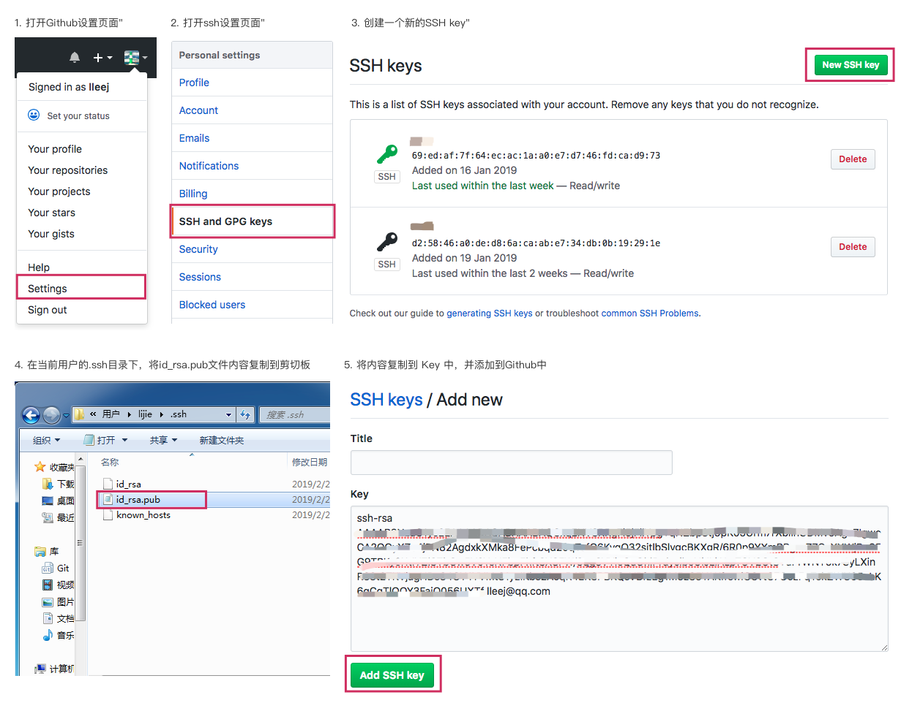
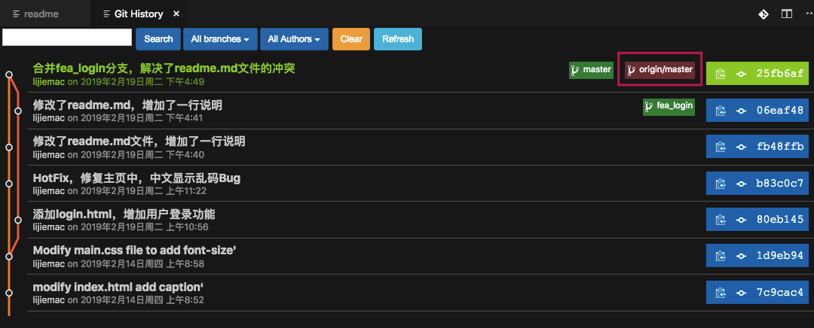

title: 3.Git-远程分支
date: 2019-02-20
tags: GIT
categories: 配置管理
layout: post

------

摘要：文本是使用Git进行代码管理的第三篇文章，重点介绍：如何使用远程仓库、远程分支进行代码的共享与集成。通过本文可以了解什么是远程仓库、如何在本地管理远程仓库、如何访问远程仓库，什么是远程分支、远程跟踪分支、跟踪分支、如何拉取和推送分支。

<!-- more -->

## 回顾

上文重点介绍了Git分支，包括提交、提交链、分支的概念和作用，如何创建分支、切换分支、合并分支以及删除分支。并结合`VS Code`开发工具，介绍在本地Git仓库使用分支的操作方法和注意事项。

**提交**。是Git进行版本控制的基本单位，可以理解为每个提交是一个版本的快照。

**提交链**。提交通过`parent`属性建立与父提交的联系组成一条提交链。通过这种关联可以反向遍历提交历史。

**分支**。可以理解为一个动态的指针，其总是指向某条提交链中最后的提交。使用分支可以方便的切换工作场景（如：功能开发、代码重构、Bug修复…）而不用过多的考虑不同工作场景下代码的版本。

## 远程仓库

在开始介绍**远程分支**之前，先聊聊**远程仓库**。远程仓库是指托管在因特网或其他网络中的版本库。作为一款分布式版本控制系统，理论上可以有好几个远程仓库，通常有些仓库对你只读，有些则可以读写。

### 用途

远程仓库主要的用途就是为了共享，包括：与他人协作以及本地仓库的备份等。

分布式版本管理系统是去中心化的，也就是说不依赖于一个所谓的中心仓库就可以开展工作。原则上，每个分布式节点通过配置`https`或`ssh`并设置用户的访问权限，就可以与他人进行仓库的共享。

不过，为了方便协作和数据备份，一般情况下我们会部署一个专门供大家共享的仓库。这个仓库与我们使用的本地仓库有一些不同。

### 裸仓库

作为共享用途的仓库，通过分支的推送和拉取实现与本地仓库的数据交换，原则上不需要直接对远程仓库进行代码的编辑和提交，因此远程仓库不需要创建工作区，我们称这样的仓库为**裸仓库**。

```bash
# 我们可以在本地创建一个裸仓库
# 裸仓库没有工作区，因此仓库名称采用[项目名.git]的形式
# 我们不能对裸仓库进行编辑和提交操作，如git add、git commit等
$ git init test.git --bare
```

### 常用远程仓库

作为当今最受欢迎的分布式版本控制系统，Git 的生态非常完善。不需要我们自行安装和配置相关的工具、协议、权限信息来实现远程仓库的部署，基于 Git 的可视化托管平台可以简化这个过程。

**Github**。是目前最大的开源代码托管平台，有1亿用户和超过1亿个代码库，所有知名的开源项目都托管在这个平台上。2018年微软收购 Github 后，允许免费用户创建私有化仓库。

**Gitlab**。仅次于 Github 的代码托管平台，提供的社区版本 Gitab CE 允许私有化部署，也是很多软件公司使用的内部代码管理平台，提供容器方式部署。 

**国内托管平台**。如 Coding 和 OSChina等。优势是相对于 Github 访问速度更快。 

### 准备工作

Git 远程仓库支持`https`和`ssh`加密协议进行数据的交换。而`ssh`协议通过公钥进行身份认证，这样就不用每次访问都输入用户名和密码，因此推荐采用这种方式。下面以 Github 为例介绍如何配置`ssh`，其他托管平台查看相关的配置说明。

**注册用户**。具体的操作步骤就不再赘述了，需要注意的是：建议使用邮箱作为用户名进行注册。

**安装Git**。具体的操作步骤见第一篇文章。安装 Git 后，使用`Git config`配置用户名和邮箱地址。**注意：用户名与注册用户一致**。

**生成ssh key**。在本机的命令行输入如下命令创建`ssh key`

```bash
# 按三次回车键即可
$ ssh-keygen -t rsa -C "用户名"
# 示例
$ ssh-keygen -t rsa -C "lleej@qq.com"
```

Windows 系统，在`C:\Users\[登录用户名]\.ssh`目录中创建两个文件：私钥文件`id_rsa`和公钥文件`id_rsa.pub`

**设置ssh**。打开`github`的`ssh`设置页面，将公钥文件`id_rsa.pub`的内容复制并创建一个新的`ssh key`。



**测试连接**。设置完成后，通过以下指令测试是否设置成功。

```bash
# 测试是否成功
$ ssh git@github.com
# 出现以下提示，表示设置成功
Hi lleej! You ve successfully authenticated, but GitHub does not provide shell access.
```

如果我们需要通过在本机访问多个远程仓库，例如：个人的`github`、公司的`gitlab`...，需要进行如下操作。

**为每个远程仓库创建SSH key**。最好为不同的远程仓库创建不同的`ssh key`，即使用户名一样。由于默认情况下创建的密钥文件名称为`id_rsa`，因此需要在创建多个平台的`ssh key`时指定密钥文件名。

```bash
# 指定密钥文件
$ ssh-keygen -t rsa -C "用户名" -f ~/.ssh/[平台简称]_rsa
# 示例: 为 github 创建 ssh key
$ ssh-keygen -t rsa -C "lleej@qq.com" -f ~/.ssh/github_rsa
```

注意：使用`-f`参数指定文件名时，需要指定文件放置的目录，可以写成`C:\Users\[登录用户名]\.ssh`，也可以用示例中的`~/.ssh/`表示。

**添加配置文件**。在`C:\Users\[登录用户名]\.ssh`目录中添加`config`文件，在配置文件中可以设置访问不同远程仓库时使用不同的公钥文件进行认证。

```bash
# Gitlab Private Server
Host localhost
  Hostname localhost
  IdentityFile ~/.ssh/gitlab_rsa
  User xxx@boco.com.cn

# Github Server
Host github.com
  Hostname github.com
  IdentityFile ~/.ssh/github_rsa
  User xxx@qq.com

# Coding Server
Host git.dev.tencent.com
  Hostname git.dev.tencent.com
  IdentityFile ~/.ssh/coding_rsa
  User xxx@qq.com
```

**Host**。远程仓库的名称，通常情况下这个值与`Hostname`一致

**Hostname**。远程仓库的主机名称，通常情况下是仓库的域名或IP地址

**IdentityFile**。使用的公钥文件的名称（不包括扩展名）

**User**。登录远程仓库的用户名

## 管理远程引用

> 本章节重点介绍远程仓库的管理，涉及到远程分支的部分在后面章节说明

为了能够操作远程仓库，需要在本机 Git 中添加一个具名的指向远程仓库地址的引用，称为**远程引用**。Git 中远程引用的默认名称是`origin`（类似默认分支名称为`master`），在本地 Git 中远程引用不能重名，但可以设置指向同一个远程仓库地址的多个远程引用。

管理远程引用包括：添加远程引用、移除无效的远程引用、重命名远程引用等。

### 添加远程引用

在本地仓库中添加远程引用有两种方式。

**克隆仓库**

如果我们使用`git clone`从远程克隆仓库到本地，Git 会自动添加远程引用，命名为`origin`。

```bash
# 通过克隆方式添加远程引用
$ git clone [远程仓库]
# 示例
$ git clone git@github.com:lleej/test.git
```

注意：使用`ssh`协议时远程仓库的命名格式，`git@[主机名]:[用户名]/[仓库名]`

**手动添加**

如果需要将本地仓库与多个远程仓库建立联系，比如：公司的集成仓库和备份仓库。就需要通过手动方式添加远程引用

```bash
# 手动添加远程引用
$ git remote add [远程引用] [远程仓库地址]
# 示例
$ git remote add origin git@github.com:lleej/test.git
```

添加远程引用后，就可以在本地对远程仓库进行分支的推送和抓取操作。

### 删除远程引用

```bash
# 删除远程引用
$ git remote rm [远程引用]
# 示例
$ git remote rm origin
```

### 重命名远程引用

```bash
# 重命名远程引用
$ git remote rename [OLD] [NEW]
# 示例
$ git remote rename origin ori
```

重命名后，需要使用新的远程引用进行访问。

### 查看远程引用

查看在本地 Git 仓库中连接了哪些远程仓库，以及这些仓库的地址和分支的跟踪情况。

**简要信息**

```bash
# 查看远程引用
$ git remote
# 查看远程引用和远程仓库地址
$ git remote -v
```

**注：以上三部分的操作只能通过命令行方式或者使用 Git 客户端工具实现，`VS Code`中并没有提供相应的功能。**

### 小结

**远程引用**。指向远端 Git 仓库的引用，通过这个引用可以拉取或推送分支。

**远程引用名称唯一**。为远程仓库设置的名称必须在本地仓库中唯一。

## 远程分支

顾名思义，远程分支是指远程仓库中的分支。我们通常不会直接在远程仓库上进行代码的编辑和提交，而是在本地仓库中完成相关工作后将本地分支推送到远程仓库，Git 会识别出推送的本地分支与远程分支存在哪些提交变化，只将变化的提交推送到远程仓库中。

### 查看远程分支

在本地仓库添加远程仓库引用后，我们就可以查看远程仓库中的分支情况了。注意：以下操作查看的是远程仓库当前的实时状态。

**摘要信息**。使用`git ls-remote`指令，可以查看远程分支和指向的提交信息。

```bash
# 查看远程分支
$ git ls-remote <远程仓库>
# 不指定 <远程仓库> 时默认 origin
$ git ls-remote
## 输出结果
From git@github.com:lleej/test.git
deddea3c1264a59f7695e5acf357134ba58f80fc	HEAD
deddea3c1264a59f7695e5acf357134ba58f80fc	refs/heads/from-remote
deddea3c1264a59f7695e5acf357134ba58f80fc	refs/heads/master
```

**详细信息**。使用`git remote show (远程仓库)`指令，可以查看更多远程仓库和分支的信息

```bash
# 查看远程分支详细信息
$ git remote show [远程仓库]
# 输出内容如下
* remote origin
  Fetch URL: git@github.com:lleej/test.git
  Push  URL: git@github.com:lleej/test.git
  HEAD branch: master
  Remote branch:
    from-remote new (next fetch will store in remotes/origin)
    master tracked
  Local branch configured for 'git pull':
    master merges with remote master
  Local ref configured for 'git push':
    master pushes to master (up to date)
```

**Fetch URL**。从远程仓库拉取数据的URL地址

**Push URL**。向远程仓库推送数据的URL地址

**HEAD branch**。远程仓库的分支头指针

**Remote branch**。远程仓库的所有分支。标注为`tracked`表示分支已经拉取到本地，标注为`new`表示分支没有拉取到本地。

**Local branch configured for "git pull"**。可以使用`git pull`指令从远程仓库抓取的分支。没有列出的分支需要使用`git fetch`进行拉取操作。

**Local branch configured for "git push"**。曾经使用`git push`指令推送过的分支。

### 远程跟踪分支

远程分支以及其指向的提交链是存储在远程仓库中的，不可能每次访问远程分支都与远程仓库通信来读取数据，Git 把远程仓库中的分支及其指向的提交链下载到本地仓库中，只有当需要更新数据时才与远程仓库进行通信。下载到本地的远程分支称为**远程跟踪分支**。

远程跟踪分支是远程分支状态的引用。它们是不能移动的本地引用，当你与远程仓库进行通信操作（推送和拉取）时，它们会自动移动。 远程跟踪分支像是你上次连接到远程仓库时，那些分支所处状态的书签。

远程跟踪分支是存储在本地仓库中的分支，以 `(远程仓库)/(分支)` 形式命名。可以通过`git branch -r`查看

```bash
# 查看远程跟踪分支
$ git branch -r
$ git branch -r -v
```

在`VS Code`中，使用`git history`插件可以看到远程跟踪分支（红色背景）。



### 跟踪分支

我们已经了解"远程分支"和"远程跟踪分支"的概念。远程分支存储在远端，远程跟踪分支是远程分支在本地仓库的只读副本，这两种分支我们在本地仓库都不能直接进行提交操作。

跟踪分支是与远程分支有直接关系的本地分支。当从一个远程跟踪分支检出一个本地分支，Git 会自动创建一个"跟踪分支"。 Git 使用"跟踪分支"不仅简化推送和拉取操作，而且可以提示本地分支与远程分支的差异。

跟踪分支是一种特殊的本地分支，它与远程跟踪分支建立跟踪关系，我们在本地仓库操作的是"跟踪分支"

Git 提供了三种创建"跟踪分支"的操作方式

**克隆仓库**。当将远程仓库克隆到本地时，Git 会自动创建`origin`远程仓库引用，以及`master`跟踪分支。

```bash
# 通过克隆仓库的方式创建跟踪分支
$ git clone git@github.com:lleej/test.git
```

注意：如果远程仓库中存在多个分支，克隆操作将所有远程分支拉取到本地并创建对应的远程跟踪分支，但只创建一个`master`跟踪分支。

**检出分支**。当从一个远程跟踪分支检出一个本地分支，Git 会自动创建一个"跟踪分支"。

```bash
# 通过检出方式创建跟踪分支
$ git checkout -b [跟踪分支] [远程仓库]/[分支]
# 或者使用简写方式 跟踪分支与分支名称相同
$ git checkout --track [远程仓库]/[分支]
# 示例
$ git checkout -b fix origin/fix
$ git checkout --track origin/fix
```

注意：这种方式会创建一个本地分支，因此确保本地没有这个分支存在。

**设置跟踪分支**。Git 提供了单独设置本地分支与远程分支的跟踪关系的指令。

```bash
# 单独设置跟踪关系 跟踪分支 和 远程跟踪分支 都存在的情况
# 如果当前工作分支为跟踪分支，则可以省略<跟踪分支>选项
$ git branch -u [远程仓库]/[分支] <跟踪分支>
$ git branch --set-upstream-to=[远程仓库]/[分支] <跟踪分支>
# 示例
$ git branch -u origin/fix fix
$ git branch --set-upstream-to=origin/fix fix
```

注意：这种方式是建立本地分支和远程跟踪分支的跟踪关系，两个分支必须都存在。

**查看跟踪分支**

```bash
# 查看跟踪分支
$ git branch -vv
# 输出
* fix    ac560f9 [origin/fix: ahead 1] add file c.md
  login  deddea3 Create remote.md
  master deddea3 [origin/master] Create remote.md
# 当前本地仓库有三个分支
# login 不是跟踪分支
# master 是跟踪分支，与origin/master建立了跟踪关系
# fix 是跟踪分支，与origin/fix建立跟踪关系，且有1个提交领先于远程分支
```

### 小结

**远程分支**指远程仓库中的分支，用于共享、集成或备份使用。远程分支只能通过`git push`方式进行更新

**远程跟踪分支**指远程分支在本地仓库的只读副本，拉取远程仓库将更新或创建它，除此之外不允许更改

**跟踪分支**是一种特殊的本地分支，它与远程跟踪分支建立了跟踪关系，可以简化推送和拉取操作。创建跟踪分支的三种方法：克隆仓库（只创建主分支`master`的跟踪分支）、检出分支（创建检出远程跟踪分支的跟踪关系）、设置跟踪关系（指定本地分支和远程跟踪分支）。

## 分支操作

本节介绍如何创建和使用远程分支、远程跟踪分支和跟踪分支，以及如何从远程仓库拉取分支、推送分支到远程仓库。

### 克隆远程仓库

克隆仓库是最常用的方法，我们参与维护项目代码时，首先需要将远程仓库克隆到本地。

克隆仓库完成以下工作：

1. 创建本地仓库
2. 创建远程仓库引用
3. 从远程仓库中拉取所有的分支（以及标签）
4. 在本地仓库创建对应的远程跟踪分支
5. 创建`master`跟踪分支

### 从远程仓库拉取分支

一个团队项目，远程仓库会被多人不定期更新，本地仓库的远程跟踪分支可能滞后于远程仓库，需要手动将远程仓库中最新的分支数据拉取到本地。这也是 Git 进行多人协作时需要额外付出的成本。

Git 提供两种从远程仓库拉取分支的方法

**Fetch**

使用`git fetch`指令，从远程仓库抓取**所有分支**或指定分支到本地仓库。抓取操作将更新（或创建）本地仓库中的远程跟踪分支，并不会与本地分支或跟踪分支进行合并，因此该操作不会影响当前工作目录中的文件。**是安全的**

一般情况下，我们在本地完成开发任务后，需要先执行该操作与远程仓库同步数据，然后在本地合并分支检查是否有冲突，然后再将分支推送到远程仓库。

```bash
# 抓取远程仓库 所有分支
$ git fetch [远程仓库]
# 示例
$ git fetch origin
# 当不指定远程仓库时使用默认的origin
$ git fetch
# 抓取远程仓库 指定分支
$ git fetch [远程仓库] [远程分支]
# 示例
$ git fetch origin master
```

**Pull**

我们从远程仓库抓取的分支，需要合并到本地分支中才能使用，因此 Git 提供了一个集两步操作为一体的指令`git pull`。**Pull**操作分两步执行：首先，从远程仓库**Fetch**分支到本地仓库并更新或创建远程跟踪分支；其次，将远程跟踪分支与本地分支进行合并。

因为要进行分支的合并操作，因此需要告诉 Git 远程跟踪分支要与哪个分支进行合并，而这就是**跟踪分支**的作用。上节介绍的跟踪分支就是为此而生的。

```bash
# 拉取远程仓库
$ git pull [远程仓库] [分支]
# 示例
# 从origin指向的远程仓库拉取master分支
$ git pull origin master
# 如果从远程仓库拉取当前工作分支(跟踪分支)，则可以省略掉远程仓库和分支
# 当前工作分支为master
$ git pull

# 建立远程跟踪分支与本地分支的跟踪关系
$ git branch --set-upstream-to=[远程仓库]/[分支] [本地分支]
```

在`VS Code`中集成了拉取功能，使用的就是`git pull`指令。

### 向远程仓库推送分支

在多人协作的场景中，当工作完成后需要将其推送到远程仓库，便于他人拉取最新的版本信息。在进行分支推送时我们一般会遇到以下两种情况。

**远程仓库没有该分支**

假设，我们为了完成特性开发工作在本地创建了`fea_login`分支（远程仓库中并不存在），在开发并测试完成后，要推送到远程仓库中。因为不存在远程分支和远程跟踪分支，因此必须指定推送分支名称。

```bash
# 推动只在本地存在的分支到远程仓库
$ git push [远程仓库] [分支]
# 示例
$ git push origin fea_login
```

推送操作将完成以下工作：

1. 在远程仓库创建`fea_login`分支
2. 将本地`fea_login`分支的提交历史推送到远程分支
3. 将远程仓库的`fea_login`分支抓取到本地并创建`origin/fea_login`远程跟踪分支

注意：推送操作不会自动创建跟踪分支，即建立远程跟踪分支`origin/fea_login`与本地分支`fea_login`的跟踪关系。

**远程仓库有该分支**

如果远程分支存在，我们就不能贸然推送，因为远程分支的提交可能已经领先本地分支了，本地远程跟踪分支的数据是滞后的，Git 会拒绝执行推送操作。

正常的操作流程如下：

1. 从远程仓库**Fetch**分支到本地，如果已经建立了跟踪关系也可以**Pull**
2. 合并本地分支与远程跟踪分支，保证推送的分支提交历史领先远程分支
3. 推送本地分支到远程仓库

```bash
# 推送到远程仓库 
$ git push [远程仓库] [分支]
# 示例 推送本地master分支到远程仓库
$ git push origin master
# 如果本地master分支是远程分支的跟踪分支，可以采用简写方式
# 推送当前工作分支到远程仓库中对应的远程分支
$ git push
```

### 案例演示

通过一个项目案例，了解如何操作远程分支。实际项目中的操作可能存在差异，具体要看团队的开发流程。

假设，要开发博客系统，为此创建了名为`blog`的远程仓库，仓库访问地址为`git@github.com:lleej/blog.git`。由项目负责人创建`dev`分支，并提交了一些代码。

作为一名项目开发人员，我需要执行以下步骤完成开发工作。

**克隆远程仓库**

```bash
$ git clone git@github.com:lleej/blog.git
```

这将完成以下操作

1. 在本地创建名为`blog`的仓库

2. 在仓库中添加远程引用`origin`

3. 拉取远程仓库`master`和`dev`分支，创建`origin/master`和`origin/dev`远程跟踪分支，从`origin/master`分支检出`master`分支并建立跟踪关系

**检出dev跟踪分支**

一般情况下`master`分支禁止直接推送，而采用`PR`或`MR`的方式进行更新，这部分我们会在后面工作流程中详细介绍。

我们需要基于`origin/dev`分支进行开发工作

```bash
$ git checkout -b dev origin/dev
# 或者
$ git checkout --track origin/dev
```

这将完成以下操作：

1. 基于`origin/dev`创建本地分支`dev`
2. 设置`origin/dev`和`dev`的跟踪关系
3. 检出`dev`分支为工作分支

**进行开发工作**

这时，我们就可以在`dev`分支上进行代码的创建、修改、提交等操作

```bash
$ vi index.html
$ vi main.css
...
$ git add .
$ git commit -m'完成了主页面的开发工作'
```

**推送到远程仓库**

个人的开发工作完成后，需要把最新的提交推送到远程仓库中。项目负责人会根据版本计划将`dev`分支合并到`master`分支中，进行上线前的测试和部署工作。

```bash
# 第一步：从远程仓库拉取最新dev分支的最新提交
$ git pull
# 如果出现合并冲突的情况，参照"2.Git-分支"一文中分支合并章节进行冲突的处理
# 第二步：将dev分支推动到远程仓库
$ git push
```

这将完成以下操作：

1. 将远程仓库`blog`中的`dev`分支拉取到本地并更新`origin/dev`远程跟踪分支
2. 将`origin/dev`分支合并到`dev`分支中
3. 如果有冲突则提示进行冲突处理，处理完成后再次提交完成合并
4. 推送`dev`分支到远程仓库中，远程仓库更新`dev`分支的提交历史
5. 更新`origin/dev`分支的提交历史与`dev`分支一致