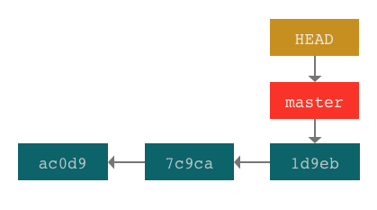
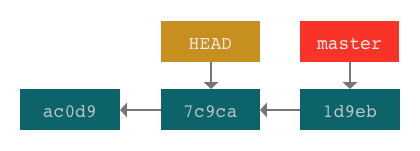
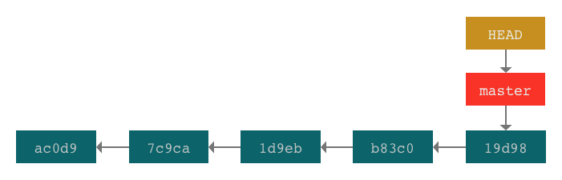
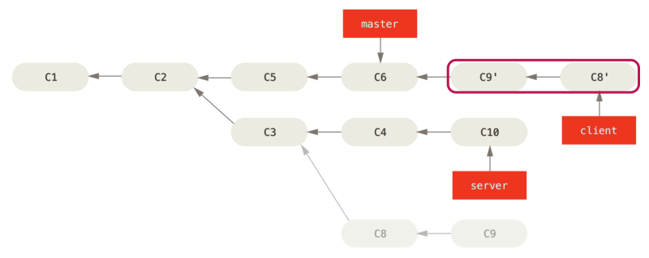
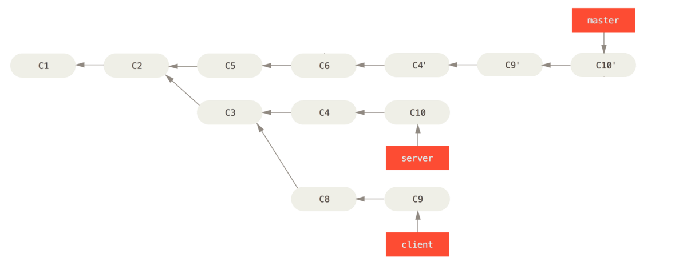

title: 5.Git-高级功能
date: 2019-03-14
tags: GIT
categories: 配置管理
layout: post

------

摘要：文本是使用Git进行代码管理的第五篇文章，重点介绍：Git的一些高级用法，包括：分离头指针、变基、Cherry-pick、撤销、提交合并、修改提交消息、强制移动分支、垃圾回收等。这些高级用法让我们可以更加自如的应对出现的各种问题，例如：提交到了错误的分支上、修改已提交的消息、从不同分支中提取部分提交到新的分支上、自由移动分支的指针、让提交历史更简洁等。

<!-- more -->

我们之前了解了Git的基本用法，包括：初始化仓库、克隆远程仓库、添加文件到暂存区、提交、创建分支、切换分支、删除分支、推动到远程仓库、从远程仓库拉取等等。掌握了这些用法基本满足日常使用的需要，但有时在使用时会出现一些误操作，或者导致分支提交历史的混乱，这就需要使用Git的高级用法来解决。

## 头指针

在分支部分介绍过头指针`HEAD`，头指针是指向当前分支（更准确的说是提交）的引用。我们在切换工作分支时，头指针指向当前工作分支，工作区的内容切换为分支指向的提交版本。



使用检出指令`git checkout [分支名称] | [提交哈希]`，将改变头指针的指向。

### 分离头指针

分离头指针是头指针的一种非正常状态`detached HEAD`。当头指针指向的不是本地分支而是某个提交时（即使是分支指向的提交），就处于分离头指针状态。



由于远程跟踪分支是只读副本，无法进行提交操作。因此，如果检出一个远程跟踪分支也会处于分离头指针状态。

```bash
# 检出远程跟踪分支
$ git checkout origin/master
$ git status
# 输出
HEAD detached at origin/master

# 检出提交哈希
$ git checkout 7c9ca
$ git status
# 输出
HEAD detached at 7c9ca
```

当处于分离头指针状态时，添加暂存区和提交操作能够正常执行。但是，由于新的提交没有关联的分支，当切换到其他分支后，在分离头指针状态下的提交会被 Git 垃圾回收。

### 相对引用

正常情况下，头指针的指向由 Git 负责维护。在切换分支、提交、回退等操作时，头指针都会自动进行移动。

当我们需要将头指针移动到指定位置（提交）时，通常情况下使用提交的哈希值，而哈希值的查找和记忆比较不方便，因此 Git 引入了相对引用，在分支名或`HEAD`后使用`^`和`~n`快速定位提交。

在分支章节我们介绍过，分支是一个单向的提交树，相对引用是从分支指向提交，沿着提交树向上移动指定数量提交记录的引用。

`^`。向上移动一个提交记录

`~n`。向上移动多个提交记录，n >= 1



```bash
# 定位到 b83c0 提交
$ git checkout b83c0
$ git checkout HEAD^
$ git checkout HEAD~1

# 定位到 7c9ca 提交
$ git checkout 7c9ca
$ git checkout HEAD^^^
$ git checkout HEAD~3
```

相对引用在 Git 高级用法中会经常用到，需要掌握。

## 变基

变基`rebase`是分支合并的另一种方法。在分支章节，介绍了使用`git merge`进行分支合并的方法。

### 什么是变基

变基是将一系列提交按照原有次序依次应用到另一分支上，取出提交记录、"复制"它们、逐个提交到另一分支上。

1. 变基用于分支的合并
2. 与`merge`不同的是，变基不会生成合并提交，而是将提交们依次应用到目标分支上
3. `merge`是将目标分支合并到当前分支，而`rebase`是将当前分支合并到目标分支
4. 变基可以创造更线性的提交历史，保持提交树的整洁、避免分叉，感觉就像串行工作一样

### 变基操作

下面通过一个例子，介绍变基的操作。

下图是 Git 的分支和提交情况，有两个分支分别为`experiment`和`master`，两个分支有一个共同的祖先`C2`。


如果使用`merge`进行合并，则合并操作将采用第三方合并的方式，创建一个合并提交`C5`，提交树出现分叉。

```bash
# 切换到 master 分支
$ git checkout master
# 合并 experiment 分支
$ git merge experiment
```

合并操作后，`master`分支指向合并提交`C5`，而`experiment`分支保持不变


如果采用`rebase`进行合并，则合并操作将创建与`C4`提交相同的`C4'`提交并指向`C3`，而`C4`提交被废弃，提交树不会出现分叉。

```bash
# 切换到 experiment 分支
$ git checkout experiment
# 变基到 master 分支
$ git rebase master
```

合并操作后，`experiment`分支指向提交`C4'`，而`master`分支保持不变。


如果要移动`master`分支指向合并后的提交`C4'`，则需要执行快速合并操作`merge`

```bash
# 切换到 master 分支
$ git checkout master
# 合并 experiment 分支
$ git merge experiment
```


### 变基操作原理

1. 找到两个分支（即当前分支 `experiment`、基底分支 `master`）的最近共同祖先 `C2`
2. 对比当前分支相对于该祖先`C2`的历次提交，提取相应的修改并存为临时文件
3. 将当前分支指向目标基底 `C3`
4. 将之前另存为临时文件的修改依序应用在当前分支

### 变基的用途

1. 创造更线性的提交历史，保持提交树的整洁、避免分叉
2. 保持远程仓库中分支的整洁，便于团队内部更好的协同工作

### 变基的几种用法

1. 将特性分支变基到基底分支

```bash
# 完整语法 可以在任意工作分支上执行
# 指定 特性分支 则在操作前会自动切换到 特性分支
$ git rebase [基底分支] [特性分支]
$ git rebase master experiment

# 简写语法 当前工作分支为 特性分支
$ git rebase [基底分支]
$ git rebase master
```

3. 将特性分支的子分支变基到基底分支

下图有三个分支，基底分支`master`、特性分支`server`、特性分支的子分支`client`

如果，直接将子分支`client`变基到`master`上，则会包含提交`C3`；而我们只想把`C8`和`C9`变基到`master`上


```bash
# 只将 client 子分支(C8、C9) 变基到 master
# 1. client 变基到 server, 提取出 C8 C9
# 2. 指定--onto 分支，变基操作重定向到 --onto 分支，即 master 分支
$ git rebase --onto master server client
```


## 交互式变基

交互式变基就是在进行变基操作时，可以通过交互方式来调整提交的顺序或者设置提交的操作方式。

1. 不用过多考虑变基分支和变基提交的关系
2. 可以调整变基提交的顺序
3. 可以设置变基提交的操作方式

交互式变基操作时，对提交的可操作方式有以下几种：

| 方式   | 含义                                                  |
| ------ | ----------------------------------------------------- |
| pick   | 应用提交                                              |
| reword | 修改提交消息                                          |
| edit   | 对提交进行编辑，然后使用**git commit -amend**进行提交 |
| squash | 把多个提交合并成一个提交                              |
| drop   | 不应用提交                                            |

### 变基操作

还是上一章节中三分支变基的例子，我们需要实现如下图所示的提交树，看看使用交互式变基如何操作。**注意：`C8'`和`C9'`顺序发生了变化。 **



首先，执行交互式变基指令，将分支`client`变基到分支`master`

```bash
# 交互式变基 使用 -i 开关
$ git rebase -i master client
```

Git 会出现一个可供编辑的交互界面

```bash
pick 54032aa C3
pick ec8e417 C8
pick 2a5c4a5 C9

# Rebase 126494c..2a5c4a5 onto 126494c (3 commands)
#
# Commands:
# p, pick <commit> = use commit
# r, reword <commit> = use commit, but edit the commit message
# e, edit <commit> = use commit, but stop for amending
# s, squash <commit> = use commit, but meld into previous commit
# f, fixup <commit> = like "squash", but discard this commit's log message
# x, exec <command> = run command (the rest of the line) using shell
# d, drop <commit> = remove commit
# l, label <label> = label current HEAD with a name
# t, reset <label> = reset HEAD to a label
# m, merge [-C <commit> | -c <commit>] <label> [# <oneline>]
# .       create a merge commit using the original merge commit's
# .       message (or the oneline, if no original merge commit was
# .       specified). Use -c <commit> to reword the commit message.
```

根据提示的变基操作方式，进行如下修改

```bash
# 不应用该提交
drop 54032aa C3
# 先是 C9
pick 2a5c4a5 C9
# 再是 C8
pick ec8e417 C8
```

保存并退出后，变基操作完成

## Cherry-pick变基

`Cherry-pick`也是一种变基操作，它从任意提交树上选取任意数量的提交，变基到当前分支，可以形象的称为"摘樱桃"。

1. 语法简单，只需指定要变基的提交哈希
2. 可以指定任意提交树上的任意数量的提交
3. 对于变基提交的数量和顺序，相比交互式变基要简单得多，不用该考虑分支的关系，还需手动进行调整
4. 对于变基提交的指定，相比交互式变基要麻烦很多，要通过日志查看提交的哈希值
5. 变基操作完成后，基底分支移动到分支的末尾

### 变基操作

继续沿用上一章节三分支变基的例子，我们需要实现如下图所示的提交树，看看使用`cherry-pick`变基如何操作。**注意：`master`分支的变化。**

> 我们可以想想，如果用变基操作、交互式变基操作如何实现，需要几个步骤。



使用`cherry-pick`对上例进行变基操作，则只需两步即可

```bash
# 切换到 master 分支
$ git checkout master
# 将 C4 C9 C10 提交变基到 master 分支
$ git cherry-pick C4 C9 C10
```

是不是非常简单！

### 适用性

1. 在工作流中，将主干分支的某个补丁提交应用到其他分支上（如：版本分支、生产分支等）
2. 重新整理提交树，清理不需要的提交、调整提交的先后顺序

## 变基小结

1. 变基是一种改变提交历史的操作，可以为一些特殊需求提供便利性
2. 变基操作只能针对本地分支，对于已经推动到远程仓库的分支，禁止进行变基操作
3. 变基操作的三种方式：变基、交互式变基、`Cherry-pick`
4. `rebase`操作不会移动基底分支的指向，`Cherry-pick`操作会移动基底分支的指向
5. 变基适用于分支合并，为了让提交树保持整洁和线性
6. 交互式变基适用于分支的整理，包括清除不需要的提交或改变提交的顺序
7. `Cherry-pick`适用于针对提交的变基，将一个提交应用到多个分支，或者将多个分支中的提交应用到一个分支
8. 变基操作改变了提交历史，需要慎重操作

## 在提交树上强制移动分支

有时，我们需要在提交树上移动分支指向特定的提交，这是可以使用强制移动分支的指令

1. 变基、合并、提交、撤销等操作，Git 都会移动分支，但有时候我们需要更简单直接的方式
2. 强制移动分支操作，可以在提交树上随意移动
3. Git 不会对该操作进行任何警示，因此需要格外谨慎

```bash
# 强制移动分支 使用 -f 选项
$ git branch -f [分支名] [提交哈希]
# 示例 强制将 master 分支 指向 C0
$ git branch -f master C0
```

## 撤销操作

在入门章节介绍过 Git 的撤销指令`git reset`，Git 还提供了另外一种撤销指令`git revert`，下面详细说说两者的区别和具体用法。

### Reset撤销

`reset`撤销指令可以撤销暂存区内的文件修改，也可以撤销提交（移动分支的引用）。

**撤销暂存区**

```bash
# 撤销暂存区
$ git reset HEAD --[文件名]
# 示例 撤销暂存区中C1.txt文件的修改，将当前提交中的文件覆盖暂存区
$ git reset HEAD --C1.txt
```

**撤销提交**

撤销提交是将分支引用回退到之前的某个提交，执行撤销提交操作后，当前的提交将被废弃（不在任何分支中）

```bash
# 撤销提交
$ git reset <mode> [提交哈希]
# 示例
$ git reset HEAD~2
$ git reset C1
```

注意：撤销提交的分支将不能推送到远程仓库中

### Revert撤销

如果一个分支推动到远程仓库中，就不能使用`reset`进行撤销操作了。这时你需要使用`revert`完成撤销操作。

如果想撤销多个提交（哪怕不是连续的）也可以使用`revert`实现

```bash
# 撤销提交
$ git revert [提交列表]
# 示例
$ git revert C1 C3
```

不同于`reset`只是将分支指向某个提交，`revert`是在当前分支上增加新的提交的方式实现撤销，新的提交中将去除提交列表中包含的变更部分，也就是说新的提交中删除了要撤销的变更部分。

由于是新增提交，所以分支指向的提交树上增加了新的节点，可以认为是一次提交操作（特殊而已），所以`revert`后的分支是能够推送到远程仓库中的。

## 修改提交消息

修改提交消息也是一个经常使用的操作。我们知道，每个提交对 Git 来说都相当于一个版本，提交消息就是对这个版本修订内容的一个注释，在团队协作时，他人可以通过提交消息了解提交包含的内容；当我们查找问题时，也可以通过提交消息快速的检索到提交。

```bash
# 修改提交消息
$ git commit --amend -m'新的提交消息'
```

该指令将修改当前分支的提交（不能指定），使用"新的提交消息"替换原有提交，并生成新的提交替换原有提交。因此，执行该指令**不会在当前分支中增加新的提交**

