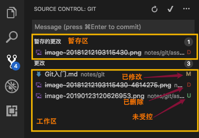

title: 1.Git入门
date: 2018-12-12
tags: GIT
categories: 配置管理
layout: post

------

摘要：文本是使用Git进行代码管理的第一篇文章，重点介绍：Git的由来、原理、安装、配置、常用命令和工具，并通过一个示例演示创建和使用本地Git仓库。

<!-- more -->

## GIT是版本控制系统

### 版本控制

版本控制，是一种记录一个或若干文件内容变化，以便将来查阅特定版本修订情况的系统。理论上可以对任何类型的文件进行版本控制。

在软件开发领域，版本控制是必备的。在一个软件产品的生命周期中，需要很多开发人员参与，经历多次的修改（BUG修复、功能增加、软件重构），尤其是当前软件迭代的速度越来越快，若缺少有效的版本控制，是无法想象的。

有效的版本控制系统意味着，就算把整个项目中的文件改的改删的删，也照样可以轻松恢复到原先的样子，工作量却微乎其微。

### 为什么使用GIT

我们在工作中很早就在使用版本控制系统，如：VSS、TFS、SNV。为什么要迁移到GIT上来呢？

**分布式版本控制系统。**相对于集中式版本控制系统（VSS、TFS、SNV），分布式不会过度依赖服务端，减少对资源使用的冲突，更利于多人间协作开发；而且，GIT的分支设计可以将本地仓库的代码一次提交到不同的远端仓库中，避免因服务端故障而影响开发工作。

**业界普遍在使用。**既然是业界普遍使用的，足以说明其有很多优点、稳定性和可靠性得到了验证，而且不需要对开发人员进行单独的培训。

**可视化管理平台。**大家耳熟能详的Github、Gitlab、Coding、Gitee等，就是基于GIT的可视化管理平台。这些平台提供了可视化的用户管理、权限管理、分支管理、ISSUE管理、代码评审、第三方服务集成等功能，打通了需求、设计、开发、测试、部署整个环节，大大提升了软件开发效率。其中，Gitlab的社区版提供本地化部署。

**成熟的DevOps能力。**业界基于GIT有很多DevOps解决方案，可以提升研发团队的持续集成、持续交付能力。


## GIT的由来

Linux 内核开源项目有着为数众多的参与者。 绝大多数的 Linux 内核维护工作都花在了提交补丁和保存归档的繁琐事务上（1991－2002年间）。到 2002 年，整个项目组开始启用一个专有的分布式版本控制系统 BitKeeper 来管理和维护代码。

到了 2005 年，开发 BitKeeper 的商业公司同 Linux 内核开源社区的合作关系结束，他们收回了 Linux 内核社区免费使用 BitKeeper 的权力。 这就迫使 Linux 开源社区（特别是 Linux 的缔造者 Linus Torvalds）基于使用 BitKeeper 时的经验教训，开发出自己的版本系统。 

> 合作关系结束是因为：Linux开源社区的某个成员尝试破解BitKeeper的通信协议，导致厂家翻脸；而Linus Torvalds用了2周时间就完成Git原型的开发

他们对新的系统制订了若干目标：

- 速度
- 对非线性开发模式的强力支持（允许成千上万个并行开发的分支）
- 完全分布式
- 有能力高效管理类似 Linux 内核一样的超大规模项目（速度和数据量）

## 原理

在正式使用GIT前，先对GIT的工作原理进行一个简单的介绍，将有助于在工作中更好的运用它。

### 文件管理

作为一个版本控制系统，GIT有其特有的文件管理方式。

- **为了提高操作速度**，GIT大部分的文件操作（除了与远程库交换数据外）都是在本地完成的，GIT将文件保存在一个隐藏目录中（工作目录下的`.git`），作为**分布式版本控制系统**，不需要频繁的访问**管理服务器**。
- **为了减少存储空间**，GIT只对修改的文件进行存储（大部分版本控制系统也采用这种方式）
- **为了提高便捷性**，GIT采用快照的方式对版本进行管理，也就是说每个版本都保存了全部受控的文件。
- **为了保证文件的完整性**，GIT采用`SHA-1`对文件计算校验和，并将该校验和作为文件名存储在仓库中。因此GIT可以根据校验和判断出哪个文件发生了变化，且文件也不会出现重名现象


### 工作区域

作为一款分布式版本控制系统，GIT的工作区域概念与SVN的不同，如下图所示：


GIT使用了三个工作区域，分别是：工作区（Working Area）、暂存区（Index Area）、版本库（Resository）

- **工作区**，就是我们放置代码的目录，我们可以在这里进行开发工作（添加文件、修改文件、删除文件、重命名文件），工作区中的文件（含目录结构）受GIT的管理，当进行分支和版本切换时，工作区中的文件与相应的版本保持一致。
- **暂存区**，顾名思义是暂时存放受控文件的区域，如上图所示版本库内左侧区域。暂存区存放在版本库中，与版本库公用一个存储对象。暂存区内的文件会在一次提交操作后，一次性的更新到版本库（Repository）中
- **版本库**，存放受控文件的仓库。版本库中存放着已提交受控文件的历史版本，每次提交操作都会在版本库中创建一个新的版本

### 文件状态

为了让GIT用户直观的了解工作目录中文件所处的状态和位置，提出了文件状态的概念。


如上图所示，在GIT中文件共有四种状态

- **未跟踪**（Untracked），表示该文件没有纳入GIT版本控制系统中。常见于在**工作区**新创建的文件
- **已修改**（Modified），表示纳入GIT版本控制系统中的文件，在**工作区**内被修改（内容改变、被删除、重命名）
- **已暂存**（Staged），表示纳入GIT版本控制系统中的文件被修改，或者是未受控文件被添加后的状态，文件此时处于**暂存区**中
- **未修改**（Unmodified），表示纳入GIT版本控制系统中的文件，在提交到仓库（Repository）后没有被修改

很多开发工具已经深度集成了GIT功能，可以在开发工具中直观的了解文件的状态。下图是VS Code的相关界面。

- **暂存的更改**即暂存区内文件的状态，可以将**更改**区中的文件添加到暂存区中（支持单个文件添加和所有文件添加）
- **更改**即当前工作目录中，自上一次提交后的变化情况
- **M**表示文件内容被修改
- **D**表示文件被删除或者重命名（重命名=删除+新建）
- **U**表示新创建的文件或者重命名




### 不纳入GIT管理

需要明确的一点是**GIT管理的是源代码和资源文件**，而不是编译后的可执行程序、依赖的包文件或者数据库备份等。因此，有些工作区内的文件是不需要纳入GIT进行管理的。

GIT已经考虑到了这一点，通过在工作区跟目录下的创建`.gitignore`文件，来自动忽略掉不需要管理的文件。

下面是一个`.gitignore`文件的示例，列出需要忽略的文件和目录。注意：支持通配符、目录需要在结尾加入`/`

```shell
.DS_Store
Thumbs.db
db.json
*.log
node_modules/
public/
.deploy*/
```


## 环境搭建

下面介绍如何在Windows环境下搭建GIT环境，其他系统的搭建请参照[官方指南](https://git-scm.com)。

### 安装

GIT的安装非常简单，这里就不赘述了。

- GIT安装，[下载地址](https://git-scm.com/download/win)
- 图形工具，[下载地址](https://tortoisegit.org/download/)

按上面给出的下载地址，下载对应的版本，先安装GIT，再安装图形工具及其汉化包

### 配置

> 安装好Git后，需要在正式使用前先进行配置

考虑到用户操作的便利性，GIT引入了**作用域**的概念

- **系统作用域**，配置信息对所有当前终端上的所有用户和仓库均有效（**很少使用**）
- **全局作用域**，配置信息仅对当前用户的所有仓库有效
- **局部作用域**，配置信息只对当前仓库有效

在配置操作时，通过添加**作用域可选项**对作用域进行限制，默认的作用域是**全局作用域**。不同作用域的配置信息将存储在不同位置，不会相互影响。因此，当多个作用域的配置信息同时存在时，其优先级为**局部 > 全局 > 系统**

> 什么时候需要多个配置信息呢？可以考虑这样的场景：你同时维护两个代码库，一个是公司的代码库使用公司的邮箱作为账号；另一个是github上的个人代码库，使用个人qq邮箱作为账号。这时就需要配置多个参数信息。

**配置用户信息**：

大部分可视化版本控制平台的用户名均采用邮箱地址，因此建议用户名=邮箱。邮箱单独设置，是因为可以在仓库发生变化（PR）时通知相关人员。

```shell
# 设置用户信息为全局作用域
$ git config --global user.name '<用户名>'
$ git config --global user.email '<邮箱>'

# 设置用户信息为局部作用域
$ git config --local user.name '<用户名>'
$ git config --local user.email '<邮箱>'
```

**查看配置信息**

```shell
# 查看全部配置信息
$ git config --list

# 查看某项配置
$ git config user.name

# 查看作用域下的配置(叠加作用域参数)
$ git config --global user.name
```

**删除配置信息**

```shell
# 使用 --unset 参数
# 如果用户名和邮箱设置错误，需要先删除
$ git config --local --unset user.name
$ git config --local --unset user.email
```


## 常用命令

## 工具

## 示例演示

