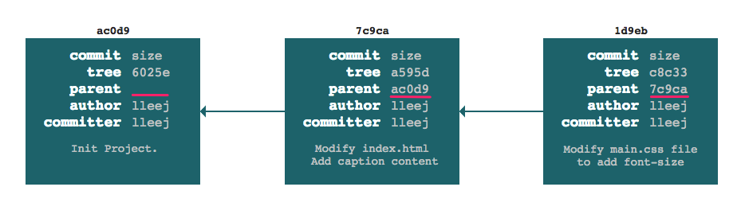

title: 2.Git的分支
date: 2019-01-25
tags: GIT
categories: 配置管理
layout: draft

------

摘要：文本是使用Git进行代码管理的第二篇文章，重点介绍：Git“必杀技”分支的原理、用途、用法以及指令，通过一个示例演示如何利用分支进行多版本管理。

<!-- more -->

回顾：上篇介绍了Git的一些基本概念和日常用法，包括Git的特点、工作区域和文件状态的概念；如何安装Git环境、配置用户信息；如何在本地创建版本库，使用`VS Code`操作版本库等。

你也许会有这种感觉，这跟之前使用的版本管理系统没有什么区别呀？而且，这个也解决不了快速迭代和并行开发的问题呀？那是因为，我们还没有使用Git“必杀技”分支。本文就讲讲分支的妙用。

## 分支

