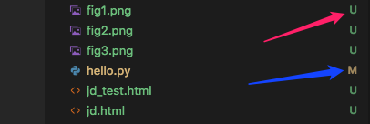

> 2018.12.12
>
> 2018.12.17 重新整理

#版本控制

​	版本控制是一种记录一个或若干文件内容变化，以便将来查阅特定版本修订情况的系统。可以对任何类型的文件进行版本控制。

​	使用版本控制系统通常还意味着，就算你乱来一气把整个项目中的文件改的改删的删，你也照样可以轻松恢复到原先的样子。但额外增加的工作量却微乎其微。

#分布式版本控制

​	客户端和服务端保存的都是完整的代码仓库。开发人员可以在各自的仓库进行开发和版本控制。服务端代码仓库更多是为了便于代码的集成、测试、部署等管理功能。

## 优势

- 客户端不依赖于服务端工作，可以离线工作。
- 客户端可以将本地仓库提交到不同的远端仓库中。


# Git

## 由来

​	Linux 内核开源项目有着为数众多的参与者。 绝大多数的 Linux 内核维护工作都花在了提交补丁和保存归档的繁琐事务上（1991－2002年间）。到 2002 年，整个项目组开始启用一个专有的分布式版本控制系统 BitKeeper 来管理和维护代码。

​	到了 2005 年，开发 BitKeeper 的商业公司同 Linux 内核开源社区的合作关系结束，他们收回了 Linux 内核社区免费使用 BitKeeper 的权力。 这就迫使 Linux 开源社区（特别是 Linux 的缔造者 Linus Torvalds）基于使用 BitKeeper 时的经验教训，开发出自己的版本系统。 他们对新的系统制订了若干目标：

> 合作关系结束是因为：Linux开源社区的某个成员尝试破解BitKeeper的通信协议，导致厂家翻脸；而Linus Torvalds用了仅仅1周时间就完成Git原型的开发

- 速度
- 简单的设计
- 对非线性开发模式的强力支持（允许成千上万个并行开发的分支）
- 完全分布式
- 有能力高效管理类似 Linux 内核一样的超大规模项目（速度和数据量）

## 文件管理

​	把数据文件看作是小型文件系统的一组快照。 每次你提交更新，或在 Git 中保存项目状态时，它主要对当时的全部文件制作一个快照并保存这个快照的索引。 为了高效，如果文件没有修改，Git 不再重新存储该文件，而是只保留一个链接指向之前存储的文件。 Git 对待数据更像是一个 **快照流**

​	下图：数据文件 3 个，一共提交了 5 个版本


​	下图：每个版本都存储了全部文件的快照。若文件没有修改，则不复制该文件，而是指向该文件的历史快照。这样可以有效的节省存储空间


## 工作区

​	Git仓库有三个工作区


### Git 仓库

用来保存元数据和对象数据库的地方（`.git`目录）。是最重要的部分，克隆仓库就是拷贝这里的数据。

```shell
-rw-r--r--   1 lijie  staff    9 12 12 09:14 COMMIT_EDITMSG
-rw-r--r--   1 lijie  staff   23 12 12 09:14 HEAD				# HEAD头指向的branch/commit
drwxr-xr-x   2 lijie  staff   64 12 12 09:14 branches			# branch存放的目录
-rw-r--r--   1 lijie  staff  144 12 12 09:24 config				# local配置信息
-rw-r--r--   1 lijie  staff   73 12 12 09:14 description		# 
drwxr-xr-x  12 lijie  staff  384 12 12 09:14 hooks
-rw-r--r--   1 lijie  staff  118 12 12 09:14 index				# 暂存区
drwxr-xr-x   3 lijie  staff   96 12 12 09:14 info				# 可以存放项目的忽略文件配置
drwxr-xr-x   4 lijie  staff  128 12 12 09:14 logs				# 操作日志
drwxr-xr-x   4 lijie  staff  128 12 12 09:14 objects			# 文件快照存储的目录
drwxr-xr-x   4 lijie  staff  128 12 12 09:14 refs				# heads和tags存放的目录
```

**注：以上是Git 仓库的目录结构，在下一节中进行详细介绍**

###暂存区

一个文件，保存下次将提交的文件列表信息，在 Git 仓库目录中。

```shell
-rw-r--r--   1 lijie  staff   14 12 12 16:09 COMMIT_EDITMSG		# 执行git commit 时提交消息
-rw-r--r--   1 lijie  staff  190 12 12 17:56 index				# 暂存区 二进制格式
```

### 工作目录

就是我们保存文件的目录，该目录中存放的文件是从仓库中某个版本提取出来的。

```shell
-rw-r--r--  1 lijie  staff  7 12 12 16:06 readme.md
-rw-r--r--  1 lijie  staff  5 12 12 17:56 test
```


## 文件状态

​	下图是四种状态的变化周期


​	在编辑器中( VSCode )，状态的提示( U -- 未跟踪态；M -- 已修改状态)



### 未跟踪

没有纳入版本管理中的文件。既不存在于上次快照（提交）的记录中，也没有放入暂存区。

1). 哪些文件？

- 已存在工作目录(有数据文件)，使用`git init` 指令初始化仓库后，该目录中所有文件均处于未跟踪状态
- 在一个仓库的工作目录下，新添加的文件均处于未跟踪状态

```shell
$ git status
On branch master
Your branch is up to date with origin/master.
Untracked files: # 指示下面的文件属于 未跟踪 状态
  (use git add <file>... to include in what will be committed)

	git/assets/deltas.png
	git/assets/lifecycle.png
	git/assets/snapshots.png

no changes added to commit (use git add and/or git commit -a)
```

2). 哪些操作？

对处于未跟踪状态的文件，可以纳入Git仓库管理；也可以作为临时文件使用

纳入Git仓库管理，可以有两种方式：先放入暂存区 或者 直接放入 仓库中

- 放入暂存区 （使用 git add [文件名 / 目录名]）

```shell
# 将一个文件放入暂存区
$ git add git/assets/deltas.png

# 查看仓库状态
$ git status
On branch master

Changes to be committed: # 只是已加入暂存区
  (use "git reset HEAD <file>..." to unstage)

# 指示该文件 放入暂存区中
	`new file:   git/assets/deltas.png  

# 还有两个文件 处于未跟踪状态
Untracked files:
  (use "git add <file>..." to include in what will be committed)

	git/assets/lifecycle.png
	git/assets/snapshots.png
```

- 放入仓库 （使用 git commit -a ）不推荐。将工作目录中所有未跟踪文件 以及 暂存区中的文件 提交到仓库中

```shell
$ git commit -am'commit -a'
[master f98876d] commit -a
 14 files changed, 156 insertions(+), 56 deletions(-) # 把所有文件全部提交仓库中
 create mode 100644 git/assets/deltas.png
```


### 已暂存

​	文件处于暂存区（Index），该文件在仓库中做了标记，包含在下次提交的快照中。注意：暂存区中的文件并没有正式提交到仓库中，处于一种暂存的中间状态。

1). 作用：

- 纳入版本管理，暂存区中的文件快照已经存储到`.git/objects`中，但该状态并不稳定。
- 便于在提交时，将本次提交涉及的相关文件一同提交

2). 哪些文件？

- 未跟踪文件：使用`git add [文件名]`指令添加到暂存区中，这些文件显示为`new file:`标签
- 已提交文件被修改后：使用`git add [文件名]`指令添加到暂存区中，这些文件显示为`modified:`标签
- 已删除文件：使用`git rm --cached -- [文件名]`指令，这些文件显示为`deleted:`标签

```shell
# 查看仓库状态
$ git status
On branch master

# 这个表示 下面的文件处于 暂存区中
Changes to be committed:
  (use git reset HEAD <file>... to unstage)

	`modified:   git/03.基本原理.md`   # 已纳入版本管理的文件被修改
	`new file:   git/assets/lifecycle.png` # 未跟踪的文件
	`deleted:    first.md`	# 使用git rm --cached 指令 从仓库中移除文件 将在这里显示 
```

2). 哪些操作？

- 提交到仓库中（ 使用`git commit -m'注释'`指令 ）

```shell
$ git commit -m'first'
[master 290640e] first
 1 file changed, 1 insertion(+)
 create mode 100644 first.md
```

- 从暂存区移除（ 使用`git reset HEAD [文件名]` 指令）

  **注意：该操作只是把文件从暂存区移除，并不会影响工作区中文件的内容（即使文件被再次修改过）**

```shell
$ git reset HEAD first.md
Unstaged changes after reset:
M	first.md
```

- 从暂存区移除 （ 使用`git rm --cached -- [文件名]`指令 ）

```shell
$ git rm --cached -- first.md
rm 'first.md'
```

- 覆盖工作目录中的文件（ 使用`git checkout -- [文件名]`指令）

  **注意：该指令用暂存区中的文件 覆盖 工作目录中的文件**

```shell
$ git checkout -- first.md
```


### 已提交 (未修改)

文件已经提交到仓库中。这时，工作目录中的文件 与 仓库中的文件 版本一致

**使用：`git commit`指令**

```shell
# 使用 git commit 命令 将暂存区中的文件保存到仓库中
$ git commit -m'Add readme.md'
[master (root-commit) 156aa60] Add readme.md
 1 file changed, 1 insertion(+)
 create mode 100644 readme.md
# 再次查看时，已经没有需要提交的信息了
$ git status
On branch master
nothing to commit, working tree clean
```

1). 哪些操作？

- 从提交中移除文件 （ 使用`git rm -- [文件名]`指令，直接从仓库中移除文件 ）

  移除提交的文件后，工作目录中的该文件处于未跟踪状态（ `Untracked` ）

```shell
$ git rm -- first.md
rm 'first.md'
$ git s
On branch master
Changes to be committed:
  (use "git reset HEAD <file>..." to unstage)

	`deleted:    first.md
	
Untracked files:
  (use "git add <file>..." to include in what will be committed)

	first.md
```

- 重命名文件（ 使用`git mv [源文件]  [目标文件]`指令 ）

  注意：使用`git mv`指令是对受`git`管理文件的操作，如果文件处于未跟踪状态，则无效。

```shell
# 重命名受Git管理的文件
$ git mv first.md second.md

# 查看文件状态
$ git status
On branch master
Changes to be committed:
  (use "git reset HEAD <file>..." to unstage)

	renamed:    first.md -> second.md

# 工作目录中文件状态
$ ls
second.md
```


### 已修改

对已经被`Git`管理的文件进行修改后，提示修改的文件处于已修改状态

对文件进行的修改(新增、删除、编辑)等，git会自动发现并将这些文件标注为`untracked`

```shell
$ git status
On branch master

# 这行说明 表示 有受控文件被修改
Changes not staged for commit:
  (use git add <file>... to update what will be committed)
  (use git checkout -- <file>... to discard changes in working directory)

	"modified:   css/00.伪类.md
	"modified:   git/00.安装.md
	"modified:   git/02.初始化库.md
	"modified:   git/03.基本原理.md
	"modified:   git/04.git剖析.md
	"modified:   git/06.实操.md
```

1). 哪些操作？

- 覆盖工作目录中的文件（ 使用`git checkout -- [文件名]`指令）

  **注意：该指令用 暂存区 中的文件 覆盖 工作目录中的文件** 

```shell
$ git checkout -- first.md
```


### 小结

在仓库中的文件，最多同时可以有三个版本存在

- 提交到仓库中的版本
- 修改后添加到暂存区中的版本
- 工作目录中修改的版本

## 基本流程

1. 编辑文件：在工作目录中编辑文件
2. 暂存文件：将文件的快照放入暂存区域
3. 提交更新：找到暂存区域的文件，将快照永久性存储到 Git 仓库目录

# 总结

1. `Git` 是一个小型的文件管理系统
2. 采用文件快照方式记录文件修改情况( 若文件没有修改，则引用源文件快照 )
3. 使用`Git`进行版本管理时，尽量不要把多个文件以压缩文件形式存放
4. `Git` 并不适合对历史版本的某一个文件进行操作，其操作的基本单位是 `commit` 而不是 `blob`

