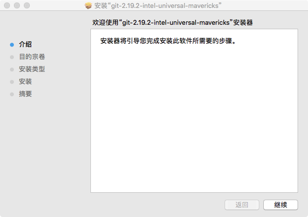
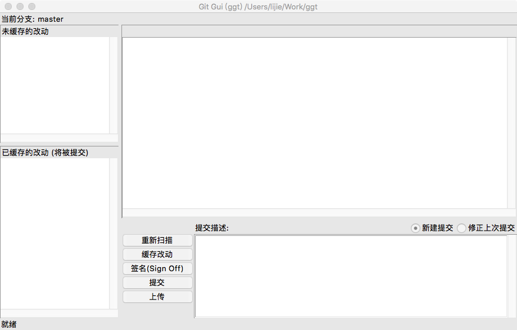
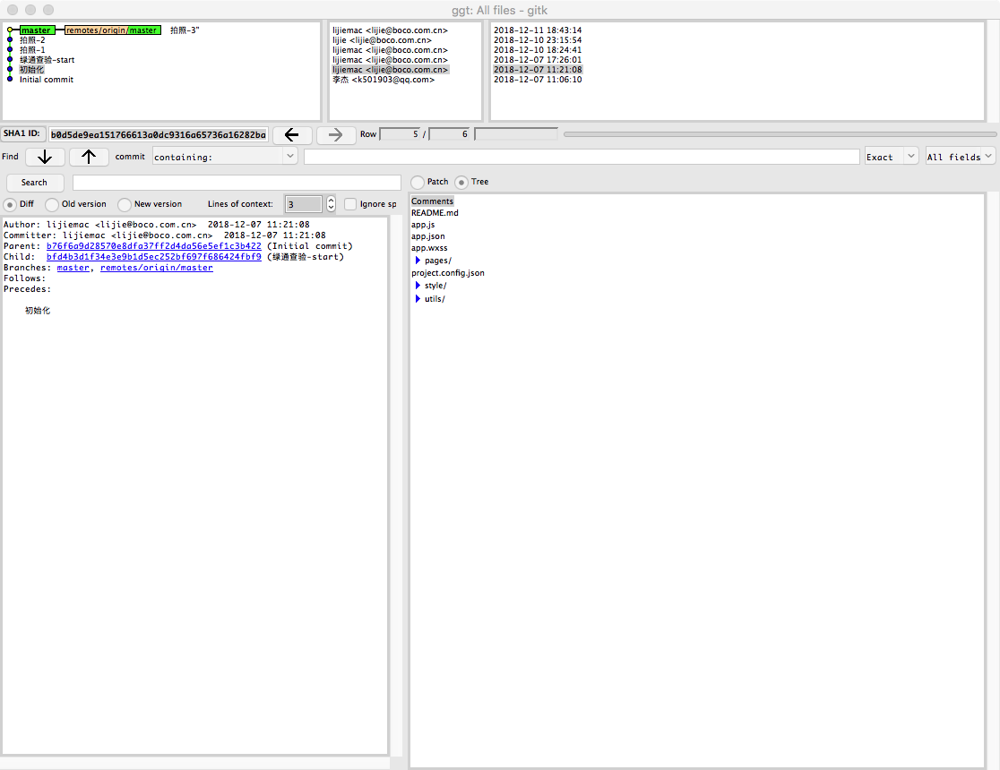

> 2018.12.12 

# 网址

[官网](https://git-scm.com/)

[中文文档](https://git-scm.com/book/zh/v2)

[源代码](https://github.com/git/git)

# Mac

## 安装包

下载最新的文件包(笔记时为 2.19.2 版本)，按照提示一步步安装即可。



## 图形化工具

git自带两个图形化工具

- Git-gui。用于提交

  ```shell
  git gui
  ```

  

- gitk。用于浏览

  ```shell
  gitk
  ```

  

# Windows

## 安装文件

[下载地址](https://github.com/git-for-windows/git/release) 

Git for Windows 项目

# Unix

## 二进制

```shell
 $ sudo yum install git
 $ sudo apt-get install git
```


##源代码

- 安装 Git 依赖的库：curl、zlib、openssl、expat、libiconv

```shell
  $ sudo yum install curl-devel expat-devel gettext-devel openssl-devel zlib-devel
  $ sudo apt-get install libcurl4-gnutls-dev libexpat1-dev gettext libz-dev libssl-dev
```

- 格式文档的依赖库（如 doc, html, info）：asciidoc、xmlto、docbook2x

```shell
  $ sudo yum install asciidoc xmlto docbook2x
  $ sudo apt-get install asciidoc xmlto docbook2x
```

- kernal网站下载 https://www.kernel.org/pub/software/scm/git
- github下载 https://github.com/git/git/releases

- 编译并安装：

```shell
  $ tar -zxf git-2.0.0.tar.gz
  $ cd git-2.0.0
  $ make configure
  $ ./configure --prefix=/usr
  $ make all doc info
  $ sudo make install install-doc install-html install-info
```

- 使用 Git 来获取 Git 的升级：

```shell
  $ git clone git://git.kernel.org/pub/scm/git/git.git
```

#集成插件

- 大部分开发工具都内置了Git功能
- VS Code中的 Git History 插件 可以图形化方式浏览


