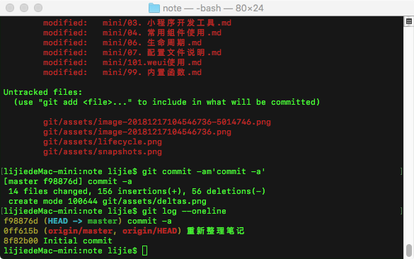

# 解惑

## 每个提交中数据文件的快照都是全量的


```shell
$ git init mv  # 创建一个空仓库
$ cd mv

# 添加第一个文件并提交
$ echo 'first' > first.md
$ git add first.md
$ git commit -m'first'
[master (root-commit) 51da0ac] first
 1 file changed, 1 insertion(+)
 create mode 100644 first.md
 
# 当前提交 51da0ac 的内容
# 第一个提交 没有 parent 配置项
$ git cat-file -p 51da0ac
tree 2e6f4dc6f559b8dbb4f4e7b0de60b316ba24bd2b
author lijiemac <lijie@boco.com.cn> 1544694245 +0800
committer lijiemac <lijie@boco.com.cn> 1544694245 +0800

first
# 当前提交中 tree 的内容
$ git cat-file -p 2e6f4dc
100644 blob 9c59e24b8393179a5d712de4f990178df5734d99	first.md

# 添加第二个文件并提交
$ echo 'second' > second.md
$ git add second.md
$ git commit -m'second'
[master 2fe03f9] second
 1 file changed, 1 insertion(+)
 create mode 100644 second.md

# 当前提交 2fe03f9 的内容
# parent 配置项 指向了上一次提交
$ git cat-file -p 2fe03f9
tree c2bd0cc40088082e6f7d8fe306ccdacc5efa4cd6
parent 51da0acb71e0f26ce845f5dbee8a8f2a5fc51209
author lijiemac <lijie@boco.com.cn> 1544694579 +0800
committer lijiemac <lijie@boco.com.cn> 1544694579 +0800

second

# 当前提交中 tree 的内容
$ git cat-file -p c2bd0cc
100644 blob 9c59e24b8393179a5d712de4f990178df5734d99	first.md
100644 blob e019be006cf33489e2d0177a3837a2384eddebc5	second.md
```


## 不同仓库中，文件相同则哈希值相同

接上一个操作

```shell
# 创建一个新的工作目录mm
# 将 mv 仓库中的文件拷贝到mm中
$ mkdir mm
$ cd mm
$ cp ../mv/*.md .

# 初始化仓库
# 分两次将两个文件提交仓库
# 可以看出两次提交的commit的哈希值不同
$ git init
Initialized empty Git repository in /Users/lijie/study/mm/.git/
$ git add first.md
$ git commit -m'first'
[master (root-commit) 256cb0d] first
 1 file changed, 1 insertion(+)
 create mode 100644 first.md
$ git add second.md
$ git commit -m'second'
[master 72931be] second
 1 file changed, 1 insertion(+)
 create mode 100644 second.md

# 查看 tree 的哈希值是否一样
# 可以看出 哈希值 不同
$ git cat-file -p 72931b
tree c2bd0cc40088082e6f7d8fe306ccdacc5efa4cd6
parent 256cb0dce4e3594adef394e21b633a7cd0da5263
author lijiemac <lijie@boco.com.cn> 1544694977 +0800
committer lijiemac <lijie@boco.com.cn> 1544694977 +0800

second

# 查看文件的哈希值是否一样
# 可以看出 相同文件的哈希值 在不同仓库中是一样的
$ git cat-file -p c2bd0c
100644 blob 9c59e24b8393179a5d712de4f990178df5734d99	first.md
100644 blob e019be006cf33489e2d0177a3837a2384eddebc5	second.md
```


## commit branch tag head的关系





