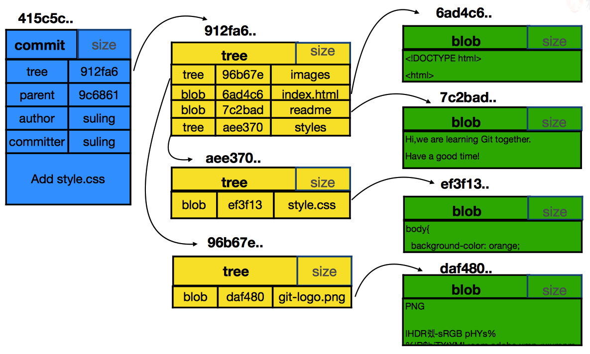

title: GIT 之三个核心对象
date: 2018-12-10
tags: git
categories: 配置管理
layout: draft

---
# 核心概念（三个对象）

在深入研究Git前，首先需要明白Git的几个核心概念，这样便于后面的学习和理解

下图是其中最主要的三个对象类型`commit` `tree` `blob`之间的关系。



## commit

`commit`是存储在`git`仓库中的快照，每次执行`git commit`指令后，在`git`仓库中都会创建一个新的`commit`对象

### 是什么？

1. `git`内置的对象类型
2. 表现为`SHA-1`哈希值（长度40）
3. 一次提交的快照
4. 每次提交操作将产生一个新的`commit id`

### 在哪里？

1. 存储在`.git/objects/`目录中
2. 名称为`./前2位/后38位`

### 有什么？

1. `tree`：树对象名称

   - 一个`commit`对象中只有一个`tree`对象

   - 能够找到该`commit`包含的所有文件快照

2. `parent`：在哪个`commit`对象基础上创建的

   - 形成`commit`的遍历关系
   - 第一个提交`parent`为空
   - 从多个分支合并时，有多个`parent`

3. `author`：该`commit`的作者

   - 该`commit`的创建人
   - 多人协作时，`author`可能不是自己

4. `committer`：该`commit`的提交人

   - 谁提交了

5. 提交注释

看一个`commit`的具体案例

```shell
# 查看 Git 对象的类型
$ git cat-file -t 1f414886a
commit

# 查看 Git 对象的内容
$ git cat-file -p 1f414886a
tree 124098142d34d43b4df63a4c3655f0112f7c0682 # 该 commit 中包含的目录树
parent 156aa60400c19d00a4d8bcef1ad0ed5a846e9849	# 从该 commit 创建的，因此parent 为该 commit
author lijie <lijie@boco.com.cn> 1544613332 +0800 # 作者
committer lijie <lijie@boco.com.cn> 1544613332 +0800 # 提交人

Add readme.md # 提交注释
```


## tree

在`git`中数据文件的存储没有采用类似操作系统的树状结构，而是用`tree`对象代替

### 是什么？

1. `git`内置对象类型
2. 模拟目录存储结构
3. 表现为`SHA-1`哈希值（长度40）

### 在哪里？

1. 存储在`.git/objects/`目录中
2. 名称为`./前2位/后38位`

### 有什么？

1. `tree`对象
   - 子树（目录）
2. `blob`对象
   - 数据文件（各种类型）
3. 每个对象一行描述（各属性用空格分隔）
   - 对象类型
   - 哈希文件名（ 仓库中存储的文件 ）
   - 真实文件/目录名（ 对应的工作目录中的名称 ）

```shell
# 看看 commit 中 tree 配置项对应对象的类型
$ git cat-file -t 124098142d34d43b4
tree

# tree 具体的内容
$ git cat-file -p 124098142d34d43b4
100644 blob 72943a16fb2c8f38f9dde202b7a70ccc19c52f34	aaa.txt
100644 blob e6076a05b53658ebd812398523da7f38fc552aa1	readme.md
100644 blob 5d308e1d060b0c387d452cf4747f89ecb9935851	test

# 使用 git ls-tree 直接查看分支/HEAD/commit中 tree 的内容
$ git ls-tree -r 1f414886a # -r 表示递归显示子树
100644 blob 72943a16fb2c8f38f9dde202b7a70ccc19c52f34	aaa.txt
100644 blob e6076a05b53658ebd812398523da7f38fc552aa1	readme.md
100644 blob 5d308e1d060b0c387d452cf4747f89ecb9935851	test
```


## blob

在`git`中多有的文件统一由`blob`对象表示

### 是什么？

1. `git`内置对象类型
2. 文件的存储实体
3. 表现为`SHA-1`哈希值（长度40）

### 在哪里？

1. 存储在`.git/objects/`目录中
2. 名称为`./前2位/后38位`

### 有什么？

1. 数据文件内容
2. 压缩存储

```shell
# 看看 blob 对象的类型
$ git cat-file -t e6076a0
blob

# 看看 blob 对象的内容
$ git cat-file -p e6076a0
你好

# 使用 git ls-files 列出 暂存区 或者 本地数据目录中的文件
# 常用参数 -s --with-tree=
$ git ls-files -s # 列出暂存区中文件
100644 blob 72943a16fb2c8f38f9dde202b7a70ccc19c52f34	aaa.txt
100644 blob e6076a05b53658ebd812398523da7f38fc552aa1	readme.md
100644 blob 5d308e1d060b0c387d452cf4747f89ecb9935851	test

$ git ls-files --with-tree=HEAD^ # 列出上一次提交的文件
100644 blob 72943a16fb2c8f38f9dde202b7a70ccc19c52f34	aaa.txt
100644 blob e6076a05b53658ebd812398523da7f38fc552aa1	readme.md
```


