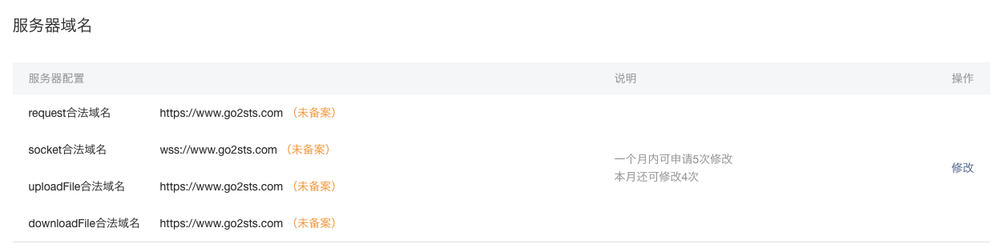

# 依赖条件

> 小程序的部署和发布需要一些工具和环境

## 云环境

> 小程序的服务端环境，一般采用购买云服务即可

为了更方便支持小程序的开发和部署，我采用[腾讯云服务](https://cloud.tencent.com)

### 腾讯云

1. 注册。可以使用微信扫码快速注册
2. 登录。扫码后需要填写“腾讯云助手”小程序中的MFA安全码

### 云主机

> 注意：
>
> 1. 在选购时最好与客服联系一下，看看如何搭配
> 2. 不同的可用区的主机间有可能不能通过内网访问，需要注意

1. 云主机：1核、1G内存、50G存储
2. 数据库：1G内存、50G空间的MySQL数据库实例

### 申请域名

> 小程序的后台服务器必须配置为已备案的网站

1. 挑选域名，查询申请的域名是否已经被使用
2. 填写注册人信息。个人注册需要提供身份证验证
3. 二级域名不用申请，直接在域名解析中添加记录即可

### 网站备案

> 腾讯云中“网站备案”入口

1. 个人网站备案，网站名称最好是个人信息描述，如：个人学习交流等。网站名称如果包含了公司名、行业、政府、敏感字等，都会被驳回重新修改
2. 网站域名必须不能解析，也就是说需要在域名解析中删除该域名的解析记录
3. 云主机必须处于关机状态，也就是说给主机的IP地址不可抵达
4. 需要提交身份证照片（正反两面）以及本人手持身份证的照片
5. 以上资料提交审核后，初审通过。
6. 需要提交幕布照片（可以到指定地点拍照、或者寄送幕布自行拍照）
7. 提交的幕布照片审核通过后，提交管局审核（需要20个工作日）
8. ...

### SSL证书

> 小程序与后台服务采用HTTPS进行传输

可以免费申请SSL证书，申请成功后，可以下载证书（压缩文件）

SSL证书的是针对域名的，因此必须申请域名后才能申请此证书

SSL证书分四个目录（四种不同的WEB服务）

```shell
+ Apache
	- 1_root_bundle.crt
	- 2_<域名>.crt
	- 3_<域名>.key
+ IIS
	- <域名>.pfx
	- keystorePass.txt
+ NginX
	- 1_<域名>_bundle.crt
	- 2_<域名>.key
+ Tomcat
	- <域名>.jks
	- keystorePass.txt
```

具体用法后面详细介绍

## 注册小程序

> 小程序和公众号是分属两个不同的账号，需要两个邮箱地址，但可以用一个微信账号进行管理

1. 小程序和公众号的入口是一个，以账号区分
2. 登录成功后，需要微信扫码验证通过后才能真正进入管理后台
3. 绑定开发者，必须绑定开发者的微信号
4. 一个账号只能发布一个小程序
5. 一个个人用户只能注册五个小程序账号，也就是说个人最多发布五个小程序

### 配置

1. AppID。重要的一个参数，在开发小程序时，需要在配置文件中指定
2. 服务器域名。



看到提示了吧，这里设置的网站，必须是经过备案的。否则不能通过最后的发布审核。

### 开发

> 如果AppID与小程序开发工具的登录账号不一致，会有提示

1. 下载小程序开发工具
2. 使用微信扫码登录（微信号必须与AppID对应的小程序账号绑定）
3. 新建小程序，指定项目目录、AppID

## 服务器环境

> 在腾讯云环境下安装
>
> 1. 申请了一台有公网IP的云主机
> 2. 注册了域名并申请了SSL证书
> 3. 网站通过了备案

### 安装Node环境

1. NodeJS

```shell
sudo apt-get update  
sudo wget https://mc.qcloudimg.com/static/archive/262420521a966befe17dfa0070ddb272/node-v6.11.0.tar.gz
sudo tar xvf node-v6.11.0.tar.gz
cd node-v6.11.0
sudo ./configure
sudo make
sudo make install  
sudo cp /usr/local/bin/node /usr/sbin/
```

安装完成后，测试安装是否成功

```shell
node -v
```


2. 安装pm2

> PM2是node进程管理工具，可以利用它来简化很多node应用管理的繁琐任务，如性能监控、自动重启、负载均衡等，而且使用非常简单。

```shell
sudo apt-get install npm
sudo npm install -g pm2
```

首先安装npm包管理工具


### 安装Nginx

> Nginx是搭配Node的最佳服务器端
>
> 配置SSL

1. 安装

```shell
sudo apt-get install nginx -y
```

2. 启动

```shell
sudo /etc/init.d/nginx start
```

启动后，在浏览器中访问http://<主机ip地址>，出现Nginx欢迎信息，即表示生效

3. 配置

```shell
# 1. 修改读写权限
sudo chmod a+r+w /etc/nginx
# 2. 将SSL证书复制到nginx目录中
sudo cp *.crt /etc/nginx
sudo cp *.key /etc/nginx
# 3. ssl配置文件
cd /etc/nginx/conf.d
sudo touch ssl.conf
sudo chmod a+r+w ssl.conf
# 4. 添加配置
server {
        listen 443;
        server_name www.example.com; # 改为绑定证书的域名
        # ssl 配置
        ssl on;
        ssl_certificate 1_www.example.com_bundle.crt; # 改为自己申请得到的 crt 文件的名称
        ssl_certificate_key 2_www.example.com.key; # 改为自己申请得到的 key 文件的名称
        ssl_session_timeout 5m;
        ssl_protocols TLSv1 TLSv1.1 TLSv1.2;
        ssl_ciphers ECDHE-RSA-AES128-GCM-SHA256:HIGH:!aNULL:!MD5:!RC4:!DHE;
        ssl_prefer_server_ciphers on;

        location / {
            proxy_pass http://127.0.0.1:8765;
        }
    }
# 5. 重启nginx
sudo nginx -s reload
```

配置完成后，在浏览器中输入https://<域名>，可以访问就表示成功