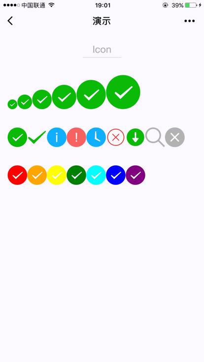

# 组件

> 注意：
>
> 1. 小程序中，没有标签的概念，只有组件。组件相对于标签来说，增加了更多的属性

##image组件

> 一般情况下，图片需要保持宽高比，适度进行裁剪

### 属性

| 属性名 | 类型   | 默认值      | 说明         |
| ------ | ------ | ----------- | ------------ |
| mode   | string | scaleToFill | 图片显示模式 |
|        |        |             |              |
|        |        |             |              |

### 四种缩放模式

| 值          | 说明                                                         |
| ----------- | ------------------------------------------------------------ |
| scaleToFill | 不保持纵横比缩放图片。拉伸/缩放填满image组件                 |
| aspectFit   | 保持纵横比缩放图片。图片的长边能完整的显示出来               |
| aspectFill  | 保持纵横比缩放图片。图片的短边能完整的显示出来，长边将被裁剪(保留中部) |
| widthFix    | 保持纵横比。宽度不变，高度自动变化。                         |

### 九种裁剪模式

> 裁剪模式不缩放图片

| 值 | 说明 |
| -- | -- |
|top | 只显示图片的顶部区域 |
|bottom | 只显示图片的底部区域 |
|center | 只显示图片的中间区域 |
|left | 只显示图片的左边区域 |
|right | 只显示图片的右边区域 |
|top left | 只显示图片的左上边区域 |
|top right | 只显示图片的右上边区域 |
|bottom left | 只显示图片的左下边区域 |
|bottom right | 只显示图片的右下边区域 |

### 注意事项

1. 图片默认尺寸为 320px * 240px
2. 小程序的尺寸在2M以内，因此较大的图片应该放置在服务器上

## swiper组件

> 小程序封装的轮播图组件

### 属性

> 注意：
>
> 除了interval外，其他属性值都是boolean类型

| 属性名         | 类型    | 默认值 | 说明                                       |
| -------------- | ------- | ------ | ------------------------------------------ |
| indicator-dots | boolean | False  | 是否显示面板指示点，默认在下方             |
| interval       | Number  | 5000   | 间隔时间，单位毫秒                         |
| autoplay       | boolean | False  | 是否自动切换                               |
| vertical       | Boolean | False  | 滑动方向是否为纵向，为True时，指示点在右侧 |
| circular       | boolean | false  | 是否采用衔接滑动                           |
|                |         |        |                                            |

##input组件

> 用于输入交互

###属性

| 属性名            | 类型            | 默认值              | 说明                                                         |
| ----------------- | --------------- | ------------------- | ------------------------------------------------------------ |
| value             | String          |                     | 输入框的初始内容                                             |
| type              | String          | "text"              | input 的类型                                                 |
| password          | Boolean         | false               | 是否是密码类型                                               |
| placeholder       | String          |                     | 输入框为空时占位符                                           |
| placeholder-style | String          |                     | 指定 placeholder 的样式                                      |
| placeholder-class | String          | "input-placeholder" | 指定 placeholder 的样式类                                    |
| disabled          | Boolean         | false               | 是否禁用                                                     |
| maxlength         | Number          | 140                 | 最大输入长度，设置为 -1 的时候不限制最大长度                 |
| cursor-spacing    | Number / String | 0                   | 指定光标与键盘的距离，单位px或rpx，默认为px。取 input 距离底部的距离和 cursor-spacing 指定的距离的最小值作为光标与键盘的距离 |
| auto-focus        | Boolean         | false               | (即将废弃，请直接使用 focus )自动聚焦，拉起键盘              |
| focus             | Boolean         | false               | 获取焦点                                                     |
| confirm-type      | String          | "done"              | 设置键盘右下角按钮的文字，仅在type='text'时生效              |
| confirm-hold      | Boolean         | false               | 点击键盘右下角按钮时是否保持键盘不收起                       |
| cursor            | Number          |                     | 指定focus时的光标位置                                        |
| selection-start   | Number          | -1                  | 光标起始位置，自动聚集时有效，需与selection-end搭配使用      |
| selection-end     | Number          | -1                  | 光标结束位置，自动聚集时有效，需与selection-start搭配使用    |
| adjust-position   | Boolean         | true                | 键盘弹起时，是否自动上推页面                                 |
| bindinput         | EventHandle     |                     | 键盘输入时触发，event.detail = {value, cursor, keyCode}，keyCode 为键值，2.1.0 起支持，处理函数可以直接 return 一个字符串，将替换输入框的内容。 |
| bindfocus         | EventHandle     |                     | 输入框聚焦时触发，event.detail = { value, height }，height 为键盘高度，在基础库 1.9.90 起支持 |
| bindblur          | EventHandle     |                     | 输入框失去焦点时触发，event.detail = {value: value}          |
| bindconfirm       | EventHandle     |                     | 点击完成按钮时触发，event.detail = {value: value}            |

1. Bindconfirm事件。可以作为键盘“完成”提交的响应事件

##icon组件

> 内置的图标组件

### 属性

| 属性名 | 类型            | 默认值 | 说明                                                         |
| ------ | --------------- | ------ | ------------------------------------------------------------ |
| type   | String          |        | icon的类型，有效值：success, success_no_circle, info, warn, waiting, cancel, download, search, clear |
| size   | Number / String | 23px   | icon的大小，单位px或rpx，默认为px                            |
| color  | Color           |        | icon的颜色，同css的color                                     |

###示例

##scroll-view组件

> 1. flex布局，对其中的子块级元素如view不起作用。除非将view设置为`inline-block`和`inline-flex`
> 2. 子元素可能出现换行现象，需要设置`white-space: nowrap;`
> 3. 不能使用textarea map canvas video组件
> 4. 滚动时会阻止页面回弹，无法触发onPullDownRefresh事件