# 记录

> 学习时长：2天
>
> 记录时间：2018-12-05 下午

# 概述

## What

​	是一套同微信原生视觉体验一致的**基础**样式库，由微信**官方**设计团队为微信内网页和微信小程序量身设计，令用户的使用感知更加统一。包含`button`、`cell`、`dialog`、 `progress`、 `toast`、`article`、`actionsheet`、`icon`等各式元素。

## Why

- 与微信原生视觉体验一致
- 提供基础样式，提高开发效率

##How

### 下载

使用前需要先下载[样式文件](https://github.com/Tencent/weui-wxss)

- 页面级wsxx文件。`dist/app.wxss`，提供`page_xx`样式
- 组件级wsxx文件。`dist/style/weui.wxss`，提供全量的样式
- 组件级wsxx文件。`dist/style/widget/*.wxss`，提供分组件的样式

将下载的文件放到根目录`style`下。页面级wsxx文件可以直接覆盖项目中的文件

> 考虑到小程序的尺寸限制，根据项目需要尽量精简文件数量和大小

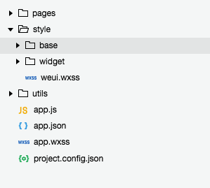

### 引入

在`app.wxss`或需要使用样式的`页面.wxss`中引入

```css
/**app.wxss**/
/* 引入全量样式文件 */
@import 'style/weui.wxss';

/* 引入组件样式文件 */
@import 'style/widget/weui-button/weui-button.wxss';
```


### 使用

- 参考`dist/example`下的示例文件
- 样式采用`BEM`命名规范
  - `B`即`block`，代表功能或组件，例如：按钮、搜索框、面板、对话框等等，可以抽象为可重用的部分
  - `E`即`element`，代表`block`中的元素，例如：按钮、文本、图标、输入框等等，元素使用的场景必须在`B`中
  - `M`即`Modifier`，代表对`B`和`E`的修饰，例如：白色、窄边、可用、激活等等，修饰依赖其修饰的对象(`B`和`E`)，作为附加项使用，不能独立使用。
  - 书写格式：`B__E_M`，`B`和`E`间用两个下划线分隔，`B`和`M`或者`E`和`M`间使用一个下划线分隔
  - `E`不能嵌套，即不能像这样定义`B__E__E`
- 大部分样式使用`weui`前缀，如：`weui-cells`、`weui-cells__title`
- `B`中的样式不对外边距进行控制（控制内边距），避免`边距塌陷`

# 总结

## 布局

> 涉及到页面布局的样式

### 按钮区域

> 隔离按钮和内容

### 列表

> 应用场景：类似于我的中的列表

### 九宫格

> 应用场景：应用入口

### 面板

> 组合多种样式在一起
>
>

### 表单预览

>

### 消息页

>

# 表单类

## 标签

### Block

| 类名         | 含义 | 样式特点                              | 备注 |
| ------------ | ---- | ------------------------------------- | ---- |
| `weui-label` | 标签 | 宽度：`105px`<br />换行：`break-word` |      |


## 按钮

### Block

| 类名        | 含义     | 样式特点                                                     | 备注                               |
| ----------- | -------- | ------------------------------------------------------------ | ---------------------------------- |
| `weui-btn`  | 标准按钮 | 宽度：`100%`<br />行高：`2.5`大约`46px`<br />字体：`18px`<br />圆角：`5px` | 块级元素<br />`margin-top`：`15px` |
| `mini-btn`  | 小按钮   | `margin-right：5px`                                          |                                    |
| `btn-hover` | 点击态   | 改变按钮背景色和字体颜色的透明度                             | 自动添加无需设置                   |

属性：

| 属性      | 含义 | 取值                                                         | 备注               |
| --------- | ---- | ------------------------------------------------------------ | ------------------ |
| `type`    | 类型 | `primary`：主按钮，背景绿色，字体白字<br />`default`：默认按钮，灰底白字<br />`warn`：告警按钮，红底白字 |                    |
| `disable` | 禁用 | `disable=""` 不可点击                                        |                    |
| `plain`   | 平面 | `plain=""` 带边框                                            |                    |
| `size`    | 尺寸 | `mini`：小按钮，行内元素、字体`13px`、行号`2.3`约`30px`      | 搭配`mini-btn`使用 |


### 示例

```html
<button class="weui-btn" type="primary">页面主操作 Normal</button>
<button class="weui-btn" type="primary" disabled="true">页面主操作 Disabled</button>
<button class="weui-btn" type="primary" plain="true">按钮</button>
<button class="weui-btn mini-btn" type="primary" size="mini">按钮</button>
```


## 列表

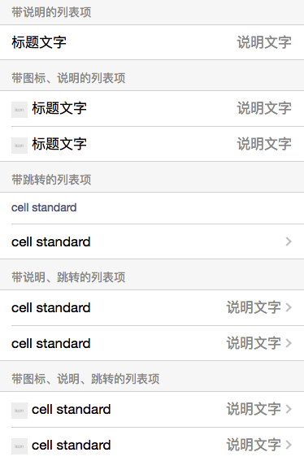

### Block

| 类名         | 含义   | 样式特点                                              | 备注                   |
| ------------ | ------ | ----------------------------------------------------- | ---------------------- |
| `weui-cells` | 列表组 | 行高：`1.4`大约`24px`<br />字体：`17px`               | `margin-top`：`1.17em` |
| `weui-cell`  | 列表   | `flex`布局<br />内边距：`10px 15px`<br />元素垂直居中 | 嵌套在`weui-cells`内   |


### Element

| 类名                | 含义     | 样式特点                                              | 备注                 |
| ------------------- | -------- | ----------------------------------------------------- | -------------------- |
| `weui-cells__title` | 列表组标题 | 颜色：`#999`<br />字体：`14px`                        | 在`weui-cells`前面，放置列表组的标题 |
| `weui-cells__tips` | 列表组底部 | 颜色：`#999`<br />字体：`14px` |在`weui-cells`后面，放置列表组的底部提示|
| | | ||
| `weui-cell__hd` | 列表左侧 |  | 放置图标 |
| `weui-cell__bd` | 列表中部 | `flex: 1` | 标题文字、正文 |
| `weui-cell__ft` | 列表右侧 | 文字右对齐<br />字体颜色：`#999` | 右侧说明文字、箭头 |


### Modifier

| 类名                         | 含义           | 样式特点                              | 备注                                                       |
| ---------------------------- | -------------- | ------------------------------------- | ---------------------------------------------------------- |
| `weui-cells_after-title`     | 列表组在标题后 | `margin-top`：`0`                     | 与`weui-cells`配合使用<br />列表标题类下第一个`weui-cells` |
| `weui-cells_in-small-appmsg` | 小图文态       | 取消所有内边距                        | 在`media-box`中使用                                        |
|                              |                |                                       |                                                            |
| `weui-cell_access`           | 可以访问       | 无                                    | 占位符                                                     |
| `weui-cell_active`           | 激活           | 颜色                                  | `hover-class="weui-cell_active"`                           |
| `weui-cell_primary`          |                | 交叉轴对齐：`flex-start`              | 左对齐 / 上对齐                                            |
| `weui-cell_link`             | 链接           | 字体：`14px`<br />颜色：`#586c94`蓝色 | 正常是从`weui-cells`继承的`17px`                           |
| `weui-cell_input`            | 包含输入框     |                                       | 见输入框                                                   |
| `weui-cell_check`            | 包含选择框     |                                       | 见输入框                                                   |
| `weui-cell_switch`           | 包含开关       |                                       | 见输入框                                                   |
| `weui-cell_warn`             | 警告           | 字体红色                              |                                                            |
| `weui-cell_select`           | 包含选择项     | 取消内边距                            | 弹出式选择框                                               |
| `weui-cell_vcode`            | 校验码         |                                       |                                                            |
|                              |                |                                       |                                                            |
| `weui-cell__ft_in-access`    | 右箭头`>`      | 显示一个灰色的右箭头                  |                                                            |


### 示例

```html
<!-- 列表组标题，放在列表组前面 --> 
<view class="weui-cells__title">带图标、说明、跳转的列表项</view>
<!-- 列表组，第一个要加入 after-title 修饰类 --> 
<view class="weui-cells weui-cells_after-title">
<!-- 列表项，因为是可以跳转的，因此使用 navigator 组件 --> 
    <navigator url="" class="weui-cell weui-cell_access" hover-class="weui-cell_active">
    	<view class="weui-cell__hd">
        	<image src="" style="margin-right: 5px;vertical-align: middle;width:20px; height: 20px;"></image>
        </view>
        <view class="weui-cell__bd">cell standard</view>
        <view class="weui-cell__ft weui-cell__ft_in-access">说明文字</view>
    </navigator>
</view>
```


## 选择框

> 包括单选框（radio）和多选框（checkbox）

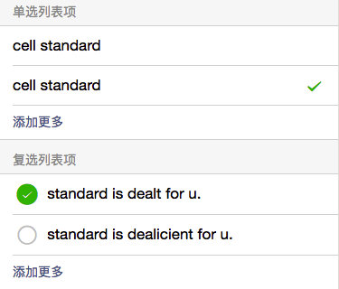

### Block

| 类名         | 含义   | 样式特点                       | 备注                              |
| ------------ | ------ | ------------------------------ | --------------------------------- |
| `weui-check` | 选择框 | 通过绝对定位方式，使组件不可见 | 只作用于`radio`和`checkbox`组件上 |


### Element

| 类名                | 含义     | 样式特点                                              | 备注                 |
| ------------------- | -------- | ----------------------------------------------------- | -------------------- |
| `weui-check__label` | 选择框标题 | 激活时改变颜色              | 放置在`label`组件中 |


### Modifier

| 类名                      | 含义      | 样式特点                 | 备注                                                         |
| ------------------------- | --------- | ------------------------ | ------------------------------------------------------------ |
| `weui-check__ft_in-radio` | 尾部放置√ | `margin-left`：`0.35em`  | 与`weui-cell__ft`配合使用<br />尾部显示√图标（需要放置`icon`） |
|                           |           |                          |                                                              |
| `weui-check__hd_in-check` | 头部放置√ | `margin-right`：`0.35em` | 与`weui-cell__hd`配合使用<br />头部显示√图标（需要放置`icon`） |


### 示例

```html
<!-- 以下为 单选 -->
<!-- 思路：用label组件包裹(radio组件但不可见，选项描述，选中图标) -->
<view class="weui-cells weui-cells_after-title">
 	<radio-group bindchange="radioChange">
    	<label class="weui-cell weui-check__label">
        	<radio class="weui-check" checked="{{ True }}"/>
            <view class="weui-cell__bd">选项一</view>
            <view class="weui-cell__ft weui-cell__ft_in-radio" wx:if="{{ True }}">
            	<icon class="weui-icon-radio" type="success_no_circle" size="16"></icon>
            </view>
        </label>
    </radio-group>
</view>

<!-- 以下为 多选 -->
<!-- 思路：用label组件包裹(checkbox组件但不可见，选中图标，选项描述) -->
 <view class="weui-cells weui-cells_after-title">
 	<checkbox-group bindchange="checkboxChange">
    	<label class="weui-cell weui-check__label">
        	<checkbox class="weui-check" checked="{{ False }}"/>
            <view class="weui-cell__hd weui-check__hd_in-checkbox">
            	<icon class="weui-icon-checkbox_circle" type="circle" size="23" wx:if="{{ True }}"></icon>
                <icon class="weui-icon-checkbox_success" type="success" size="23" wx:if="{{ False }}"></icon>
            </view>
            <view class="weui-cell__bd">多选一</view>
        </label>
    </checkbox-group>
</view>
```


## 输入框

> Input组件
>
> textarea组件

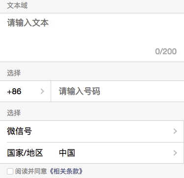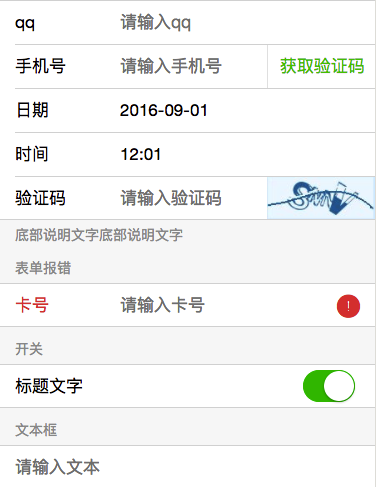

### Block

| 类名                    | 含义       | 样式特点                                  | 备注                     |
| ----------------------- | ---------- | ----------------------------------------- | ------------------------ |
| `weui-input`            | 输入组件   | 高度 = 最小高度 = 行高：`2.588`大约`44px` |                          |
| `weui-textarea`         | 文本域组件 | 宽度：`100%`                              | 不能添加`cell_input`修饰 |
| `weui-textarea-counter` | 文本域计数 | 颜色：`##b2b2b2`，右对齐                  |                          |


### Modifier

| 类名               | 含义       | 样式特点          | 备注                                 |
| ------------------ | ---------- | ----------------- | ------------------------------------ |
| `weui-cell_input`  | 包含输入框 | 取消上下内边距    | 与包含输入框的列表项配合使用         |
| `weui-cell_vcode`  | 包含校验码 | 取消右侧内边距    | 与包含获取校验码按钮的列表项配合使用 |
| `weui-cell_switch` | 包含开关   | 上下内边距：`6px` | 与包含开关的列表项配合使用           |


## 上传文件

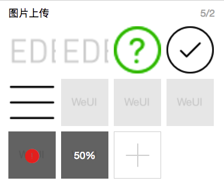

### Block

| 类名            | 含义     | 样式特点 | 备注         |
| --------------- | -------- | -------- | ------------ |
| `weui-uploader` | 上传文件 | 无       | 没有定义样式 |


### Element

| 类名                          | 含义                       | 样式特点                                                     | 备注                     |
| ----------------------------- | -------------------------- | ------------------------------------------------------------ | ------------------------ |
| `weui-uploader__hd`           | 头部                       | `flex`布局<br />下内边距：`10px`                             | 显示标题、文件数量       |
| `weui-uploader__title`        | 标题                       | `flex: 1`                                                    | 一般嵌套在头部内         |
| `weui-uploader__info`         | 数量                       | `color: #b2b2b2`                                             | 一般嵌套在头部内         |
|                               |                            |                                                              |                          |
| `weui-uploader__bd`           | 内容                       | `overflow: hidden`<br />右外边距：`-9px`，下外边距： `-4px`  | 显示已选择文件、控制按钮 |
| `weui-uploader__files`        | 文件组                     | 无                                                           | 文件组容器               |
| `weui-uploader__file`         | 文件                       | `float: left`<br />右下外边距：`9px`                         | 文件容器                 |
| `weui-uploader__file-content` | 文件缩略图上叠加显示的内容 | `color: #FFF`<br />`position: absolute`<br />`left top:50%` `transform: 50%` | 在文件容器内居中显示     |
| `weui-uploader__img`          | 缩略图                     | `width: 79px`<br />`height: 79px`                            |                          |
| `weui-uploader__input-box`    | 添加按钮的容器             | 边框<br />鼠标激活状态改变<br />内部的十字                   | 放置添加按钮`+`          |
| `weui-uploader__input`        | 添加按钮                   | 透明                                                         | 绑定点击事件             |


### Modifier

| 类名                          | 含义     | 样式特点 | 备注                      |
| ----------------------------- | -------- | -------- | ------------------------- |
| ``weui-uploader__file_status` | 文件状态 | 相对定位 | 与`uploade__file`一同使用 |


# 基础组件

## 文章

### Block

| 类名           | 含义 | 样式特点                              | 备注     |
| -------------- | ---- | ------------------------------------- | -------- |
| `weui-article` | 文章 | 字体：`15px`<br />内边距：`20px 15px` | 大段文字 |


### Element

| 类名                     | 含义 | 样式特点          | 备注   |
| ------------------------ | ---- | ----------------- | ------ |
| `weui-uploader__h1`      | 标题 | 字体：`18px` 加粗 | 大标题 |
| `weui-uploader__h2`      | 标题 | 字体：`16px` 加粗 | 章标题 |
| `weui-uploader__h3`      | 标题 | 字体：`15px` 加粗 | 节标题 |
| `weui-uploader__p`       | 正文 | 下外边距：`0.8em` |        |
| `weui-uploader__section` | 段落 | 下外边距：`1.5em` |        |


## 徽章

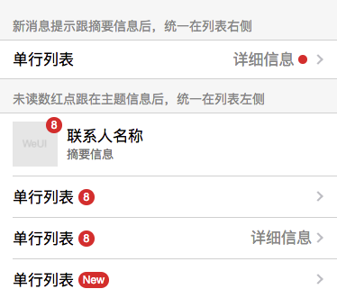

### Block

| 类名         | 含义 | 样式特点                                                 | 备注                           |
| ------------ | ---- | -------------------------------------------------------- | ------------------------------ |
| `weui-badge` | 徽章 | 字体：`12px`<br />`display: inline-block`<br />红色 圆角 | 显示文字、数字时，宽度自动调整 |


### Modifier

| 类名             | 含义 | 样式特点 | 备注 |
| ---------------- | ---- | -------- | ---- |
| `weui-badge_dot` | 圆点 |          |      |


## Flex布局

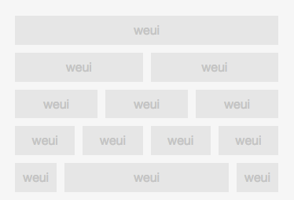

### Block

| 类名        | 含义 | 样式特点 | 备注                       |
| ----------- | ---- | -------- | -------------------------- |
| `weui-flex` | 布局 |          | 根据内部的单元自动分配宽度 |


### Element

| 类名              | 含义 | 样式特点  | 备注 |
| ----------------- | ---- | --------- | ---- |
| `weui-flex__item` | 元素 | `flex: 1` | 单元 |


## 页脚

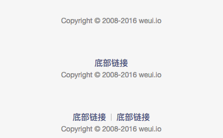

### Block

| 类名          | 含义 | 样式特点                  | 备注     |
| ------------- | ---- | ------------------------- | -------- |
| `weui-footer` | 页脚 | 字体：`14px` 颜色：`#999` | 页面底部 |


### Element

| 类名                 | 含义     | 样式特点                                            | 备注     |
| -------------------- | -------- | --------------------------------------------------- | -------- |
| `weui-footer__links` | 链接容器 |                                                     | 容纳链接 |
| `weui-footer__link`  | 链接     | 字体：`14px` 颜色：`#586c94` 行内块元素 前面加`|`符 |          |
| `weui-footer__text`  | 文本     | 字体：`12px`                                        |          |


### Modifier

| 类名                       | 含义     | 样式特点   | 备注 |
| -------------------------- | -------- | ---------- | ---- |
| `weui-footer_fixed-bottom` | 固定底部 | 固定在底部 |      |


## 九宫格

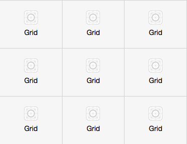

### Block

| 类名         | 含义     | 样式特点                                   | 备注 |
| ------------ | -------- | ------------------------------------------ | ---- |
| `weui-grids` | 表格容器 | 左上边框                                   | 容器 |
| `weui-grid`  | 表格     | 右下边框，左浮动，宽度：`33.33.33333333%%` |      |


### Element

| 类名               | 含义 | 样式特点                               | 备注 |
| ------------------ | ---- | -------------------------------------- | ---- |
| `weui-grid__icon`  | 图标 | 大小：`28 * 28` 水平居中               |      |
| `weui-grid__label` | 标签 | 字体：`14px` 居中 不换行 超出显示`...` |      |


### Modifier

| 类名               | 含义   | 样式特点  | 备注 |
| ------------------ | ------ | --------- | ---- |
| `weui-grid_active` | 激活态 | 背景颜色` |      |


## 加载更多

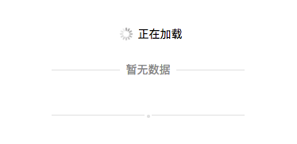

### Block

| 类名            | 含义 | 样式特点                                                    | 备注 |
| --------------- | ---- | ----------------------------------------------------------- | ---- |
| `weui-loadmore` | 容器 | 宽度：`65%` 字体：`14px` 行高：`1.6em` 外边距：`1.5em auto` | 容器 |
| `weui-loading`  | 动画 | 大小：`20 * 20` 行内块元素 动画                             |      |


### Element

| 类名                  | 含义     | 样式特点             | 备注 |
| --------------------- | -------- | -------------------- | ---- |
| `weui-loadmore__tips` | 提示信息 | 行内块元素，垂直居中 |      |


### Modifier

| 类名                          | 含义     | 样式特点     | 备注                        |
| ----------------------------- | -------- | ------------ | --------------------------- |
| `weui-loadmore_line`          | 水平线   | 上边框       | 显示一条水平线              |
| `weui-loadmore_dot`           | 圆点     | 无           | 提示只显示圆点，没有文字    |
|                               |          |              |                             |
| `weui-loadmore__tips_in-line` | 水平线内 | 调整垂直位置 | 在`loadmore_line`组件内使用 |
| `weui-loadmore__tips_in-dot`  | 线中圆点 |              | 在`loadmore_dot`组件内使用  |


## 面板

> 应用场景：用于展示富媒体信息的容器
>
> 特点：
>
> 1. 主要是用于布局，自身没有很多的样式设置
> 2. 仅包含`hd`元素，`bd`、`ft`仅为占位符
> 3. `hd`元素需要嵌套在`panel`块内使用。这与`cells`不同

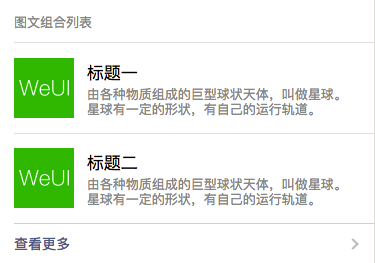

### Block

| 类名         | 含义 | 样式特点            | 备注 |
| ------------ | ---- | ------------------- | ---- |
| `weui-panel` | 面板 | 上边、下边 添加边框 | 容器 |


### Element

| 类名             | 含义 | 样式特点             | 备注                                |
| ---------------- | ---- | -------------------- | ----------------------------------- |
| `weui-panel__hd` | 头部 | 行内块元素，垂直居中 | 用于放置面板标题，嵌套在`panel`块内 |


## 媒体盒子

> 应用场景：图文组合的列表，如下图中间区域
>
> 特点：
>
> 1. 支持图片、文字（多行）
> 2. 可以内嵌`cells`

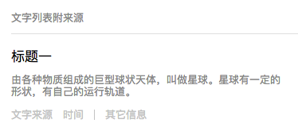

### Block

| 类名             | 含义     | 样式特点                                | 备注 |
| ---------------- | -------- | --------------------------------------- | ---- |
| `weui-media-box` | 媒体盒子 | 左内边距：`15px` 上边边框（第一个没有） | 容器 |


### Element

| 类名                         | 含义     | 样式特点                 | 备注                      |
| ---------------------------- | -------- | ------------------------ | ------------------------- |
| `weui-media-box__hd`         | 头部     | 无                       | 占位符（包含左右布局）    |
| `weui-media-box__bd`         | 身体     | 无                       | 占位符（包含左右布局）    |
|                              |          |                          |                           |
| `weui-media-box__title`      | 标题     | 字体：`17px` 加粗        | 在`_text`修饰符容器内使用 |
| `weui-media-box__desc`       | 描述     | 字体：`13px` 灰色        | 同上                      |
| `weui-media-box__info`       | 底部信息 | 字体：`13px` 浅灰 上边距 | 同上 见第二张示意图       |
| `weui-media-box__info__meta` | 信息项   | 左浮动  右边距           | 同上 见第二张示意图       |
| `weui-media-box__thumb`      | 拇指     | 宽和高：`100%`           | 作用于`image`组件         |


### Modifier

| 类名                               | 含义         | 样式特点         | 备注                            |
| ---------------------------------- | ------------ | ---------------- | ------------------------------- |
| `weui-media-box_appmsg`            | 图文组合态   | `Flex`布局       | 修饰`media-box`组件内包含图文   |
| `weui-media-box_small-appmsg`      | 图文组合态   | 取消所有内边距   | 修饰`media-box`组件内包含小图文 |
| `weui-media-box_text`              | 纯文字态     | 左内边距：`15px` | 修饰`media-box`组件内包含纯文本 |
|                                    |              |                  |                                 |
| `weui-media-box__hd_in-appmsg`     | 组合态       | 宽高：`60px`     | 父级使用`_appmsg`               |
| `weui-media-box__hd_in-appmsg`     | 组合态       | `flex`布局       | 父级使用`_appmsg`               |
|                                    |              |                  |                                 |
| `weui-media-box__title_in-text`    | 纯文本标题   | 下外边距：`8px`  | 父级使用`_text`                 |
| `weui-media-box__info__meta_extra` | 信息项分离态 | 添加左边框       |                                 |


## 表单预览

> 应用场景：交易表单预览
>
> 特点：
>
> 1. 金额重点突出
> 2. 商品信息多行
> 3. 提供可操作按钮


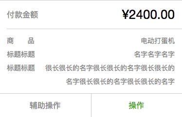

### Block

| 类名                | 含义     | 样式特点      | 备注 |
| ------------------- | -------- | ------------- | ---- |
| `weui-form-preview` | 表单预览 | 白底 上下边框 | 容器 |


### Element

| 类名                       | 含义    | 样式特点             | 备注               |
| -------------------------- | ------- | -------------------- | ------------------ |
| `weui-form-preview__hd`    | 头部    | 右对齐，下边框       | 大字体，突出显示   |
| `weui-form-preview__bd`    | 身体    | 右对齐，`#999`       | 详细信息，多行     |
| `weui-form-preview__ft`    | 身体    | `flex`布局 上边框    | 放置按钮           |
|                            |         |                      |                    |
| `weui-form-preview__item`  | 单项/行 | `overflow: hidden`   | 在`hd`、`bd`中使用 |
| `weui-form-preview__label` | 标签    | 左浮动  `#999`       | 在`item`中使用     |
| `weui-form-preview__value` | 信息    | 字体：`14px` 折行    | 在`item`中使用     |
| `weui-form-preview__btn`   | 按钮    | `flex: 1` 右侧加边框 |                    |


### Modifier

| 类名                             | 含义       | 样式特点        | 备注 |
| -------------------------------- | ---------- | --------------- | ---- |
| `weui-form-preview__value_in-hd` | 头部信息态 | 26号字          |      |
| `weui-form-preview__btn_active`  | 按钮激活态 | 背景：`#eee`    |      |
| `weui-form-preview__btn_primary` | 主按钮态   | 颜色：`#0bb20c` |      |
| `weui-form-preview__btn_default` | 默认按钮态 | 颜色：`#999`    |      |


## 进度条

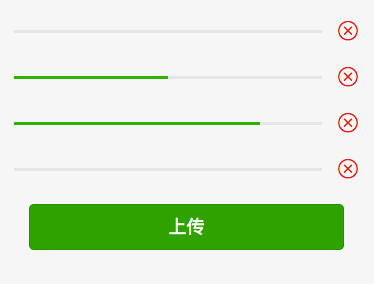


### Block

| 类名            | 含义   | 样式特点            | 备注 |
| --------------- | ------ | ------------------- | ---- |
| `weui-progress` | 进度条 | `flex`布局 居中对齐 | 容器 |


### Element

| 类名                 | 含义   | 样式特点                       | 备注               |
| -------------------- | ------ | ------------------------------ | ------------------ |
| `weui-progress__bar` | 进度条 | `flex`布局                     | 容纳`progress`组件 |
| `weui-progress__opr` | 操作   | 左内边距：`15px` 字体大小：`0` | 容纳`icon`组件     |


# 操作反馈

## 弹出菜单

> 调用系统API `wx.showActionSheet()`

## 对话框

> 调用系统API `wx.showModal()`


## 消息窗口

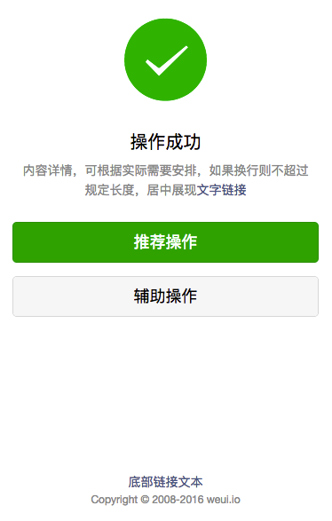


### Block

| 类名       | 含义     | 样式特点                  | 备注 |
| ---------- | -------- | ------------------------- | ---- |
| `weui-msg` | 消息提示 | 文字居中 上内边距：`36px` | 容器 |


### Element

| 类名                   | 含义     | 样式特点                                       | 备注           |
| ---------------------- | -------- | ---------------------------------------------- | -------------- |
| `weui-msg__icon-area`  | 图标区域 | 下外边距：`30px`                               | 内放`icon`图标 |
| `weui-msg__text-area`  | 正文区域 | 下外边距：`25px` 内左右边距：`20px`            | 内放正文       |
| `weui-msg__opr-area`   | 操作区域 | 下外边距：`25px`                               | 内放按钮       |
| `weui-msg__extra-area` | 补充区域 | 下外边距：`15px` 字体：`14px #999`  固定在底部 | 内放补充       |
|                        |          |                                                |                |
| `weui-msg__title`      | 正文标题 | 字体：`20px` 加粗                              |                |
| `weui-msg__desc`       | 正文描述 | 字体：`14px #999`                              |                |
| `weui-msg__link`       | 正文链接 | 行内元素 字体：`#586c94`                       |                |


## 选择器

> 使用原生组件`picker`


## 面包屑

> 使用系统API：`wx.showToast()`


# 其他

## 导航条

> 顶部导航条


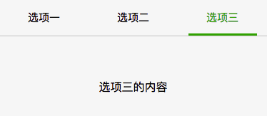

### Block

| 类名          | 含义    | 样式特点                                         | 备注           |
| ------------- | ------- | ------------------------------------------------ | -------------- |
| `weui-tab`    | `tab`页 | 高度：`100%` 自动调节                            | 容器           |
| `weui-navbar` | 导航条  | 绝对定位 左上角 `flex`布局 下边框 `z-index: 500` | 在`weui-tab`中 |


### Element

| 类名                  | 含义     | 样式特点                      | 备注                              |
| --------------------- | -------- | ----------------------------- | --------------------------------- |
| `weui-tab__panel`     | 图标区域 | 高度：`100%` 上内边距：`50px` | 页面容器                          |
| `weui-tab__content`   | 正文区域 | 无                            | 占位符                            |
|                       |          |                               |                                   |
| `weui-navbar__item`   | 导航项   | 上下内边距：`13px` `flex: 1`  |                                   |
| `weui-navbar__slider` | 导航滑块 | 滑块颜色 绝对定位 动画        | 需要在使用的组件上设置`transform` |
| `weui-navbar__title`  | 导航名   | 最大宽度：`8em` 字体：`15px`  |                                   |


### Modifier

| 类名                   | 含义   | 样式特点     | 备注 |
| ---------------------- | ------ | ------------ | ---- |
| `weui-navbar__item_on` | 激活态 | 变为选中颜色 |      |


## 搜索栏

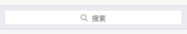

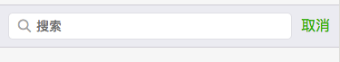

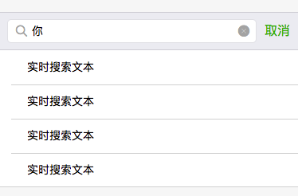

### Block

| 类名              | 含义   | 样式特点            | 备注 |
| ----------------- | ------ | ------------------- | ---- |
| `weui-search-bar` | 搜索栏 | `flex`布局 上下边框 | 容器 |


### Element

| 类名                          | 含义   | 样式特点                         | 备注                                                         |
| ----------------------------- | ------ | -------------------------------- | ------------------------------------------------------------ |
| `weui-search-bar__form`       | 搜索区 | 圆角边框                         | 放在`B`中的第一层                                            |
| `weui-search-bar__box`        | 输入盒 | `z-index: 1` 左右内边距          | 放置搜索图标和输入框                                         |
| `weui-search-bar__label`      | 提示盒 | 绝对定位：`0 0 0 0` `z-index: 2` | 默认情况下显示在最前面，<br />获得鼠标进入后隐藏，<br />点击取消按钮激活 |
| `weui-search-bar__input`      | 输入框 | 字体：`14px` 高度：`28px`        | 输入框                                                       |
| `weui-search-bar__text`       | 提示   | 字体：`14px`                     | 在`label`中使用                                              |
| `weui-search-bar__cancel-btn` | 取消   | 颜色 行高                        | 取消按钮                                                     |


## 其他

### Block

| 类名                                                         | 含义     | 样式特点                | 备注                         |
| ------------------------------------------------------------ | -------- | ----------------------- | ---------------------------- |
| `weui-select`                                                | 选择框   | 右边框<br />右部添加`>` | 配合弹出式选择框使用`picker` |
| `weui-btn-area`                                              | 按钮区域 | 设置外边距              | 与其他区域分割，用于布局     |
| `weui-icon-radio`<br />`weui-icon-search`<br />`weui-icon-clear` | 图标     | --                      | 单选框<br />搜索<br />清除   |
|                                                              |          |                         |                              |
|                                                              |          |                         |                              |


### Element

| 类名 | 含义 | 样式特点 | 备注 |
| ---- | ---- | -------- | ---- |
|      |      |          |      |


### Modifier

| 类名                      | 含义 | 样式特点 | 备注 |
| ------------------------- | ---- | -------- | ---- |
| `weui-icon-check_success` |      |          |      |
| `weui-icon-check_circle`  |      |          |      |
| `weui-icon-search_in-box` |      |          |      |


