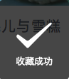

#界面

##交互反馈

> 小程序内置了交互反馈API

###wx.showToast

> 显示消息提示框

特点：

1. 自动消失。默认1500毫秒，可以自定义
2. 支持透明蒙版，防止触摸穿透。

样式如下



语法如下：

```javascript
wx.showToast({
  title: '成功',
  icon: 'success',
  duration: 2000,
  mask: true
})
```

参数对象属性：

| 属性     | 类型     | 默认值    | 是否必填 | 说明                                             |
| -------- | -------- | --------- | -------- | ------------------------------------------------ |
| title    | string   |           | **是**   | 提示的内容                                       |
| icon     | string   | 'success' | 否       | 图标                                             |
| image    | string   |           | 否       | 自定义图标的本地路径，image 的优先级高于 icon    |
| duration | number   | 1500      | 否       | 提示的延迟时间                                   |
| mask     | boolean  | false     | 否       | 是否显示透明蒙层，防止触摸穿透                   |
| success  | function |           | 否       | 接口调用成功的回调函数                           |
| fail     | function |           | 否       | 接口调用失败的回调函数                           |
| complete | function |           | 否       | 接口调用结束的回调函数（调用成功、失败都会执行） |

icon属性值：

| 值      | 说明                                               |
| ------- | -------------------------------------------------- |
| success | 显示成功图标，此时 title 文本最多显示 7 个汉字长度 |
| loading | 显示加载图标，此时 title 文本最多显示 7 个汉字长度 |
| none    | 不显示图标，此时 title 文本最多可显示两行          |


## 媒体

### wx.previewImage

> 全屏幕预览图片

注意事项：

1. 不支持本地文件预览

语法如下：

```javascript
wx.previewImage({
  current: '', // 当前显示图片的http链接
  urls: [] // 需要预览的图片http链接列表
})
```


参数对象属性

| 属性     | 类型           | 默认值        | 是否必填 | 说明                                                         |
| -------- | -------------- | ------------- | -------- | ------------------------------------------------------------ |
| urls     | Array.<string> |               | 是       | 需要预览的图片链接列表。[2.2.3](https://developers.weixin.qq.com/miniprogram/dev/framework/compatibility.html) 起支持云文件ID。 |
| current  | string         | urls 的第一张 | 否       | 当前显示图片的链接                                           |
| success  | function       |               | 否       | 接口调用成功的回调函数                                       |
| fail     | function       |               | 否       | 接口调用失败的回调函数                                       |
| complete | function       |               | 否       | 接口调用结束的回调函数（调用成功、失败都会执行）             |


###wx.chooseImage

> 选择图片或拍照
>
> 调用前需要 [用户授权](https://developers.weixin.qq.com/miniprogram/dev/framework/open-ability/authorize.html) scope.record


语法如下：


参数对象属性


### wx.getRecorderManager

> 从1.6.0版本以后 wx.startRecord和wx.stopRecord将不再维护


## 路由

###wx.switchTab

> 跳转到tabBar页面，并关闭其他所有非tabBar页面


## 网络

### wx.request

> 最大并发数为5
>
> 默认超时和最大超时时间为60秒
>
> url中不能有端口


##用户

###wx.getUserInfo

> 获取用户基本信息
>
> 需要先调用`wx.login`，在其回调函数`success`中调用getUserInfo函数
>
> 会弹出提示窗口，让用户选择是否授权获取用户的信息。

1. 明文信息
2. 加密信息
   - openId。每个微信应用的id号，唯一用于识别用户身份，不能跨应用使用。
   - UnionId。每个用户在多个应用中的Id号，可以跨应用使用，在多应用间同意用户身份