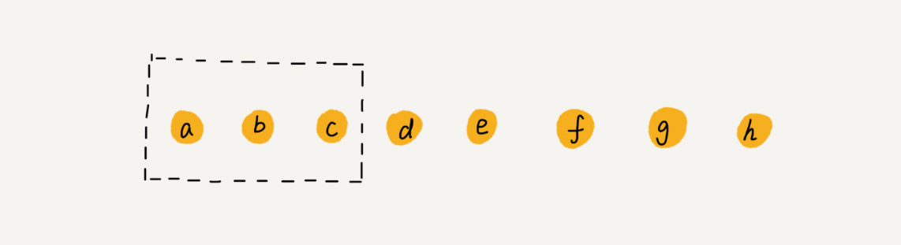

title: 03.数据结构-数组
date: 2020-05-09
tags: 数据结构
categories: 数据结构
layout: post

------

摘要：本节是系列课程中的线性表-数组部分。关键字：线性表、随机访问、连续存储、相同类型

<!-- more -->

## 知识点

### 线性表

线性表：数据排成像一条线一样的结构。每个线性表上的数据最多只有前和后两个方向，数组、链表、队列、栈等均是线性表结构


### 非线性表

非线性表：数据之间并不是简单的前后关系。二叉树、堆、图等都是非线性表结构


## 是什么

数组（`Array`）：是一种**线性表**数据结构。它用一组**连续**的内存空间，来存储一组具有**相同类型**的数据

数组在内存中存储的模型，如下图所示：


- 数组长度为：10，下标从`0-9`
- 数据类型：`整型 data_type_size = 4`
- 内存首地址：`base_address: 1000`

如果要访问上图中数组`a`的第`5`个元素，可以使用`a[4]`直接进行访问，其寻址公式为：

```go
a[i]_address = base_address + i * data_type_size
```

## 为什么

数组是一种重要的数据结构，在每一种编程语言中，都会有数组这种数据类型

数组有以下鲜明的特点

### 从0开始

为什么数组要从`0`开始编号，可以从以下两个方面理解：

- 处理性能最优

  如果从`1`开始，则寻址公式为：`a[i]_address = base_address + (i - 1) * data_type_size`。`CPU`每次寻址会增加一个减法操作

- 历史原因

  最开始的`C`语言采用从`0`开始，后续的开发语言都延续了这一习惯。当然，有一些语言在此基础上进行了扩展，例如：`Python`中的负数下标

### 高效改查

因为数组是连续存储的相同类型的数据，使得**随机访问**成为可能。下标这种随机访问对数据的修改和查询操作非常高效，其时间复杂度为`O(1)`，但是除了随机访问外的查找操作的最好时间复杂度为`O(logn)`

### 低效增删

数组为了保持内存数据的连续性，会导致插入、删除这两个操作比较低效

**插入数据**

需要将数组中原插入点之后的所有数据依次向后移动，最好时间复杂度为`O(1)`、最坏时间复杂度为`O(n)`、平均时间复杂度为`O(n)`

改善措施：为了提升插入操作的效率，在插入操作时，只需将数组中插入点原有数据移动到数组的尾部即可，整个操作只需要移动一个数据，其时间复杂度为`O(1)`；这个处理思想在快排中会用到；但如果需要保持原有数据的相对位置，则不能采用这种办法


**删除数据**

需要将数组中原删除点之后的所有数据依次向前移动，最好时间复杂度为`O(1)`、最坏时间复杂度为`O(n)`、平均时间复杂度为`O(n)`

改善措施：为了提升删除操作的效率，在删除操作时，只需要将删除点进行标记，待满足条件（数组空间满、一定时间间隔）后，对所有删除的数据进行一次清理（移动数据），其均摊时间复杂度为`O(1)`；这也是`JVM`标记清除垃圾回收算法的核心思想；但需要增加对数组中不连续存储的额外寻址和管理功能，代码的复杂度较高



## 怎么做

### 警惕数组越界

数组越界问题，主要的危害是：存在非法访问导致的程序逻辑问题。但目前，在很多编程语言中已经不存在这个问题了，运行时环境会对数组的越界访问进行检查并报告异常

这里只针对`C`语言的代码进行说明

```go
int main(int argc, char* argv[]){
    int i = 0;
    int arr[3] = {0};
    for(; i<=3; i++){
        arr[i] = 0;
        printf("hello world\n");
    }
    return 0;
}
```

这段代码的输出结果不是打印`hello world`三次，而是无限打印。具体说明一下原因：

- 访问地址越界了`arr[3]`不是`arr`变量的有效地址
- 函数中变量存放在栈中，且分配顺序是从高到低，导致`arr[3]`的地址就是存放`i`的地址
- `arr[3] = 0`这句话就会将`i`的值设置为`0`，因此会无限循环下去

当然了，上例中逻辑问题发生需要一些前提条件：

- 数组的长度是`3`，因为`32`为系统都是`4`对齐的。如果是`5`则结果不同
- 变量在内存中的存储位置，`i`必须与`arr`地址连续，且`i`在高位地址

### 容器还是数组

很多开发语言中提供了容器的概念，将数组的操作进行了高效的封装（自动扩容、增删操作等）

建议**使用数组**

- 不使用这些封装的功能
- 容量固定、操作简单
- 对性能有苛刻的追求，例如底层代码

建议**使用容器**

- 简单易用
- 容量不确定

### 内存分配

数组需要连续的内存空间，如果声明的数组过大，系统可能没有足够的连续内存空间分配给它（即使有足够的内存）；如果声明的数组过小，在扩容时有很大的性能损耗（拷贝数据）。总的来说，尽量分配足够大的空间，以**空间换时间**

连续分配的内存空间，可以借助`CPU`的缓存机制，预读数组中的数据，所以访问效率更高

## 一句话

数组用一块连续的内存空间，来存储相同类型的一组数据，最大的特点就是支持随机访问，但插入、删除操作也因此变得比较低效，平均情况时间复杂度为`O(n)`

在业务开发中，可以直接使用编程语言提供的容器类，但是，如果是特别底层的开发，直接使用数组可能会更合适

## 课后作业

### 二维数组的寻址公式

二维数组：`arr[m][n]`

```go
arr[i][j]_address = base_address + (i * n + j) * data_type_size
```


