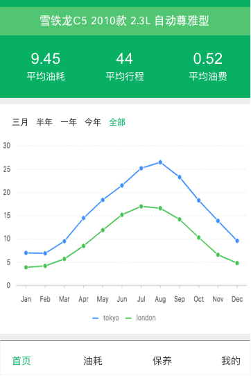

## 用途

用于记录车辆使用情况，包括：里程、油耗、保养、维修、出险等相关信息。通过对信息的收集、记录、分析，更好的服务车主安全用车

## 体验

在移动端采集上述信息，支持人工输入、语音输入、加油小票拍照输入等多种输入方式（快速、准确）

信息输入后，可以查看到本次油耗的统计信息，包括：L / 百公里、元/公里、油耗上升/下降值、平均油耗

## 模型

### 品牌（Brand）

> 基础数据，可以从网上爬取全部信息

品牌信息 = 品牌编码 + 品牌名称 + 品牌标志

品牌编码 = 整数, 4字节, 非空

品牌名称 = 字符串, 50字节, 非空

品牌标志 = 字符串, 100字节, 空

**举例如下**

品牌信息 = 1 + "奥迪" + "\upload\audi.jpg"

### 车系（Series）

> 基础数据，可以从网上爬取全部信息

车系信息 = 车系编码 + 车系名称

车系编码 = 整数, 4字节, 非空

车系名称 = 字符串, 50字节, 非空

**举例如下**

车系信息 = 1 + "奥迪A4L"

### 车型（Type）

> 基础数据，可以从网上爬取全部信息

车型信息 = 车型编码 + 品牌编码 + 车系编码 + 车型名称 + 引擎 + 油箱 + 油耗 + 变速箱 + 车重 + 价格

车型编码 = 整数, 4字节, 非空

车型名称 = 字符串, 50字节, 非空

引擎 = 字符串, 100字节, 空

油箱 = 整数, 1字节, 空, 单位：L

油耗 = 浮点数, 4字节, 空, 单位：L/100KM

变速箱 = 字符串, 50字节, 空

车重 = 整数, 4字节, 空, 单位：KG

价格 = 浮点数, 4字节, 空, 单位：万元

**举例如下**

车型信息 = 1 + 1 + 1 + "2020款 40 TFSI 豪华动感型" + "2.0T 190马力 L4" + 56 + 6.1 + "7档双离合" + 1615 + 34.4

### 油品（）

> 可以使用的油品数据

油品信息 = ID + 油品名称

ID = 整数, 4字节, 非空

油品名称 = 字符串, 50字节, 非空

**举例如下**

油品信息 = 1 + "92#汽油"

### 车辆（Vehicle）

> 用户需要添加至少一辆车的信息

车辆信息 = 车辆编码 + 车辆名称 + 车型编码

车辆编码 = 整数, 4字节, 非空

车辆名称 = 字符串, 50字节, 非空

**举例如下**

车辆信息 = 1 + "我的C5" 

### 油耗（Oil）

> 记录某辆车的每次加油信息

油耗信息 = ID + 车辆编码 + 加油时间 + 油品ID + 加油状态 + 当前里程 + 加油量 + 油费 + 单价 + 油耗 + 行驶里程 + 公里油费

ID = 整数, 4字节, 非空, 自增

车辆编码 = 车辆信息.车辆编码

加油时间 = 日期时间, 8字节, 非空, 加油时间

油品ID = 油品.ID

加油状态 = 布尔, 1字节, 非空, true-加满

当前里程 = 整数, 4字节, 非空, 单位：KM

加油量 = 浮点数, 4字节, 非空, 单位：L

油费 = 浮点数, 4字节, 非空, 单位：元

单价 = 浮点数, 4字节, 非空, 单位：元/L

油耗 = 浮点数, 4字节, 非空, 单位：L/100KM

行驶里程 = 整数, 4字节, 非空, 单位：KM

公里油费 = 浮点数, 4字节, 非空, 单位：元/KM

**举例如下**

 ID + 车辆编码 + 加油时间 + 油品ID + 加油状态 + 当前里程 + 加油量 + 油费 + 单价 + 油耗 + 行驶里程 + 公里油费

油耗信息 = 1 + 1 + "2020-06-19 14:45" + 3 + True + 160810 + 50.42 + 274.79 + 5.45 + 9.41 + 536 + 0.52

## 交互参考

> 以小熊油耗的公众号界面为原型

### 入口

四个底部菜单栏：首页、油耗、保养、我的

### 首页

#### 车型信息

- 车型信息，例如：雪铁龙C5 2010款 2.3L 自动尊雅型
- 统计信息
  - 平均油耗，自记录以来的平均值
  - 平均行程，自记录以来每天里程数
  - 平均费用，每公里的综合费用
- 统计图表
  - 时间范围选择：三个月、半年、今年、一年、全部
  - 油耗统计曲线
    - 范围为全部时，每个点代表一个月的统计值
    - 范围为其他时，每个点代表一次加油的值

#### 计算方法

- 平均油耗(L/100KM) = 累计加油(L) / 记录里程(KM) * 100
- 平均行程(KM/天) = 记录里程 / 记录天数
- 平均费用(元/KM) = 累计加油(元) + 累计保养(元) / 记录里程(KM)

- 记录里程(KM) = 最后加油里程数(KM) - 首次加油里程数(KM)
- 记录天数(天) = 最后加油日期 - 首次加油日期
- 累计加油(元) = 所有加油金额的总和
- 累计保养(元) = 所有保养金额的总和