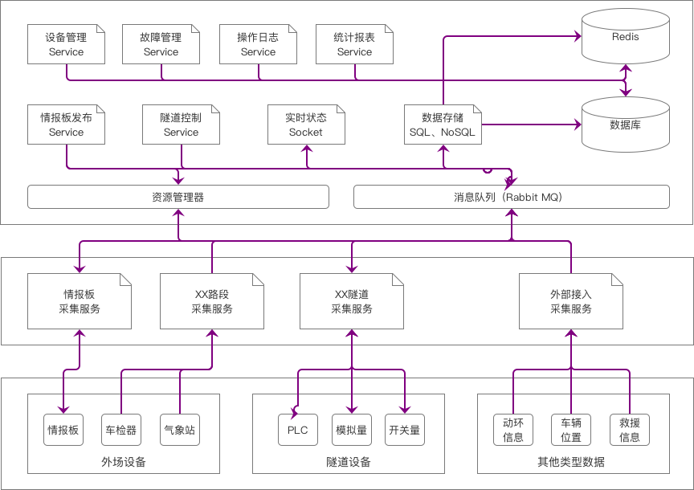
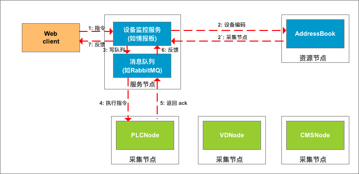

title: 高速公路监控系统-采集服务重构
date: 2020-05-19
tags: 方案 高速
categories: 方案
layout: traft

------

摘要：高速公路监控平台的采集服务，从`2003`年发布`Delphi`的`V1.0`版本开始，历经`.Net`和`Java`等语言版本，到现在已经有`17`年的时间了。虽然存活时间很长，编程语言也不断演进，但其设计理念依然停留在`V1.0`版本时期的**单节点**模式。在万物互联的时代，单节点模式已经不能适应业务和技术的需要，需要将采集服务重构为支持**分布式**的新架构...

<!-- more -->

## 目标
### 业务融合

- 将路段监控、隧道监控、视频监控、事件管理、应急指挥、日常办公等功能融合
- 各级机构使用统一`Web`入口，根据用户的权限提供功能菜单、展示业务数据

### 扩展性

- 数据采集和处理支持多层级模式。可以在任意层级添加采集节点，支持单点采集和汇集采集
- 支持设备协议驱动的组态模式。不用修改源代码支持设备协议的扩展
- 支持多种数据库。包括结构化存储的`Oracle`、`SQL Server`、`MySQL`以及非结构化存储的`HBase`、`MongoDB`等
- 支持为第三方提供数据接口`REST API`。提供面向业务的数据访问接口，不再提供数据库接口 

### 高可用

- 数据采集支持分布式和高可用。根据需要（如IP段、种类、功能）将设备分布到不同的节点；通过`ZK`实现切换
- 后台服务进行解耦（如：事件服务与采集服务，可靠数据服务与状态数据服务等），避免个别服务故障影响整体运行

## 思路
### 服务分离

- 微服务。按业务进行拆分：用户管理、系统管理、设备监控、事件管理、应急指挥、日常办公等等
- 引入对服务运行状态的监控系统

### 消息分离

- 服务间使用消息队列实现数据交换，实现扩展性和服务解耦
- 采集服务负责对数据进行合法性和完整性验证，将数据存入消息队列中
- 存储服务从消息队列中获取数据，并完成对数据库的操作。可以提供不同数据库访问接口
- 第三方服务提供`REST API`接口，对访问权限和流量进行控制

### 性能提升

- `ZK`实现对高可用服务的调度
- 缓存提高性能
- `Docker`提升部署效率

## 架构

在参考了`hadoop`的分布式架构后，采用如下的架构设计。



### 采集服务

- 采集服务根据需要进行分布式部署，采集服务节点的配置，源于本地**静态**文件或者资源管理器**动态**调度
- 采集服务负责完成对设备的通讯，检查通讯状态、采集数据，将数据以内部消息格式存入消息队列中持久化保存
- 采集服务监控消息队列中的指令队列，获取控制命令、生成控制报文、实现设备通信、反馈执行结果

### 资源管理器服务

- 管理采集服务中连接设备的信息，该信息源于：静态的配置文件、动态的采集服务上报
- 可以通过设备`ID`检索到负责该设备通信的采集服务地址
- 采集服务启动后，需要将本节点配置信息，以及采集的设备信息，在资源管理器中注册
- 可以配置为主备模式，以提高可靠性
- 采集节点离线后，根据配置的策略对离线节点中设备进行动态调配，分配到其他节点中；离线节点上线后，再恢复为默认状态

### 消息队列

- 负责各服务节点间的解耦
- 实现多层级间的数据同步（分中心、片区、中心），取代之前的数据库同步模式

### 数据存储服务

- 从消息队列中获取采集数据，并存储到数据库中
- 将数据更新到`Redis`缓存中

### 实时状态服务

- 以`socket`通信方式与前端进行消息交换，以提高数据响应的时效性
- 不可靠数据传输，有可能丢失数据。因此，需要另外的机制定期刷新数据
- 实时状态可以从消息队列，最好是从缓存中读取数据

### 设备控制类服务

- 设备控制类（向设备发送数据）服务，要根据业务进行拆分，相互独立
- 暂时支持可变情报板服务、隧道服务
- 通过后台服务的方式进行交互，不建议采用`socket`方式
- 实现从设备到采集服务的寻址工作
- 控制结果反馈的管理工作，包括超时、正应答、负应答等

### 后台管理类服务

- 这类服务主要与数据打交道（数据库/缓存）
- 包含：设备管理、故障管理、统计报表、操作日志、系统管理、用户管理、权限管理等
- 独立的服务，提供标准的`REST API`

### 流程图

从`Web`前端发起控制指令，到得到控制反馈期间，各服务节点协同工作的流程



## 采集驱动

采集驱动在新的架构下是可以独立运行的服务节点，是整个分布式采集服务的核心之一

### 要求

- 高可靠。至少连续无故障运行`30`天
- 低延时。处理延时小于`100ms`
- 大连接。每个逻辑内核至少`10`个连接

### 思路

借鉴`Go`语言中关于图像解码器的设计思路，将不同协议的设备驱动以插件的形式提供给主程序

```Go
package main

import (
    "fmt"
    "image"
    "image/jpeg"
    _ "image/png" // register PNG decoder
    "io"
    "os"
)

func main() {
    if err := toJPEG(os.Stdin, os.Stdout); err != nil {
        fmt.Fprintf(os.Stderr, "jpeg: %v\n", err)
        os.Exit(1)
    }
}

func toJPEG(in io.Reader, out io.Writer) error {
    img, kind, err := image.Decode(in) // 对png进行解码
    if err != nil {
        return err
    }
    fmt.Fprintln(os.Stderr, "Input format =", kind)
    return jpeg.Encode(out, img, &jpeg.Options{Quality: 95})
}
```

```Go
package png // image/png

func Decode(r io.Reader) (image.Image, error)
func DecodeConfig(r io.Reader) (image.Config, error)

func init() {
    const pngHeader = "\x89PNG\r\n\x1a\n"
    image.RegisterFormat("png", pngHeader, Decode, DecodeConfig)
}
```

`Go`源码分析：

- `image.Decode`函数在解码时会依次查询支持的格式列表
- 每个格式驱动列表的入口指定了四件事情
  - 格式名称。本例为`png`
  - 描述图像格式特征的字符串，用于解码器识别。本例为`\x89PNG\r\n\x1a\n`
  - `Decode`函数用于完成实际的解码工作
  - `DecodeConfig`函数用于解码图像的大小和颜色空间的信息
- 驱动入口通过调用`image.RegisterFormat`函数注册，在每个格式包的`init`初始化函数中调用

其实，对于驱动来说，也是一个编解码的过程

- 从设备端接收到的报文，解码成内部使用的格式（只有部分需要解码）
- 从用户端接收到的指令，编码成设备通信的报文

其他的方面，各个设备都是一样的

- 与设备建立通信连接
- 判断设备通信状态的算法
- 控制指令反馈的有状态模式
- 将解码的数据存入消息队列中
- 与资源管理器通信
- 初始化过程，含静态配置读取等

如果采用这种思路，则所有的采集服务都可以支持全系列的设备，进而可以实现动态的加载？

源码中的格式驱动入口有四个参数：名称、特征码、解码函数、配置函数。正好也适用于设备的驱动，配置函数可以用于不同设备间一些细微的差异

## 资源管理器

