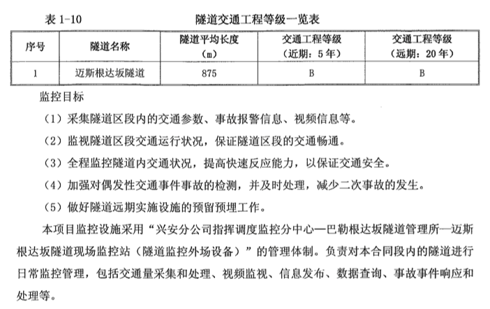
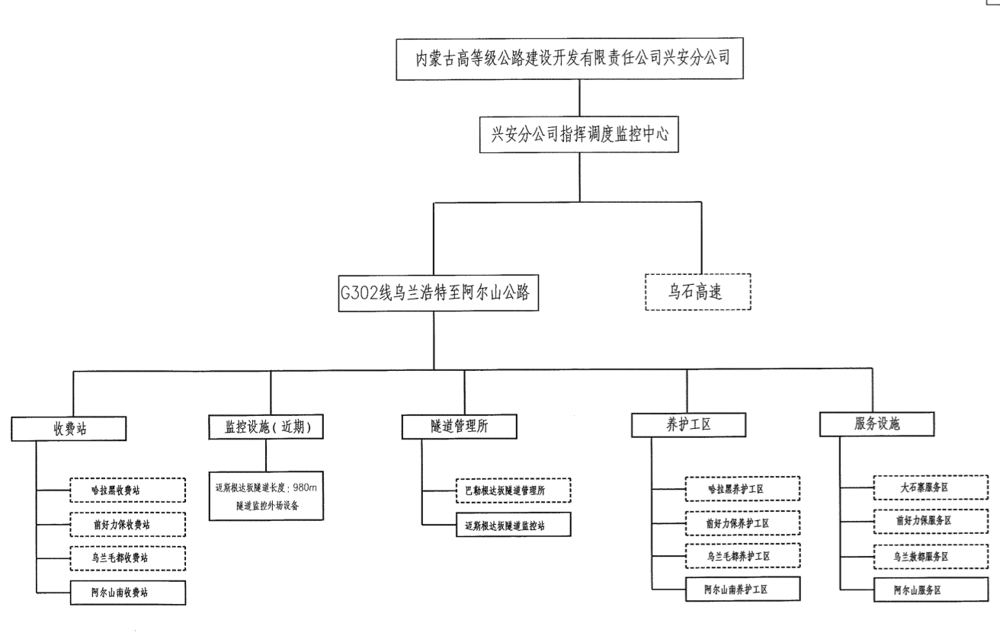
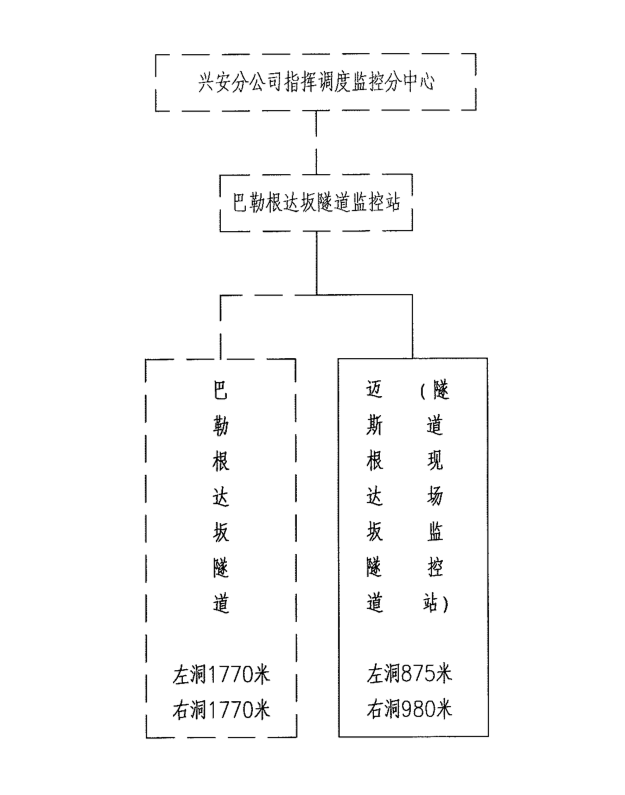
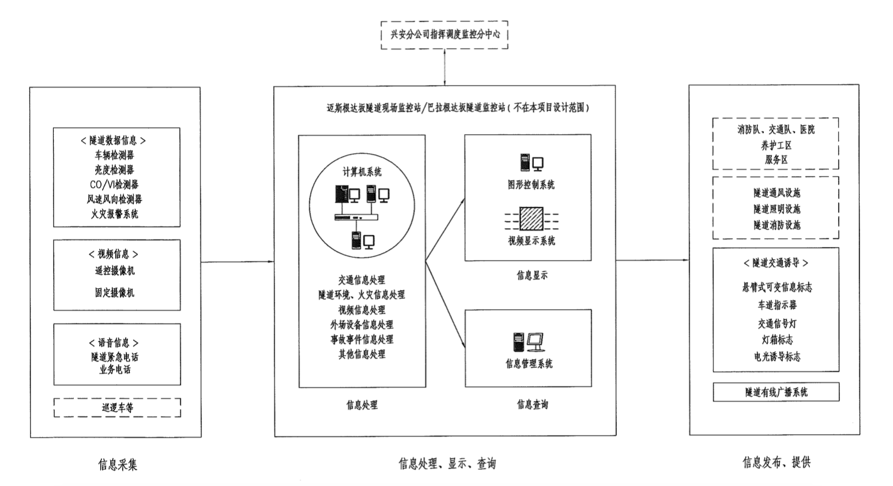
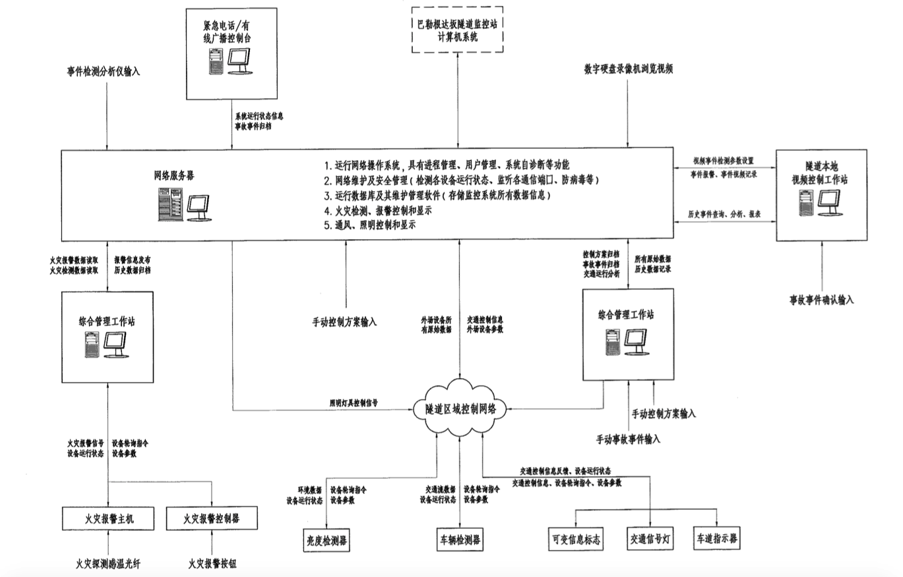
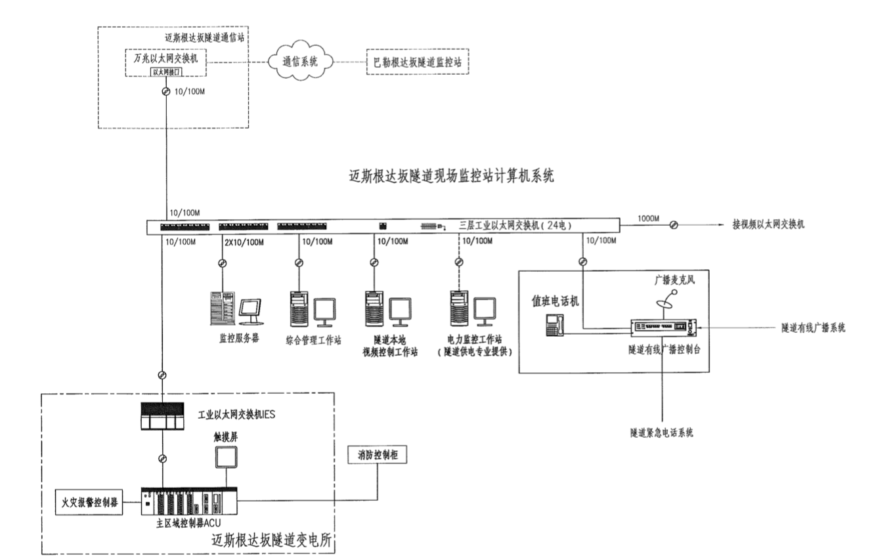
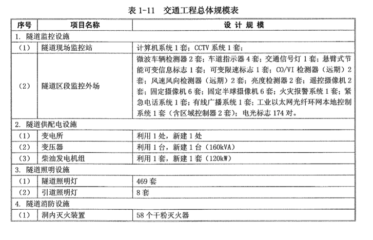

title: G320线三岔至阿尔山段公路-隧道监控软件
date: 2020-06-01
tags: 项目 隧道
categories: 项目
layout: traft

------

摘要：

<!-- more -->

## 项目概况

### 项目概况

### 管理体制

## 项目范围

下图中的实线部分，但不包含右洞（为其预留接口）

### 具体功能

不包含图中的虚线部分

### 数据流图

### 计算机系统

## 外场设备

### CCTV

- 云台摄像机
- 固定摄像机
- 半球摄像机

### 通风

- 无风机
- 无风速风向检测器（预留）
- 无`CO/VI`检测器（预留）

### 交通

- 交通灯
- 车道灯
- 人行通道灯
- 微波车检器

### 照明

- `LED`照明
- 光强检测器参与控制
- 人工控制、手动控制、自动控制

### 火灾

- 手动报警器
- 温感报警器

### 消防

- 无消防池、消防泵
- 干粉灭火器

### 紧急电话

### 有线广播

### 电光标志

## 监控软件

### 监控模式

采用“兴安分公司指挥调度监控分中心--巴勒根达坂隧道监控站--迈斯根达坂隧道现场监控站”的管理体制。新增迈斯根达坂隧道现场监控站负责隧道内紧急事件的应急处理，包括原有右洞和新建左洞隧道内发生火灾或交通事故时需进行现场处理的，或因通信故障需在现场进行管理的情况，平时隧道现场监控站为**无人值守**。巴勒根达坂隧道监控站负责对本合同段内的隧道进行日常监控管理，包括交通量采集和处理、视频监视、信息发布、数据查询、事故事件响应和处理等。**巴勒根达坂隧道监控站和兴安分公司指挥调度监控分中心不再本项目设计范围内**

### 监控功能

#### 交通监控

隧道交通检测与控制系统：主要检测隧道区域交通参数以及各种报警信息等。交通控制系统分析处理这些检测数据，为值班人员提供隧道交通运行情况、系统工作状态等信息，并自动生成控制方案供值班人员选择确定。信息发布设备和交通显示设备接收交通控制系统下达的控制指令，按要求进行相应信息显示，同时交通信号灯、车道指示器为不同工况实现封闭、绕行等车道控制功能，以保证隧道通行安全、畅通和舒适。

### 视频监控

隧道视频监控系统：主要对隧道路段和隧道变电所进行视频监控，平时用于掌握隧道路段交通状况和变电所内设备运行状况，紧急情况时，用于确认通报设备上传的信息，及监视消防活动、疏散行动等状况。

隧道视频监控要求在隧道内部、隧道洞口和隧道变电所

